# 2022/5/6(金)GWの谷間の志賀高原焼額山スキー場は…晴天高温，早朝から板が滑らない雪(涙），さみしいほどガラガラ…

📅 投稿日時: 2022-05-06 20:45:56

🏷️ カテゴリ: [2022スキー滑走日記](cc9cb73e4320f6a97af6fccc37587a61a.md)

えー．

本日はGWの谷間の平日ですが．

大変ホワイトな(？）私の職場は，

強制的に10連休となっているので．

引き続き，志賀で滑ってます～．

が．

昨日は朝3時に家を出て，更に志賀でラストまで

滑ったあとに長野市に移動して飲み会，

そして今朝長野から志賀高原に移動…

というヘビースケジュールだったので．

ちょいと寝過ごしてしまい，長野のホテルを

出たのが朝6時（涙）

だもんで，早朝はちょいと出遅れて

7:30ごろからの参加となりましたが…

さすがに3連休が終わった後で，

ガラガラの志賀高原でした…

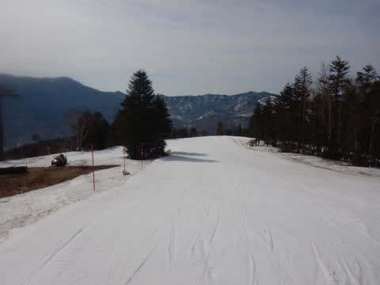

そして．

朝7:30というのに，山頂の気温はすでに

+9℃近く（涙）．

これ…6月ごろの，夏の気温なんですが（泣）

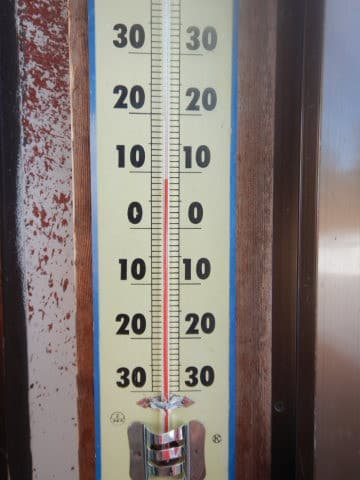

ってなことで．

一見よさそうに見えるゲレンデも…

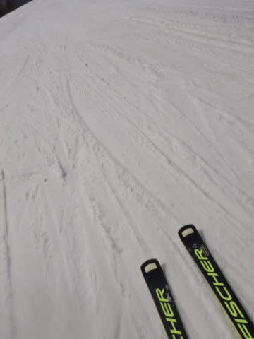

朝からザクザクのグサグサで．

高温+青天の日差しで，すでに緩斜面は

滑りが悪くなって来ています（涙）

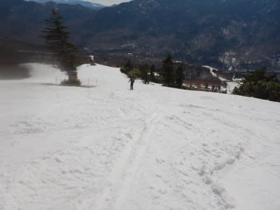

あぁ…晴れなくていいのに．

曇っていてほしいんだけどなぁ…

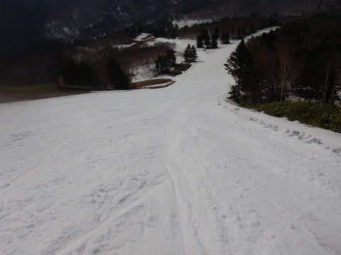

とりあえず．

すでにグサグサになっているGSコースを

8:30まで滑ったら．

パノラマコースがオープン！！

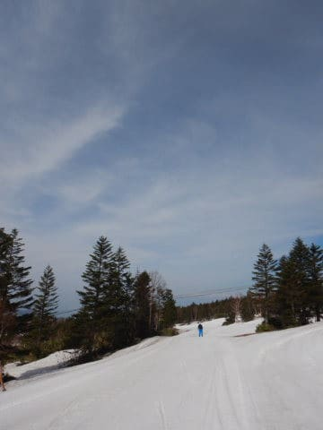

オープンしたてのパノラマコースは，

緩んでるけどまだシマシマ！！

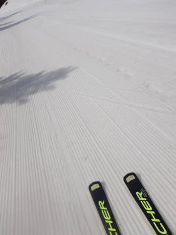

そして，誰も滑ってない

フラットバーン！

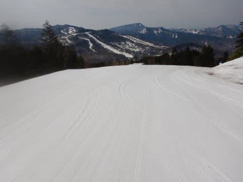

朝の2-3本ほどは，緩んではいたけど

板もそこそこ滑って，人も全くいない

ガラガラ貸し切りで．楽しく滑れた

パノラマコースでした…

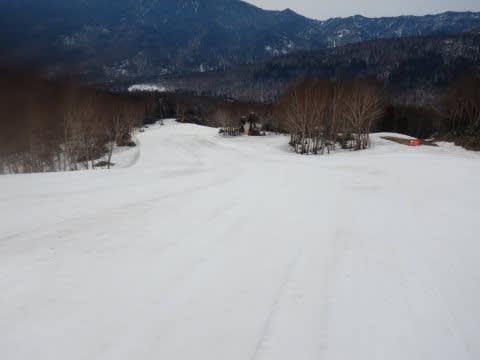

しかし．楽しかったのは2-3本だけ．

朝9時を過ぎると…

強烈な日差しと，+10℃を超える高温の

おかげで，雪の表面に汚れがかなり浮いて

きて．

板の滑りが激烈に悪くなってきました（涙）

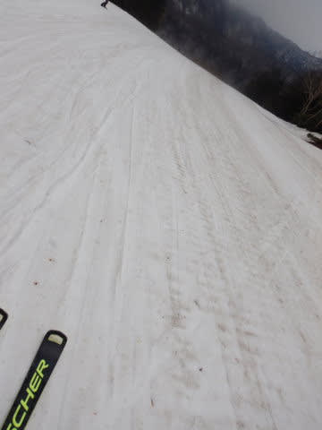

人が滑ってないので，一見フラットなよさそうな

バーンに見えますが…

滑らない．

直滑降で降りて行かないと，止まっちゃうような

バーン（泣）

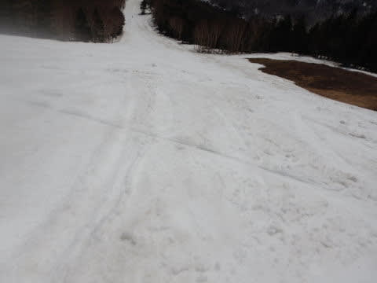

そして．

数本滑ると…

滑走面が真っ黒になってます（激涙）

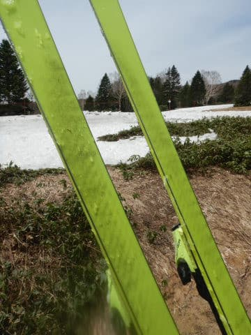

そして，昼間の気温は山頂でも+12℃を超える，

夏山レベルの気温で…

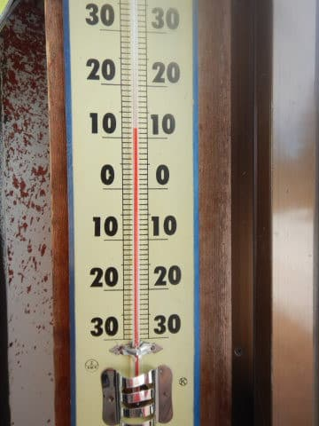

10時を過ぎると全く滑らない雪になり．

楽しくない．

全く楽しくない…

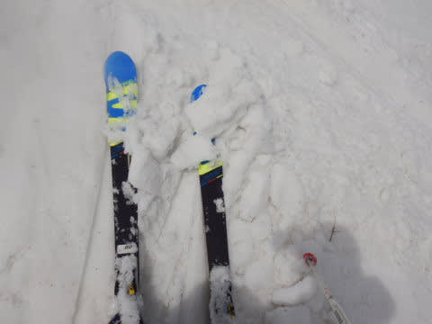

雪がたっぷりあって，まともそうに見えるけど．

全く滑らない雪の中，ゴンドラ乗り場に

必死にこぎながらなんとかたどり着くという，

娯楽のスキーというよりは

「何かの修行」をやってる感じ（涙）

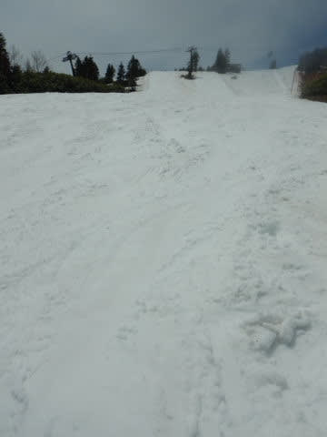

そのせいで．

ゲレンデにも人が全くいないし，

ゴンドラも飛び乗りで．

係員の人もちょっと寂しそうでした…

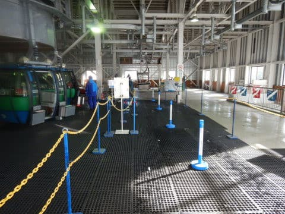

いやー．

まだ雪はいっぱいあるんですけどね～…

…とは言いながら．

今日はかなり気温が高く，日差しも

強かったこともあり．

想像以上に雪が解けました（涙）

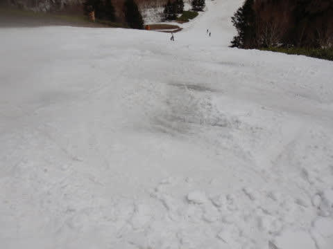

GSコースは一部雪が薄くなってきた

ところも出始めてきて…

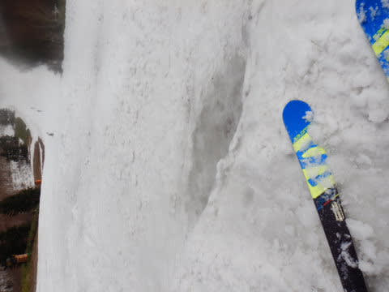

GSコースの突き当りを右に落ちる

急斜面のあたり．

昼を過ぎると地面がコンニチハして

来ました…！！！

いや…朝まで真っ白だったのに．

一気に雪解けが…（泣）

まあ，周りにはまだたっぷり雪があるので．

圧雪車で雪を運んで整備すればすぐ

埋まるレベルの穴ですが…

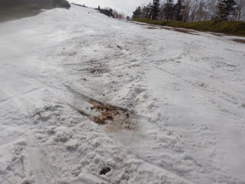

でも．

今日は一気に雪解けが進みました（涙）

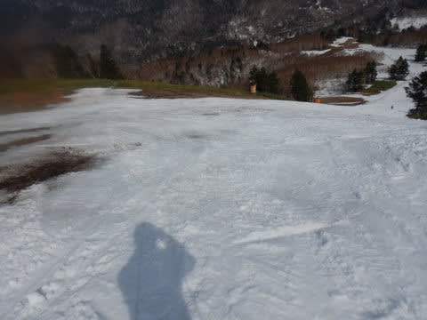

パノラマ-サウス側の，サウスコース部分も，

朝は何ともなかったのに．

今日の昼間に一気に穴が数か所

あきはじめました…

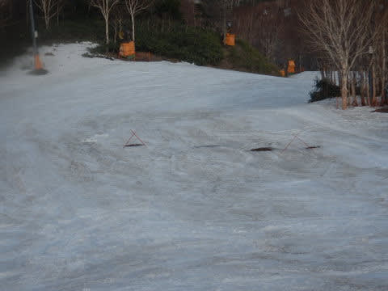

まぁ，ここもまだ幅いっぱい雪が

残ってるレベルなので．

周りの雪を寄せて整備すれば，すぐ

埋まるレベルかな．

少なくとも．

あと2日の営業で，雪がなくなってコースが

切れるとかそういうレベルではないので

ご安心を！

まだまだ雪はいっぱいあります！！

明後日の日曜まで，GSコース，パノラマコース

ともに問題なく滑れますよ～！！

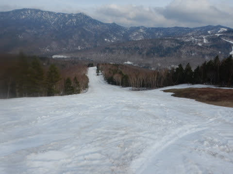

…が．

今日の午後にヤバかったのは．

人が全く滑らないので，雪の上に汚れが

溜まっていき…

この上を滑ると，板が全く滑らなく

なるという悲しい現象が（涙）

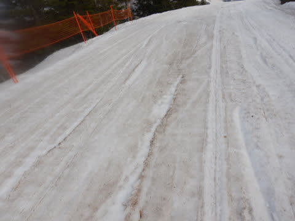

もう，クロスカントリースキーをやる人なら

分かると思うけど．

汚れた雪の上をしばらく滑ると．

「キックゾーン用のストップワックスでも塗ったのかな？」

と思うレベルの張り付き方．

登り坂をまっすぐ登れちゃうほど板が雪に

張り付くんですが…（激涙）

だもんで．

この時期にいつも持ち歩いている

スクレーパーで滑走面をスクレイピング

してみると…

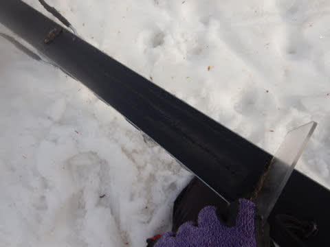

うげげげげ！！！

なんだ，これは…！？？

松ヤニみたいなねばりつく汚れが，

大量に滑走面に張り付いてました…

すごい．

こんな大量に汚れが板に張り付いて

いるのは，私も初めての経験…

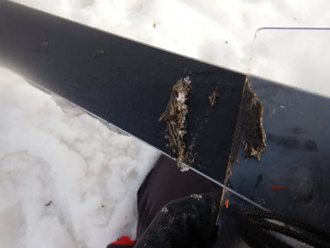

てなことで．

今日は朝9時過ぎ以降．

板にねばりつくような滑りの悪い雪の中，

ひたすら修行のようにゴンドラ乗り場へ

向かうという，全く楽しくない一日

だったので．

さすがの私も，今日はのんびり昼休みを

とっちゃうほどでしたが…

でも．結局営業終了まで滑り続けた，

Skier_Sだったのでした…

（みんなから聞こえる「やっぱりな」の声）

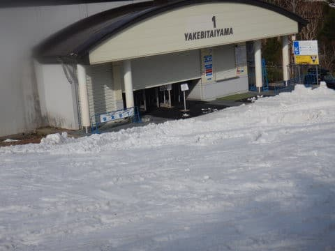

さて．

焼額の営業も残すはあと2日．

まだまだ雪はいっぱいあって，

問題なく滑れそうだけど．

晴れると日差しで雪が解けて，

板が滑らなくなってしまい，

全く楽しくない

のがちょっと悲しい…

…もう，晴れなくていいから．

せめて曇り空になってほしい…

むしろ雨でも，そっちの方が板が滑って

嬉しいかも…
