# 3月3日(月)の志賀高原焼額山スキー場，特派員レポート！…朝から重めの雪，朝までに10cm以上，昼でも10-20cm積もったよ！

📅 投稿日時: 2025-03-04 03:51:19

えー．

昨晩，日曜深夜…

夜中3時ごろまで雨だったものの，

そのあと雪に変わり，朝までに雨で

やられたバーンは新雪が隠してくれた

ようで…

特派員によると，朝までに圧雪コースでも

コース上に10cm以上の新雪が乗って

いたようです…！！！

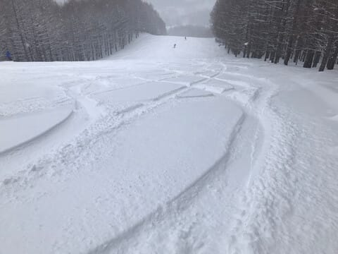

…ただ，本日月曜．

どうやら焼額の第1ゴンドラ，不具合で

なんと，朝から終日運休（涙）

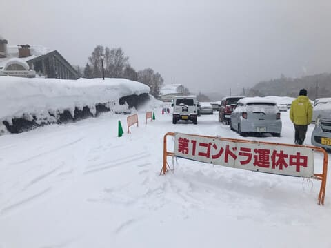

大変残念なことに，明日…

というより，日付が変わった本日4日の

火曜日も，焼額山は第1ゴンドラが

修理のために終日運休になるようです(泣)

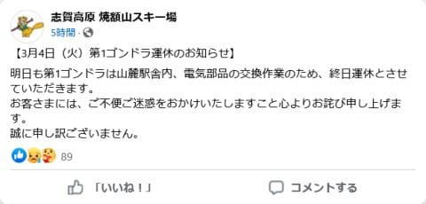

（[焼額山スキー場Facebook](https://www.facebook.com/yakebitaiyama/posts/pfbid0rwLUqLPdjfM84DiZxN8LM1KsyCitroARH76SuedTA5hgBsAXbU8N5P8j6jGL7Lt5l)より）

うーん…

架け替えられてまだそれほど経っておらず，

まだ新しいと思っていた第1ゴンドラも，

冷静に数えると，もう架け替えてから

20年以上になるのか…

第2高速リフトだけじゃなく，次々

いろいろ壊れていく…（泣）

とはいえ．

朝方は雨から雪に変わったばかりで，

朝のうちはまだ気温も+3℃と高く，

朝の雪は結構重かったようですが…

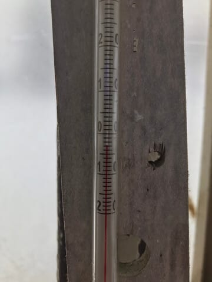

それでも，雨が降って硬くなった下地は

この重い雪のおかげで，氷の上を

吹き飛ばされることなくしっかり積

もってくれて．

雨の後のアイスバーンに悩まされる

ことはなかったみたいです…！

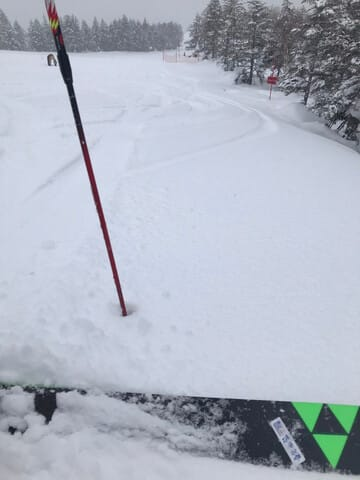

そして，第1ゴンドラが故障で

終日動いてなかった本日．

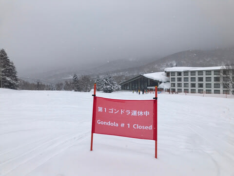

第2ゴンドラ→第3高速と回せば，第1ゴンドラ

側のGSコースやオリンピックコースが滑れる

ものの，

さすがに第1ゴンドラ側のコースはかなり

人が少なく…

これ，ほぼ無人じゃないですか！！

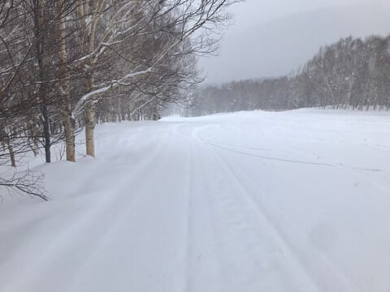

そして，夕方圧雪のオリンピックコースは

積雪20-30cm．

重い雪ながらも，太めの板を履いていれば

結構気持ちよく滑れたみたいで．

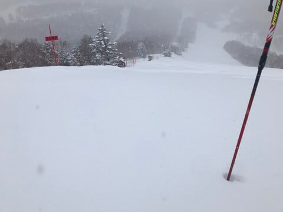

さらに午前中はかなり強く雪が降ってた

みたいなので．

朝からさらに10-20cm積もってくれて．

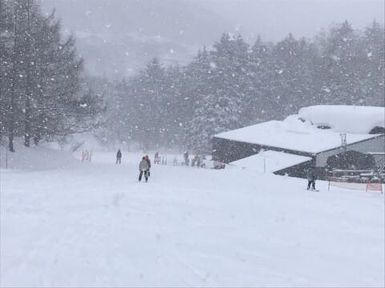

そのうえ，時間が経つとだんだん気温が

下がっていき，午後には-8℃くらいまで

下がったようで…

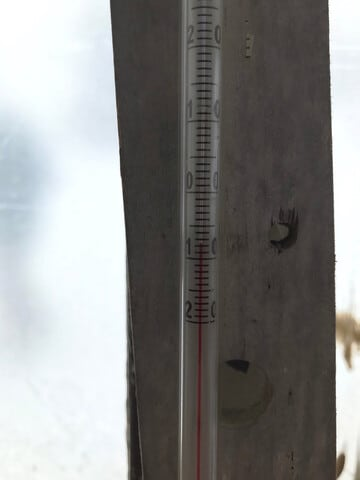

そんな中．

運休中の第1ゴンドラ側のGSコースは

ほぼ無人状態で．

かなり良さそうじゃないですか！！！

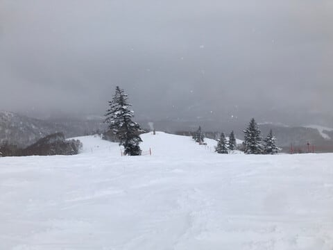

うがーーーー！！

こんなガラガラのGSコース，滑って

みたい…！！

そして，平日ということもあり，第3高速

リフトもガラガラだったみたいだし…

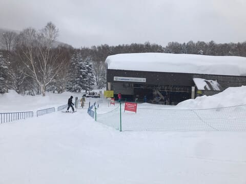

第1ゴンドラが動いてないわりに，

第2ゴンドラもそこまで混まなかった

みたいで．

ピークでも駅舎の中に納まるくらい．

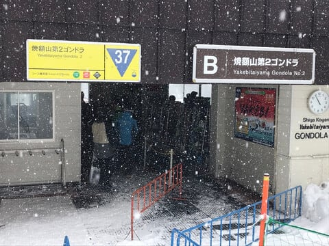

そんな中，昼過ぎには雪もやみ，

午後になると薄日も差してきたみたいで…

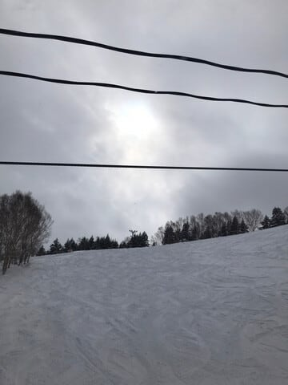

そんな中，こんな無人のいいコースを

滑れたなんて…

意外と今日は良かったのかも…？？？

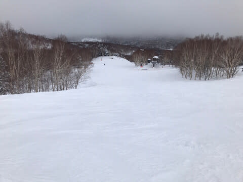

ってなことで．

なんとか3月2日深夜～3日早朝の雨の

危機は，志賀高原ではそれほどひどい

ダメージを受けることなく過ぎましたが．

このあとの予想は，

4日（火）：朝までは晴れて積雪が

　なさそうなものの．夕方から雪．

　夜の間に10cmくらい積もる？

5日（水）：昨日の予想より気温が

　上がるのが早くなり…

　早朝…というか，深夜から雨になる．

　終日雨．時折強く降るタイミングも

　ありそうだけど，終日ザーザーふる

　わけではなく，弱まったりやんだり

　しながら，夜中まで気温が高いままで

　雨がパラパラ降ったりやんだりが続く．

　深夜から雪に変わる．

6日（木）：朝から雪．

　朝のうちは重めの雪．

　終日降り続け，一日の積雪は

　30cmくらい？

という感じで，昨日は5日の雪から雨に

変わるタイミングが良く割らなかったけど．

最新の天気図では，5日は朝から雨に

なりそうです（泣）

とりあえず，4日夜は関東でも雪とかいう

ニュースをやっていますが．

4日の夜遅く，5日に日付が変わるころから

志賀高原でも雨になり，ちょっとヤバそうな

感じです…（泣）

うーん．

5日の雨あと，今日のゲレンデみたいに，

また6，7日にしっかり雪が乗ってくれて，

ゲレンデ状況が回復してくれることを

願うばかり…

いや．

大丈夫．

今週末，私はちゃんと志賀高原に行けるはず…！！

2週連続で滑りに行けなかったら暴れる．

今週末はスキーに行く！！

…日頃の行いが極めて素晴らしくよい私が

スキーに行くのだから，ゲレンデ状況は

最高になってくれるはず…！！！

…

…あ，痛い！！

石を，石を投げないで…！！！

（大勢の読者に石をぶつけられるSkier_S）

## 💬 コメント一覧

### 💬 コメント by (hapi44)
**タイトル**: Unknown
**投稿日**: 2025-03-04 06:31:30

こんにちは！

大丈夫です誰も石なんて投げる人はいないでしょう（笑）

それよりも今週末のSさんご本人のゲレンデ報告を楽しみにしております…

くれぐれも…暴れる事のないよに、全てが整いますよう祈っております😌

### 💬 コメント by (レインボー77)
**タイトル**: Unknown
**投稿日**: 2025-03-04 13:48:16

火曜日の志賀高原情報

朝の蓮池-8℃とかなりの冷え込み。今日も一ゴン故障で不便。朝一の白樺と唐松は感動もの5点。４人揃ってフィッシャーRC4の180。気持ちよく滑れる最高の板(あくまで私らの感覚でです)。サウスはコロコロ出現で3点。パノラマの壁も非の打ち所なしの5点。２本目のサウスはみんなが通るので荒れてコロコロ最悪で1点。サウスが嫌でヤケビに見切りをつけ、GSから奥志賀へ。このGSがあまり踏まれてなくて5点。奥志賀分岐から下はバス移動でしか動けないので、きっと誰も踏んでないんだろうなと未練を残しつつ奥志賀へ。

三高はレッスンが５組以上いて幅いっぱいのトレインをしているので、しばらくエキスパ回し。これが空いてて状態よし4点。ここもレッスンが増えたので上へ移動したら、三高が空いてて4点。

最後はダウンヒル。上部は快適だったけど、二壁(熊落とし入り口の下部)からはコロコロがひどくて2点。

荒れた所もあるけど、探せばいい所はあるもんです。情報も大切ですね。

### 💬 コメント by (Skier_S)
**タイトル**: 3月5日は一日雨（泣）
**投稿日**: 2025-03-05 02:00:56

＞hapi44さま

今週末こそ滑りたい…

今のところちょっと仕事がヤバい感じなので焦ってます．

何とか睡眠時間を削って仕事を仕上げないと…

＞レインボー77さま

今日も意外とコンディションよかったんですね…

でも，奥志賀でコロコロ出たんですか…うーん．

明日は一日暴風雨です．雪じゃないです．雨です…（泣）

その代わり，6日から雪が降るので，ゲレンデは回復していきます！

