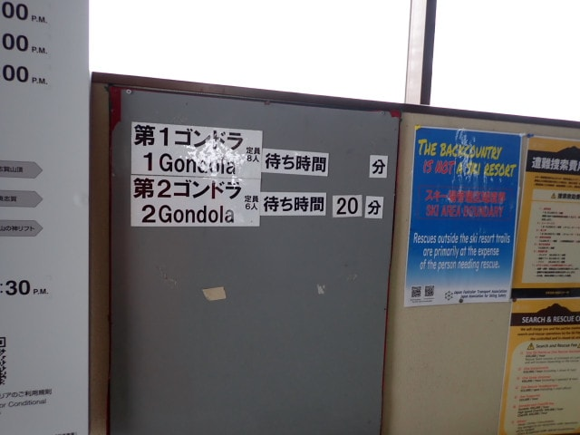

# 2025/1/2(木)の志賀高原焼額山スキー場は…終日雪がぱらつく冷え冷えデー．ゲレンデ人口密度は高め

📅 投稿日時: 2025-01-02 23:40:59

ってなわけで．

引き続き本日も志賀高原で滑ってました～！！

まず．

新年明けて2日目の本日も，

8:30の通常営業開始前に，

焼額第1ゴンドラに並びますが…

今日のゴンドラ待ちはかなり短いですね…！

朝イチの山頂の気温は-7.5℃と，

ここ数日ではぼちぼち高め．

昨晩からの積雪はほとんどないけど，

朝からちらちらと小雪が舞う天気で…

昨晩からの積雪はなかったので，

冷えた雪が圧雪されてしっかり締まって，

スピード派にはたまらない冷え冷え

ハイスピード圧雪バーン！！

うひょーーーー！！！

これはいいよ…っ！！

これまでほとんど毎日積雪があり，

割と柔らかめの圧雪が多かったので…

実に久しぶり…

というか，今シーズンでほぼ初めての，

カッツリとエッジが食い込んでくのに

それでいて硬いわけではない，絶妙な

硬さの極上のゲレンデ！！

ぐはーーー！！

これは最高！！

朝のうち数本は，

今シーズン一番スビードを出していける，

超絶快楽バーンを，ほぼ人がいない状況で

好き勝手滑れるという，悶絶級の悦楽状態

でした…！！！

ただ…

朝のうちはこれまでより人が少なかった

焼額ですが．

10時に近づくと，ゲレンデの人口密度が

だんだん上がってきて…

一ノ瀬方面から人が流れてくるピークの

10時頃には，第2高速リフトの待ちも

長くなり…

第1ゴンドラもゲートを越えるくらいまで

列が伸び…

第2ゴンドラは公式アナウンスでは20分待ち，

実際は10分ちょい待ちくらいまで行ったよう

で，ちょっと混雑気味になってきました…

まぁ，昼前にはゴンドラの混雑も減り，

リフト待ちもほとんどなくなりましたが．

第1ゴンドラは午後1時～2時頃には

またゲートに近いところまで列が並んで

ましたね～…

ただ，相乗りレーンに並べばほとんど待ち

なしで乗れるので，リフト・ゴンドラ待ち

のストレスはそれほどじゃなかったですね．

ただ…

リフト・ゴンドラ待ちのストレスは

なかったけど．

コース上の人口密度は終日高め（涙）

さらに，昼前からは山頂付近はガスっぽい

感じで，視界が悪めになることも多く…

その上，昼前には雪もそこそこの降りに

なることもあり…

そこまでひどい降りではなかったものの．

降ったりやんだりで，ゲレンデの上に

ちょっとうっすらと積もったし…

その上，午後になってもずっとコース上の

人口密度は高め（泣）

バーンは朝は硬めだったので，それほど

荒れないだろう…と思っていたけれど．

勢の人が滑った影響と，うっすら積雪も

あった効果のダブルパンチで．

午後になるとわずかにバーンが荒れ気味に

なってきました…(ちょい涙）

ということで．

晴れてないまでも，朝イチは最高のバーン

だったけど．

午後は人も多く，バーンも荒れ始め．

ちょいと快感度が落ちてきた感じ…

でも，雪質もいいし，リフト待ちはないし．

これで不満を言ったらバチが当たりそう…

と思いながら．

今日は家族で滑りに来ているので，

いろいろ事情により，大変珍しいことに

午後3時前という早めに切り上げたのでした…

…焼額がオープンしてから，今シーズンは

10日滑ったけど．

リフト営業終了前に帰るのは初めてだなぁ…

ラストまで滑りたかった（泣）

ちなみに，明日は終日曇り～雪降りで，

朝までの積雪は10cmくらいでしょうか…

明日もバーンは柔らかめで，午後は荒れていく

一日になりそうです．

とりあえず，明日も焼額で滑ってます～！
