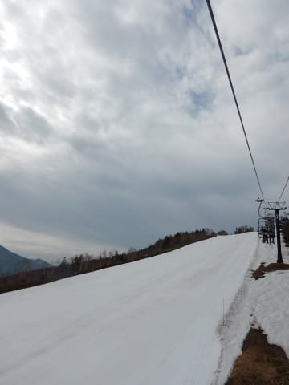

# 5月2日(水)，GW谷間の奥志賀の状況…お昼のゲレンデ状況

📅 投稿日時: 2018-05-02 21:52:35

本日昼間で志賀高原で滑ってましたが．

今はK奈川県の自宅に戻ってます…

ってなわけで．

本日の奥志賀の状況を簡単に速報しておきますと．

奥志賀のスタッフも，そろそろ営業がヤバいと感じているのか．

本日，リフト券売り場で3日券を買おうとした人が

「明後日まで営業できないかもしれませんが，

　いいんですか？」

と何度も念を押されたようです…

これは…

奥志賀，明後日以降の営業をあきらめてるのかな？？？

と，心配になりましたが．

パトロールさんと立ち話をしたところ，

「第2高速ペアが滑れなくなっても，ゴンドラで

　上り下りして，最悪第4だけしか滑れなくても

　営業したいと思ってる」

ということだったので．

おそらく，第4だけしか滑れなくても

GW後半まで意地で営業するのでは…

ってな感じで．

早朝がなくなった本日．

朝8時からの営業開始ですが．

営業開始に並んでるお客さん，少ないですね…

朝イチから曇り空だったので．

放射冷却が入らず．

今日の朝の気温は+13度と，

かなり気温は高かったです…（泣）

だもんで．

朝イチの第ゲレンデ．

シマシマだけど…

雪が緩んじゃってて，あんまり

スピードが出ない…（涙）．

ただ，日が差さず，風も強めだったので．

気温の割には肌寒く感じる朝でした．

で．

気温が高いだけじゃなく．

結構な風があったので．

ゴンドラは，午前11時に，

強風のため運休になっちゃいました…

ダメだ…

なんか，今日はダメな感じだ…

高温で，風が強いということは．

さらに雪解けが進むということで．

本日昼の奥志賀のゲレンデ状況．

こんな感じになってました…

まず，エキスパートの急斜面．

一番上，上からちょっと降りた斜面変化部分，

そして一番下の3か所，雪がヤバくなってます．

一番上は…

まだ，上から見て右側の3m，

滑ることができる感じです…

上からちょっと降りた部分は．

もうかなりやばい感じ…

でも，端っこのわずかな部分，

まだ滑って降りられます．

ここから下は，少しまともな斜面状況ですが．

急斜面が終わる部分も…

ちょっとやば気な感じになってます．

そして．

さらにヤバいのが一番下の緩斜面．

もう，完全に廊下です（涙）

ここなんか，ヤバいですね…

実際に滑ってみると．

これは，ヤバい…

パトロールさんいわく，

「上から圧雪車でここまで雪を

もって来ようにも，圧雪車のブレードに

貯めていた雪が，ここに着く前になくなって

しまうんですよ…」

とのことで．

上の方からここまで雪をもってくるのは

無理とのことです…

うーむ．

3日の雨で．

ほぼ間違いなくここ，切れます（涙）

そして，リフト乗り場近辺も…

よそから雪を運んで，何とか乗り場付近の

雪を維持しています

雪を入れ続けないと，こうなります…（涙）

第2のリフト降り場も雪が減ってきて．

第2リフトを降りてから迂回コースへ

行くところのの雪も切れそうなところ，

雪を入れて切れないように頑張っています．

第3ゲレンデは一見大丈夫そうですが．

ここも，リフト乗り場前の部分．

ちょっと土がではじめてきました…（泣）

ってな感じで．

今日の昼頃の奥志賀は，こんな状況でした…

夜9時現在の志賀高原ですが．

風も強くなり，雨が激しく

降ってきているみたいです．

…幸いなことに，意外と早く止みそうで．

昼頃には雨も上がりそうですが．

奥志賀が下まで滑れる状況を維持できるのか…

うーむ．

厳しい感じとしか，言いようがないです…（涙）

## 💬 コメント一覧

### 💬 コメント by (Goku)
**タイトル**: 終了･･･
**投稿日**: 2018-05-02 22:30:58

今晩の雨でトドメでしょうか？

4日に行こうと思っていましたが、どうやらこのままシーズン終了になりそうです(T_T)

### 💬 コメント by (もりや)
**タイトル**: かなり厳しいですね
**投稿日**: 2018-05-02 22:47:24

今晩の雨でどこまで耐える事が出来るかですね。こちらも雨は大した事が無いが風が強いです。明日は早朝熊の湯入りしますが、4日以降が心配です。今後かぐら行きも考えてます。

### 💬 コメント by (黄色い人)
**タイトル**: 奥志賀の状況
**投稿日**: 2018-05-02 22:47:48

こちらほぼ昼過ぎまで第３を滑っていましたが・・・私も発見できませんでした。

奥志賀は２２時４５分現在で気温１０度、時折激しく雨が降っています。それよりも風がスゴイです。

明日の朝、明るくなったら部屋から３００ｍｍの望遠でエキスパートを撮影しアップしますのでご参考まで。URLに画像版作りました。

### 💬 コメント by (michi)
**タイトル**: Unknown
**投稿日**: 2018-05-03 07:55:41

5日に行きたいと思っていましたがこの状況だと絶望的ですね、、、

私もこのままシーズン終了となりそうです。

### 💬 コメント by (まいる)
**タイトル**: 今シーズン終了しました。
**投稿日**: 2018-05-03 10:05:17

Sさん、ご無沙汰してます。

GWに入り、天元台、かぐらと滑りに行き、昨日(5/2)で今シーズンのスキー、スノーボードが終了しました。今シーズンは、志賀高原でSさんと滑れて良かったです。これからは登山シーズンに移ります。また、来シーズンもよろしくお願いします。

### 💬 コメント by (もりや)
**タイトル**: 熊の湯へ行きました。
**投稿日**: 2018-05-03 17:52:53

早朝は雨降りでしたが、風はなく普通に滑れました。通常営業からは雨も止み、曇りのち晴れでした。馬の背は今日で終わりでしょう(泣く)第2斜面は所々切れてましたね。スタッフに聞いたら明日は早朝営業すると言ってました。とりあえず、熊の湯スタッフやベルドールの中国からの学生さん3人に挨拶してきました。明日から、かぐらへ連勤します。

### 💬 コメント by (さち)
**タイトル**: Unknown
**投稿日**: 2018-05-03 19:39:36

今日で奥志賀も脱落したみたいですね…

残るは熊と横手渋の一騎打ちですが、

なんだかゲレンデ耐久戦という意味で若干楽しんでいる(楽しむしかない)気分です(笑)

### 💬 コメント by (Skier_S)
**タイトル**: 志賀高原，終わりな感じです…
**投稿日**: 2018-05-03 20:46:14

＞Gokuさま

この雨で，とどめを刺されましたね(涙）

奥志賀も今日で終わり，

熊の湯も山頂から滑れるのは今日で最後のようです…

4日は，熊の湯の下側と横手・渋は滑れますが，

楽しいかどうか微妙です…

シーズン終了でしょうか(泣）

＞もりやさま

今晩の雨はいろいろ致命的でしたね（泣）．

明日から，わざわざかぐらまで通うのですか！？？

片道3時間ですよね…

そこまでするとは，やっぱり今日の熊の湯は

楽しくなかったんでしょうか…

まぁ，明日から緩斜面だけですからね．

私も5日，どうしようか悩み中です．

＞黄色い人さま

一昨日は春用の薄手のウェアで滑っていたので，

分からなかったのかも…

しかし，奥志賀終わっちゃいましたね（涙）

第3，第4はまだ行けそうなかんじだったのですが，

今日は滑られましたか？

もし滑ってらしたらどんな感じだったか

教えてください～！

＞michiさま

いや…

5日は，熊の湯緩斜面か横手第2，

渋だけとはいえ，滑れなくはないのですが…

楽しいかどうか．

これで今シーズン終了ですか…

また来シーズンお会いしましょう！

…もしかしたら，関東で夏にオフ会やるかもしれません…

＞まいるさま

今シーズンはお世話になりました～！

GWのかぐら，いかがでしたか？

私は月山まで，まだ2か月近くシーズンが

続くと思います…

また来シーズン，志賀でお会いしましょう！

＞さちさま

確かに，志賀高原サバイバルレースですね(笑)

自分が利害関係者じゃなければ，客観的に楽しめますが…(^^;

一昨日は今シーズン最後のご挨拶ができませんでしたが，

また来シーズンお会いできることを楽しみにしています～！

