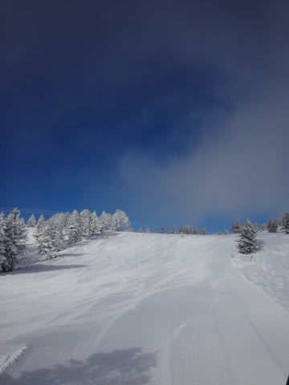
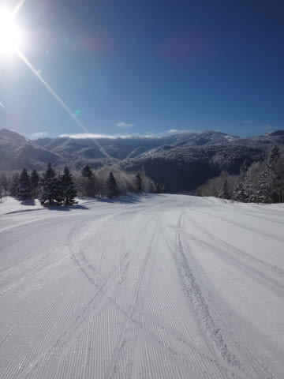
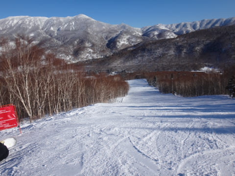

# 2月11日の志賀高原は…速報モード

📅 投稿日時: 2014-02-12 00:24:52

えー．

本日もいつものごとく，リフトストップまで滑ってしまい．

帰宅がこんな時間だし．

明日も朝が早いので．

いつもどおり，速報モードで…．

あー．

本日ですが．

すーーーーーーーーーんごい，良かったです．

ちょーーーーーーーー，最高でしたっ！

こーんな最高の晴天で．

朝イチバーンは最高のシマシマで．

人が誰も滑ってない，ガラガラのゲレンデで．

気温は冷えてて雪質は最高で．

…そして，人が少なかったので．

リフトストップまで，コースはほぼフラット…

あーーーー．

シアワセだったっ！

毎週，毎週ずーーーーーっと，

こんなだったら良いのに…

ってことで．

また明日，詳細レポートします～

おやすみなさい…
