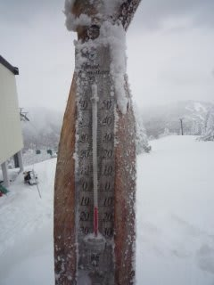

# 12月30日の志賀高原は

📅 投稿日時: 2010-12-30 23:20:15

今日は．

天気は曇り時々小雪，ごくわずか日も差すという，意外と

穏やかな天気でした．

朝イチパウダーを期待したけど残念．

道路もつるつるとかふかふかとかじゃなく，普通に踏み固められた雪道．

雪道としては走りやすいです．

コースは全面可能．

雪質は完全にハイシーズン．

やわらかい圧雪です．

気温は朝はマイナス11度．真冬です．

人が多かったので，昼ごろには蹴散らされた感じの荒れた雪に

なっちゃいますが．

焼額．ちょっと，混みましたね．

朝のうちは風が強く，焼額第2ゴンドラと奥志賀ゴンドラは

運転を中止してました．

そのせいで，焼額第1ゴンドラは5分～10分待ち．

それ以外のリフトも，5分弱待つ状況に．

昼からは第2ゴンドラが動き出したので，ゴンドラ待ちは3分弱に

縮まったでしょうか．

リフト待ちはほぼ0に．

しかし，リフト待ちはないけどゲレンデは快適に飛ばせるより

わずかに人口密度が高いかな…

とりあえず，焼額は第1高速も第3ロマンスも動き出し，

全面可能になりました．

今晩，今は雪が降ってます．

明日は朝イチパウダー滑れるかな．
