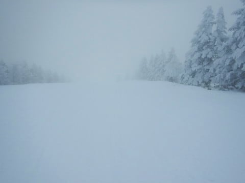
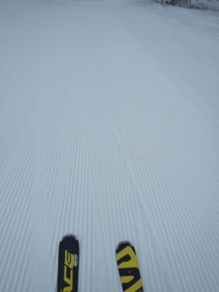
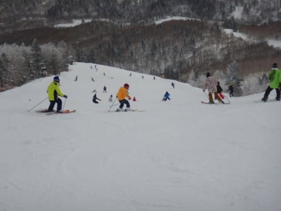
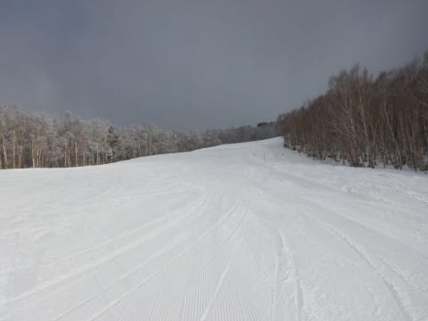
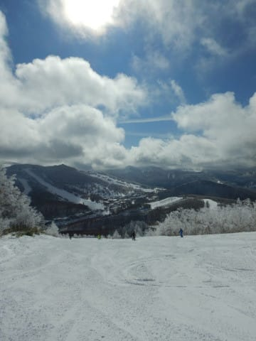
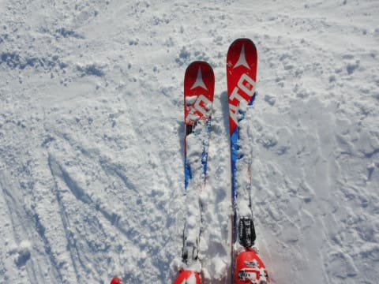
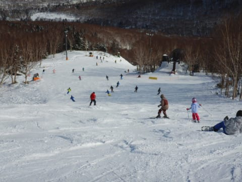
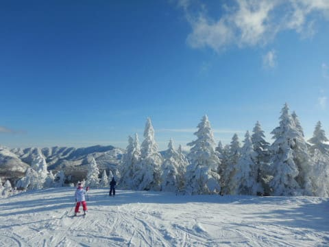
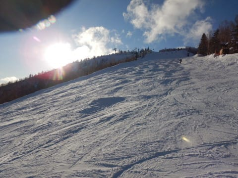

# 2020/2/2(日)の志賀高原スキー場，速報レポート！…午前は曇り，午後から晴れ！冷え冷え，志賀のトップシーズンらしい一日！

📅 投稿日時: 2020-02-03 01:36:14

🏷️ カテゴリ: [2020スキー滑走日記](c282e9230de179e245c7334eabeb0a3b3.md)

えー．

本日もいつも通り，ラストリフトまで

滑ってからの帰宅で．

片づけやらいろいろやってると．

もう深夜1時ですか…（涙）

ということで．

本日の志賀高原の状況を，

日曜深夜定例，速報モードにて！

まず．

朝は予想通りの曇り空でスタートした本日．

気温は-10℃と超冷え冷えで，

あさイチはトップシーズンらしい，

柔らか圧雪シマシマバーンを

堪能！！

…しかし．

時期に晴れるという予想を裏切り．

午前中はしばらく曇り空が続き．

コース上の人口密度もちょっと

高め…（涙）

でも．

人気のGSコースと，パノラマ・サウスコース

以外は人口密度も低く…

そして，10時ごろからうっすら日が射し始めて

来ましたよ！！

さらに，11時ごろには…

太陽が顔を出しはじめ．

お昼にはすっきり晴天！！

冷え冷え真冬の景色の，

1シーズンに何度もないような

最高雪質の晴天になりました！！（歓喜）

晴天なのに，最高気温は-5℃程度と

冷え冷えで．

雪質は終日柔らか最高のまま！！

ただ，雪が柔らかかったので．

予想通り，午後はちょっと凸凹

バーンになっていきましたが…

しかし，

写真を見ただけでスキーをやりたくなるような，

最高の天気＆景色のもとスキーができた一日で…

ラストには荒れ荒れになったものの．

今日一日，最高トップシーズン晴天の，

神様に感謝したくなるような，

最高の一日を過ごせたのでした…

これから来週末まで．

それほどひどく気温が上がることは

なさそうなので．

来週末も，いいコンディションで

滑れそうな感じ…

ってことで．

また明日詳細レポートやりますので，

お楽しみに…！！

## 💬 コメント一覧

### 💬 コメント by (ゆーき)
**タイトル**: Unknown
**投稿日**: 2020-02-03 20:45:41

お疲れ様でした、例のごとく私は奥志賀から入り、その晴れた１１時には焼額山で滑ってました。なかなか良い一日でしたね、でも雪が良かったのは、奥志賀、焼額山、タンネで、あとは、ところどころ、ガチガチの硬い雪が出てましたよ、違いはなんですかね、雪が乗らなかったんですかね。

で、最後は一の瀬クワッドの最終後、バスで奥志賀に戻り帰宅だったので、帰路は、ところどころ、ガチガチに凍ってて、大変でしたが、、、

### 💬 コメント by (Skier_S)
**タイトル**: ＞ゆーきさま
**投稿日**: 2020-02-04 00:43:23

一の瀬正面バーンや高天ヶ原は，強風で軽い雪が飛んでしまっているようですね…

一の瀬正面バーンは今でも人工雪を打っているので，

さらに硬くなっているってのがあると思います．

でも，この週末の焼額はよかったですね～！！

