# 今週末の志賀高原スキー場は天気はいいけど気温が上がりそう．そして15日は液体が降ってくる危機（涙）

📅 投稿日時: 2022-03-09 00:39:48

🏷️ カテゴリ: [日記](cc4b5682fb7b8b144980957a978653fb0.md)

ってなことで．

本日も志賀高原では数人の特派員が

滑っていたようで，写真が送られて

きたのですが…

うがーー！

なんだ，これは！！

人が仕事している時に送られてくる

この晴天＆シマシマの写真は…

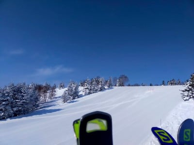

うぎゃーー！！

今すぐ仕事をほっぽり出して滑りに行きたく

なるじゃないか！！

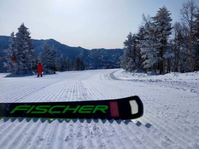

今日は晴天なのに，あさイチは-8℃と

そこそこ冷え込んでくれたらしく．

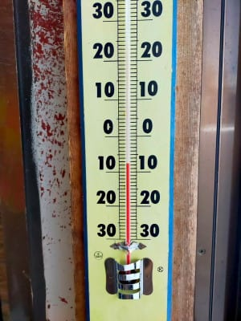

そのおかげで，エッジががっつり食いつく

最高に締まった雪で，かなり良い

コンディションだったようです…

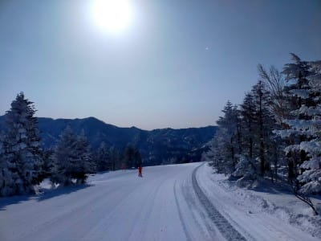

うぎゃーーー！

滑りたい！！

今週末は間違いなく春の雪になることが

予想されているので…

雪の良い今のうちに滑りたい～っ！！！

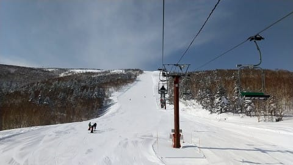

ってなことで．

おそらく9日水曜まではそこそこ冷えて．

時折雲が出るかもしれないけど

天気も悪くなく．

いいコンディションが続きそう．

で．10日，11日は…

うーん．

気温が上がりそうだけど，850hpaの赤い

0℃線がまだ志賀にかかっているレベル

なので．まだ大丈夫そう．

志賀高原はそこまで壊滅的に緩まないかな．

あ，白馬や新潟のスキー場は，

完全に春雪になると思います…

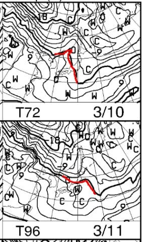

そして，地上天気図を見ても．

これから12日の土曜までずっと

高気圧が日本を覆っていて，

晴れの日が続きそうだけど．

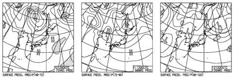

12日の土曜は赤い0℃線がかなり北に

行っちゃうので，気温が激烈に上がります（泣）

さらに晴天の日差しがありそうなので．

完全春スキー

の天気ですね（涙）

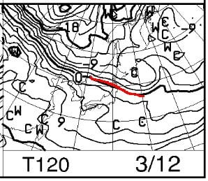

13日の日曜も，850hpaの+6℃線が志賀高原に

近づくレベルで，昼間の気温は10℃近くまで

上がりそうだし．

日差しがあると，ウェアのジャケットなんて

着てられるか！ってほど温まりそう．

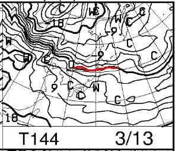

ただ，13日の日曜の地上天気図を見ると…

うーん．

高気圧の辺縁になるので．

晴れか曇りか，まだわからない…

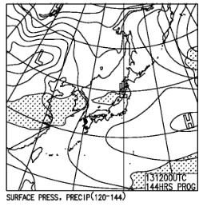

とりあえず，この週末の詳細予想は

また明日やりますが．

まぁ，この週末は，春のしっとり重い雪に

なりそうだけど，雨になることはなさそう

なのが救いかな…

ただ．

来週15日の火曜日．

この日も0℃線は志賀高原より北で…

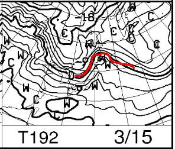

そして，地上天気図も降水域が日本を

覆っているので…

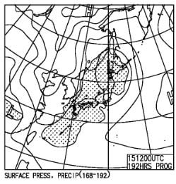

…これは，ヤバい．

ついに，来るのか．

今シーズン志賀高原がオープンして以来

初めての，

ゲレンデに液体が降ってくる日

がやってくるのか…（涙）

あぁ…

春だ．

春ですね．

花粉も飛び始めてきてるし．

私の一番嫌いなシーズンがやってきました（涙）

そう．

「待てば春がやってくる」

というのは，私にとっては

「待つと嫌なことがやってくる」

という意味にしか聞こえず．

「春の訪れ」

というのは私にとっては

「悲しい季節の到来」

という意味でしかなく．

「冬の時代の到来」

というのが，

「最大級に嬉しい時代の到来」

という風に聞こえる私にとっては

おそらく，このBlog読者1億3000万人の

全員がそう思うはずだよね

と同意を求めたい気持ちでいっぱいなのであった…

## 💬 コメント一覧

### 💬 コメント by (大阪のK)
**タイトル**: Unknown
**投稿日**: 2022-03-09 05:55:09

激しく同意致します‼️

ワックスもウェアも選択に困る春。

先週、関西のスキー場にはは黄砂が降り、今シーズン初の妖怪が出現しました。

あー嫌だ嫌だ😅

### 💬 コメント by (レインボー74)
**タイトル**: Unknown
**投稿日**: 2022-03-09 15:08:50

水曜日の志賀高原情報

朝の上林-4℃　蓮池-5℃。快晴。

やっとニゴンでスタートができました。パノラマの壁が気持ちいい。

オリンピックも硬いのでちょっかったら、自己最速。

GSも白樺も、やけびはどこも硬めでした。

奥志賀ダウンヒルがベストかな。硬すぎず柔らかすぎずの、勘違いバーン。

エキスパも良かった。

そしていよいよ本日のクライマックス。

あの皇室がお泊まりになったグランフェニックスで、初ランチです。ちらし寿司1800円、カキフライ定食1800円。プレミアム食事券利用で、一人1500円の出費ですみました。

これなら時々は来てもいいなと思いました。でも、私なんかには場違いかなあ。

### 💬 コメント by (Skier_S)
**タイトル**: 週末はやっぱり高温
**投稿日**: 2022-03-10 01:44:35

＞大阪のKさま

ですよね～．春は好きになれないですよね～．

関西，黄砂が出ましたか…

そろそろ黄砂が来るシーズン．

志賀高原には黄砂が来ないでほしい…

＞レインボー74さま

今日もちょい硬めながらもコンディション良かったんですね．

明日まではコンディションいいです．

金曜から，徐々に春の雪になっていきます…

でも，グランフェニックスのお昼はゼイタクでうらやましい…

