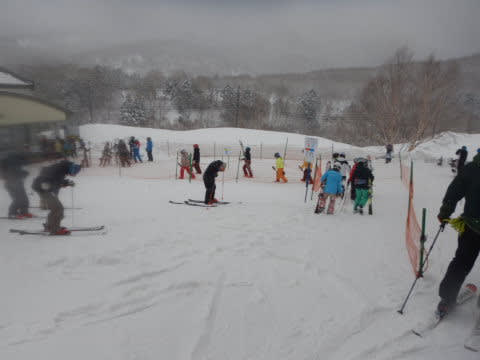

# 2022/3/20(日)の志賀高原スキー場は…激冷え！朝は冷え冷え雪10㎝でコンディションは良かったけど，かなり混んだよ(涙)

📅 投稿日時: 2022-03-21 00:23:15

🏷️ カテゴリ: [2022スキー滑走日記](cc9cb73e4320f6a97af6fccc37587a61a.md)

本日も志賀高原で滑ってきたわけですが…

今朝の志賀高原の登り坂は，昨日気温が

あがったのもあり，ウェット路面が凍った

久しぶりのテュルンテュルン道路で．

登れずに息絶えた車が多数ありました…

ってなことで，テュルンテュルン道路を

通ってたどり着いた焼額山．

8:30の営業開始時前に，すでにゴンドラは

かなりの列が…

さすが3連休の中日，今日はかなり

混みそうな予感(涙)

あさイチゴンドラで山頂へ登ると…

山頂の気温は，予想よりはちょいと

高めだけど，3月下旬としては結構

冷え冷えの-7℃！

そして，山頂は昨晩から冷え冷えの雪が

降り続けていて…

なんと．昨日からの積雪10㎝！！

予想より多めの積雪です！！

昨日はかなり高温になって，

今日は冷え冷えだったので…

積雪がなければガチガチアイスバーン

だったところ．

どうやら私の日頃の行いがよすぎたせいか．

…大事なところなので繰り返して書きますが，

私の日頃の行いが良かったおかげの

この冷え冷え10㎝の積雪で，

下地のアイスバーンは隠れてくれて，

いい感じの冷え冷え雪のトップシーズンバーン！

ちょっと視界が悪かったのが残念だけど…

3月下旬とは思えないいい雪！

と，すごく気持ちよく滑ってたら．

9時半にはゴンドラ待ちが5分を越えて，

さらに10時ごろにはさらに列が伸びて，

ゴンドラ待ちは10分を越えてきました…（激涙）

ゴンドラは混んできたけど，

リフトなら混まないよね

と，第2高速リフトへ逃げてみたけど…

こっちも激混み（泣）

久しぶりに動いている第3高速リフトも，

激混みと言わないけど，普段はそこまで

待つことのない5分ほどの待ち時間に（涙）

当然，コースもかなりの人口密度で，

快感度がちょっと低い…（泣）

せっか3月下旬としては，雪質がいい

真冬のようなコンディションなのに，

午前中のピークは，ゴンドラ40分待ち

までいったようです（激泣）

だもんで．

ゴンドラ10分待ちを超えると焼額の呪いが

解ける私．

ちょっと奥志賀へ脱出してみますが…

奥志賀エキスパートコースも人が多く．

ガスっていて焼額より視界が悪い（涙）

さらに，10時半には…

奥志賀もゴンドラ待ちはかなり伸びて，

さらに普段は全く混まない奥志賀第2高速

ペアにまで待ち行列が…（涙）

さすが3連休，これだと逃げるところがない…

なので．

奥志賀も脱出し，焼額に戻ってきますが…

やっぱり人口密度は高かったけど…

午前中ほどゴンドラは混んであらず．

待ち時間は短ければ3分，長くても10分

くらいで．

混んでいるものの，まぁ我慢できるレベルになって．

さらに，午後1時半ごろになると時折

薄日も射すようになり…

バーンが良く見えるようになってきましたよ！！！

雪質はトップシーズン並みの冷え冷え雪なのに，

バーンが見えるとは…

3月下旬と考えれば，いいコンディション！

この時期にこんないい雪で晴れるとは…

やはり私の日頃の行いが良かったおかげだな！！

…でも．

やはりゴンドラ待ち時間は長く，コースの

人口密度は高かったけど…

でも，天気の中いい雪質でこの時期滑れるとは

恵まれてる！！

ただ，混んでて本数が滑れなかったのは

残念だったけど…

ゴンドラが16時，リフトが16時15分までと

今日もいつもより15分長く営業してくれて．

今日も昼休みもとらず，

ひたすら営業終了まで滑り続けたのでした…

今日はちょっと混んでいたのが残念だけど．

雪はトップシーズン並みによかったし．

午前中は曇り空だったけど，午後は日も射したし．

まぁ，恵まれた一日だったかな～．

明日は朝は曇り空っぽいけど．

気温は冷え冷えだし，昼頃から

晴れそうだし…

明日はすごいいい一日になるかも！？？

## 💬 コメント一覧

### 💬 コメント by (アツシ)
**タイトル**: Unknown
**投稿日**: 2022-03-21 07:11:58

私は横手山・渋峠と熊の湯で一日過ごしましたが、こちらは普段よりは人が多いものの、リフト待ちはほとんどなく、快適でしたよ。

### 💬 コメント by (ヒータロゥ)
**タイトル**: Unknown
**投稿日**: 2022-03-21 07:14:12

昨日は激混みを予想してヤケビから中央エリアへの遠足にしてみました。サンバレー〜丸池に13時過ぎくらいに行きましたがガラガラでした。このような状態を見ると今後の営業が懸念されますね。他エリアとの移動がしにくいことや斜面的に魅力が薄いこともあるんでしょうが。

### 💬 コメント by (西舘)
**タイトル**: Unknown
**投稿日**: 2022-03-21 21:38:17

クイズです。

この記事の中で、Sさんの日頃の行いが良かった主張は何回だったでしょーか

### 💬 コメント by (ダウンヒル)
**タイトル**: Unknown
**投稿日**: 2022-03-21 22:58:32

お疲れ様です。

とりあえず、この週は降ったようで...

テュルンテュルンに凍てついた道になったとか、リフトゴンドラの営業開始が遅れる...なんてことを想像せず...

部下の"さる、きじ、わんこ"と連日踊り狂って楽しんでたら、"鯛、ひらめ"と"クマ"まで参戦してくれて、ひたすら"ピーヒャラピーヒャラ♪"どんちゃん騒ぎしてたおかげですよ...(なんのこっちゃ...）

### 💬 コメント by (Skier_S)
**タイトル**: これから仕事しないと(涙)
**投稿日**: 2022-03-22 02:09:33

＞アツシさま

今日はお世話になりました～！

横手は3連休中日でも混まなかったんですね…

火曜は冷えて雪が降るいいコンディションだと思います！

楽しんできてください…

＞ヒータロゥさま

3連休中日も，サンバレー方面はガラガラだったみたいですね．

ジャイアントのリフトが遅くなってから，丸池・サンバレー方面に行こうと

思わなくなりました…

みんな同じ理由で行かなくなったんじゃないでしょうか？

＞西舘さま

そんな主張してましたっけ…？←事実を正しく認識できない人

＞ダウンヒルさま

この週末は，初日は残念だったけど2日目，3日目は楽しめました！

ダウンヒルさんは3連休大変だったんですか…

### 💬 コメント by (西舘)
**タイトル**: Unknown
**投稿日**: 2022-03-23 20:30:12

失礼しました。

Sさん本人ではなく、読者の皆様が

3回目をしっかり把握してるかな、

と思ったので。

いつも楽しく拝読しつつ、Sさんの日頃の

行いに多大な感謝をしていますてす。

今週末も、どうぞよろしくお願い致します！

めちゃくちゃ期待しまくりで、

今夜の天気予報を待っているのだ！

### 💬 コメント by (Skier_S)
**タイトル**: ＞西舘さま
**投稿日**: 2022-03-26 00:30:59

今週末はダメです…高温で雪はすごいことになり，土曜は風が…

でも，雨が降らないだけマシかな！

