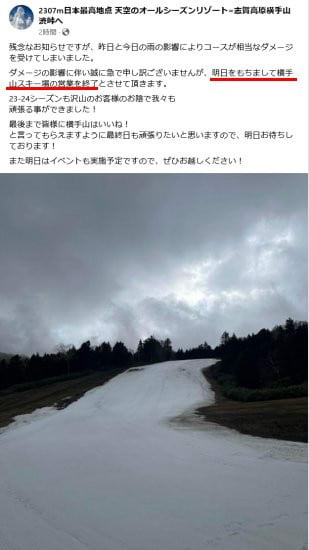
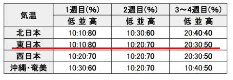
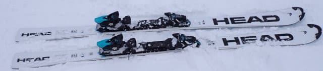
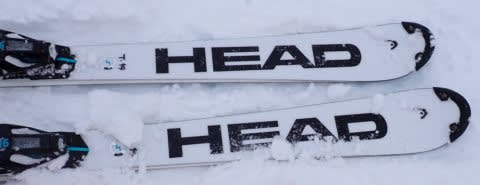
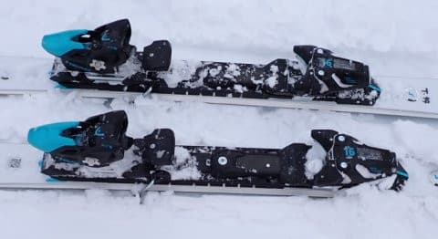
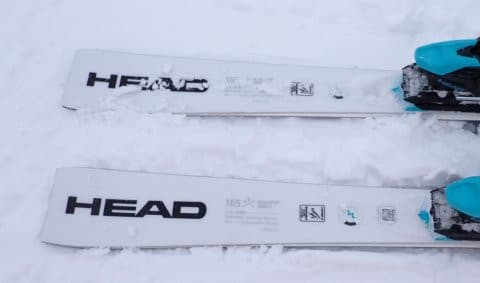
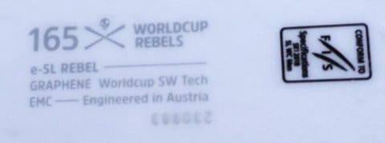

# 2025シーズンモデルのスキー板，試乗レポートその2… HEAD Worldcup Rebels e-SL RD FIS

📅 投稿日時: 2024-05-17 02:40:15

えー．

今週末の19日まで営業予定だった

志賀高原の横手山ですが．

大変残念なことに，本日も雨だった

らしく．

そのおかげで，ゲレンデがさらにやられて

しまい，

明日5月17日の金曜日で営業終了

となるようです…（涙）

（[横手山Facebook](https://www.facebook.com/yokoteyama2307/posts/pfbid05zDeG4GBsJpZyZqHE5hyAGFJjAKPxKoJq9WokWZ4CuhXtU3JQSTRziGLZanFeGfQl)より）

あぁ…横手・渋がこんなに早くに終わる

なんて…

月山も例年より雪が少ないらしく．

さらに本日発表の気象庁の1か月予報では，

これから1か月間も異常に気温が高い

期間が続きそうで…

うん．

月山もいつもよりかなり早く終わっちゃい

そうですね（激涙）

いつまでリフトが滑れるのか…

でも．まだ月山が終わってないので

私のスキーシーズンは終わってませんよ！

ってなことで，スキーネタ．

昨日から開始の2025シーズンモデルの

スキー板試乗レポート．

今回も2回連続ヘッド編です～！！

〇HEAD Worldcup Rebels e-SL RD FIS 165cm 

SL競技用，基礎小回り用

[先日の記事でレポートした，
FISマーク付きのSL板で，基礎小回りにも
適しているという，
HEAD Worldcup Rebels e-SL RD FIS SPEEDBLUE](e1a5736c5abadec185c3b641cd0fcb205.md)．

この板のトップシートだけが青→白に変わった

だけで，サイドカーブも構造もプレートも

変わってないはずのこの板ですが…

「トップシートが違うので，微妙に乗り味が

違う．履いたら分かる」

と言われ．

まさか構造もサイドカーブも同じ板で，

トップシートが違うだけの差なんて，

私のようなシロートにはわからんよ…

と，履いてみたところ．

違う…

違うよ！！！

SPEEDBLUEと違う！！

1ターンしただけで違いが判る！！

青いSPEEDBLUEより，フレックスが

硬めで突っ張るような感じがあります．

SPEEDBLUEは粘りのあるフレックスで

ターン始動時に板がたわみ，たわんでから

そのたわみに沿って回っていく感じだけど…

こっちの白い方は，ターン始動時に

硬さを感じて，たわみが出る前に板の

サイドカーブで板が回り始める感じ！！

青いSPEEDBLUEが，ターン始動時に，

板が雪面を捉えた後，たわみが出てから

回り始めるというワンクッションあるのに

対し．

白い方はたわみが出る前から素早く

サイドカーブでキュッと回り始める

感じで．

こっちの白い方が，かつてのHEADっぽい…！

返りも白いほうが早めに返ってくる感じ．

たわみのバネが解放される返りというより，

板がサイドカーブでくるっと回って反対側に

走っていく感じで，素早く切り返せます．

…青い奴と全然違う…

トップシートだけでこんなに違うとは！

青い方がたわみが出やすいだけあって，

弧のコントロール性は高く，自分の意志で

たやすく回転弧をコントロールできる

感じだけど，

白い方は板が硬めで，サイドカーブで

板が走る方向へ回っていく感じ．

うーん．

青と白の個体のフレックス差かとも

思ったけど．

どっちにしろここまで違うとは驚き…

とりあえず，ガッツリエッジグリップで

曲がっていくしっかりした板という点は

青も白も共通ながら．

白い板の方はフレックスが強めに感じる

こともあって，ハイスピード耐性は青より

高く感じる…

スピードを出していくと，きつめのサイド

カーブに沿って，板がキュンキュン小回り

していきます．

反応はやっぱり青より白が早い感じ.

基本的に，青も白も，どちらもグリップが

強めながらもガチのSL板と思えないくらい

取り扱いやすく軽快で，

それでいて高速安定性も結構高めの，

手ごわいSL板というよりは，ゲレンデ

小回りに十分使える板ですが…

硬めでクイックな白色と，

粘って気持ちよくたわむ青色の違いですね．

どっちもいい板だけど，私は青が好き…
