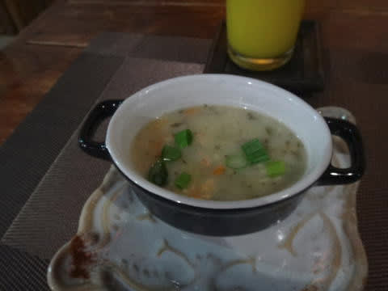

# 2016年8月　子連れで再訪！モアルボアル旅行記ファイナル…そして，帰国

📅 投稿日時: 2017-10-05 01:19:24

🏷️ カテゴリ: [ダイビング日記](ce3a7a8d424d112fce83ee85c81a0e344.md)

ということで．

長らく続いた，昨年のモアルボアル旅行記．

旅行に行ってから1年2か月近くになって．

ようやっと最終回です…

いやーーー．長かった…

とりあえず，シーズンインまでには終わりましたね～！

＃でも．10月中くらいは夏冬ミックスモードで，

＃今年の座間味レポートをやるのかな…

とりあえず．モアルボアルレポートファイナル，

Go！

---

ってな感じで．

器材をベランダで干したけど．

なんだか，このタイミングで

雨が降ってきたんですが…（涙）

器材を干したら降り出すって，タイミング悪すぎ（泣）

明日朝…

ってか，夜中の3時半に出発なので．

それまでに乾いてくれるかな…？？

ってことで．

ログづけして，器材を干すと，もう6時近く．

明日は朝早く…というか，ほぼ夜中に

起きなくちゃならないので．

今日は早めに夜ご飯に行っておきますか…

と，雨の中，モアルボアルの町中を

歩いていきます．

で．

今日やってきたレストランは，去年も立ち寄った

「The Pleasure Principle Resto-Bar」

結構口コミが良く，お値段もリーズナブルなお店．

トムヤムクンやら…

チキンの煮込みやら…

ヌードルやら…

パスタを頼みますが．

このパスタ．

すごく量が多く，かなりお腹一杯…

これでビール飲んで，3人分で2000円ちょっとだし．

やっぱりフィリピンは物価が安くていいなぁ…

ってことで．

夕食を終えるともう8時前．

ホテルに戻って，干してる途中のダイビング器材の

荷物を片づけ．

明日早いので（というか，夜中出発なので）

9時過ぎにはベッドでおやすみなさい…

…

…で．

深夜2時半に目覚ましで起きて…

うーん．

まるでスキーに行く朝のようだ…

ってか．

到着した日も2時間しか寝れなかったし．

この旅行，4泊5日のうち，2泊はまともに

寝れないような日程なのね…（ちょっと涙）．

とりあえず．

一晩干しておいた，器材を片づけますが…

でも…

雨が降ってたので，やっぱりそんなに

ちゃんと乾いてない…（涙）．

器材を片づけたら，3時半にダイブショップの

車がホテルへお出迎え．

真っ暗な中，3時間かけて空港へ向かいます…

が，わが一家．

当然のごとく，ぐっすり車の中で熟睡…

で．

車の中で完全に寝てたら．

予定より早く，6時前に空港へ到着！

…眠いよ…

まだチェックインカウンターが開いていない

時間だったので，カウンターがあくまで待ってから

フィリピンエア―にチェックイン．

チェックイン後，空港利用税一人当たり750ペソを

払う必要があります…

これを払える分の現金を，忘れずしっかり残しておきましょう！

そして．

このあとは．

あれだよ．

[私にとって鬼門の，出国審査](e3f297dded27f560b2aa0917a23a321a0.md)．

また，パスポートコントロールで別室に連れて行かれるはず…

いやだなぁ…

と，思っていたところ．

…あれ？

なんと．

鬼門の出国審査を，今回はあっさり通過．

チェックされなかったけど，いいの？

別室行かなくていいの？

ホントに大丈夫？

あ，大丈夫なんだ．．．．

どうやら．

私のパスポートに「怪しい人じゃない」とちゃんと

チェックされたのか．

無事普通に出国できる身分になったようです．

感動～！！

＃毎度別室に連れ込まれる身分になった人じゃないと分からない開放感

と，感動の中，搭乗待合室へ向かうと…

なんだか，セブの空港．

こぎれいになっちゃってますね…！

昔は中に，こんなに免税店がなかった気が

するのですが…

ってことで．

免税店をいくつか回ったあと．

搭乗待合室で待つこと，1時間…

朝7時半に，フィリピンエア―の成田行き直行便に

搭乗！

機内は毎度の如く，エンターテイメント

システムはありませんが…

でも．

機内Wifiが使えて，

アプリをダウンロードすれば，映画などが

スマホで見れるようになってますね…

フィリピンエアも進化したものよ…

飛行機は，予定時間どおり8時過ぎに離陸！

飛行時間はせいぜい4時間ちょいなので．

機内食などを食べていると…

残り飛行時間は，2時間ちょい．

今日は朝が早くて，眠かったので．

ひと眠りしている間に，日本時間の午後1時過ぎ．

飛行機は，無事成田空港に到着しました…

ってことで．

4泊5日と短かったけど．

娘も私も，満足度は高かったモアルボアル旅行が，

無事終わったのでした…
