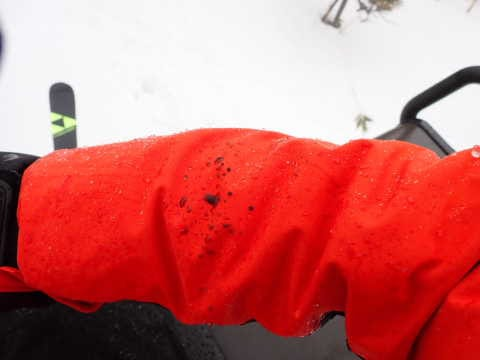

# 2023/2/19(日)の志賀高原スキー場は…天気は朝から雨，そしてガス(泣)．第1ゴンドラ一時運休やら混雑やら…さんざんな一日(激涙)

📅 投稿日時: 2023-02-20 00:53:53

🏷️ カテゴリ: [2023スキー滑走日記](cd943df30cfcc3d0896469e2ff98720cd.md)

本日は．

ダメでした(涙)

…もう，激しくダメな一日でした…(激泣)

私の全身全霊の冷え冷え踊りも全く

効力無く．

昨晩深夜から本日夕方まで，ひたすら

降り続けた雨でやられまくった

一日でした…(泣)

まず．

あさイチの8:30の焼額営業開始時点では，

それほど降りはひどくなかったものの．

朝イチゴンドラから，雨の洗礼で

始まった一日(涙)

2月中旬の，一番冷える時期というのに．

あさイチの山頂気温がプラスって…(泣)

まぁ，予想してました．

予想してたけど…

現実として突きつけられると辛い…

あさイチのゲレンデは．

雨降りの上にガスが出ているという

最悪の天気（涙）

ただでさえ雨でゴーグルに水滴がついて

見にくいのに，そのうえガスで視界が

悪いという，何かの嫌がらせとしか

思えない天気です…

せめてもの救いは．

水を吸って重くなってはいるけど．

逆に雪に重さがあるしっかりした圧雪

バーンになっていて．

あさイチは雪がまだ滑れるレベルだったこと．

…でも．

嫌がらせはこれだけでは終わらない．

なんと．

営業開始わずか30分後の午前9時過ぎに，

焼額第1ゴンドラが故障で一時運休（涙）

なんてこった…！！！

そのおかげで，第2ゴンドラは激込みに

なるし…

普段は混まない第3高速リフトまで

かなりの列に…（涙）

雨が降ってるから，吹きさらしの第2高速より，

フード付きの第3高速の方に人が集まったん

でしょうね…

だもんで．

雨に濡れるのを覚悟で，そこまで混んでいない

第2高速に乗ると．

フードが無いので，雨でびしょ濡れになるって

だけじゃなく…

オイル混じりの水滴がボタボタ落ちてくる

という嫌がらせ（激涙）

なぜ…

なぜここまでひどい目に…

そして．

雨が降り続いたおかげで．

ゲレンデの雪はボソボソになっていき…

もう，昼前にはなんだかダメな感じに（泣）

ただ，10:30には第1ゴンドラが復活し，

リフト待ちやゴンドラ待ちは解消されたけど…

相変わらず視界は悪いままで回復しないし．

さらに，午後になると某大学の団体さんで

一部ゲレンデはすごい混雑になるし…（泣）

しかし，この天気でスキーやらされてた

某大学の皆さん，スキーが嫌いになっちゃうんじゃ

ないかと心配…

午後になっても全く雨は降り止む気配は

見せず．

ザーザーぶりではないにしろ，パラパラと

休むことなく降り続け．

レインウェアを着てないとずぶぬれになる

天気が続きました…（このころになると涙も枯れ果ててくる）

ただ，午後2時ごろには山頂から徐々に雪に

変わっていき．

午後3時ごろには，山頂ではうっすら積もる

くらいの感じになってきました…！！

でも．

午後遅くになると，一部かなり重い雪が

荒らされてきて．

視界もあまり良くないので，ちょっと

飛ばすには覚悟がいるバーン状況に

なっちゃいました…（涙）

結局，

雨＆視界悪＆ゴンドラ運休＆混雑＆荒れ気味ゲレンデ

という，5重苦に苦しんだ一日で．

はっきり言うと．

あんまり楽しくなかった…（もう涙も出ない）

あぁ…

なぜ，3週間ぶりに土日とも滑れる週末

だというのに．なぜこんな週に限って，

シーズンでもそうそうない，こんな激悪

コンディションになるのか…←あなたの日ごろの行いが悪いからでしょ

でも．

こんな日でも．

やはり昼休みもとらず，ひたすらリフト

ストップまで滑り続けた自分を，

誉めるべきなのか，バカというべきなのか．

我ながら理解できない…

ってなことで．

明日朝までに10cmくらい積もるかなぁ…

積もらなかったら，明日はガチガチ

アイスバーンですごいことになりそう．

明日20日は昼間も積もりそうだし．

21日も10~20cm積もりそうなので…

22日にはゲレンデが回復してくれることに

期待！！

…で．

そういえば，この週末．

こんな板を借りて滑ってました～！

…そうです．

早くも2024シーズンモデルに乗ってきました！

今シーズンまでイエローだったHEADの

デモライン．

来シーズンは，きれいな水色になります！

ってなことで．

また後日レポート書きますので，

お楽しみに…！

## 💬 コメント一覧

### 💬 コメント by (富山県民)
**タイトル**: Unknown
**投稿日**: 2023-02-20 06:48:15

2月19日は志賀高原でも雨だったのですね。

日曜日に限って雨なんて嫌がらせに感じますね。

今週の金曜日と日曜日の天気を入れ換えたいくらいですね。

それでもこんな雨でも一日中滑走するとは逆に誉めたくなります。

私だったら雨の場合スキーは中止します。

雨雲レーダーを見たら志賀高原よりも白馬はもっと雨が強かったと思います。

白馬は土砂降りだったと思います。

### 💬 コメント by (スシネコ)
**タイトル**: Unknown
**投稿日**: 2023-02-20 08:35:44

5重苦のホームお疲れ様でした。

雨天の楽しみであるはずの「終日空いてて飛ばし放題」ができなかったご様子、心中お察しいたします (´・ω・`)

それでも傍聴席から見てると滑れない週末はやっぱり羨ましく感じてしまいました。槍が降ろうがミサイルが降ろうが今週末から参戦するぞぉ～（やっぱりフワフワ雪の大盛をお願いします(^∧^)ﾀﾉﾝﾏｽｰ）

### 💬 コメント by (レインボー75)
**タイトル**: Unknown
**投稿日**: 2023-02-20 16:16:55

月曜日の志賀高原情報

ニゴンだけが8時00分スタート。パノラマ→サウスで再びニゴンへ。あれ？楽しくない。滑らない。雨の下地に僅かなさらさら雪。これってだめなのかなあ？

ついで頼みの白樺。選択板みたいで失望。オリンピックも楽しくないとの情報が入り、残るはGS。あー良かった。楽しい楽しい。でも、昨日の雨の中の方が快感大。

この日は奥志賀に軍配。11時30分のグランフェニックスまで楽しめました。

そこで、ヤケビの従業員の人のサプライズ誕生会もできて、大いに楽しめました。歳が追いつかれましたが。

さあ明日は太板が使ってくれと言ってますので、、、

### 💬 コメント by (次はGold目標！)
**タイトル**: 熊の湯も☔でした
**投稿日**: 2023-02-20 21:17:12

こんにちは！僕は18日から3泊硯川に滞在しました。18日はなんとか滑れたものの、19日は終日の☔　ここ何処？？と何度も自分に問いかけました。。。本日20日は嬉しい雪が朝から舞ってました～ちょっと視界が悪くてコースが見えない辛さはありましたが☔よりは断然良かったです！！

今月末にまた志賀高原来ます!　いつも志賀高原情報ありがとうございます！

因みにジャイアントはガリガリ君でした

### 💬 コメント by (Skier_Sさんファン？)
**タイトル**: Unknown
**投稿日**: 2023-02-20 22:21:08

コメント失礼します。

兵庫在住なので志賀高原には年1回行けるか程度ですが、志賀高原が大好きで、かれこれ10年くらい、毎日楽しくSさんのブログを拝見しているSkier_Sさんファン？です。

今まで一度もお見かけしたことありませんでしたが、土曜日の確か昼頃にSさんかなと思われる方とゴンドラで一緒になりました。

・ストックのリングの（異様な）素晴らしい削れ具合

・スマホをグローブしたまま触れるようにするためのペンと落とさないようにするストラップ

・ゴンドラに乗る準備と相乗り時のスピード

・ブーツの種類と、ウエアが新そうなところ

もし、ゴンドラとかで一緒になったら、（初対面で失礼ながら）声をかけさせていただこうと思っていたのですが、板が2024モデルのHEADだったため、やっぱり違う人かな？とも思い声かけられず、ゴンドラでは「Sさんいないかなぁ」と妻と話すに留まってしまいました。

しかしゴンドラから降りたSさんらしき方の、

・ゴンドラから降りてから板を履いて滑り出す時の熟練した？速さ

・滑って加速していきながらの写真撮影　

準備しながらこの様子を見た私は、「やはりニューモデルを試乗しているSさんだったのでは」と思っていました。

そして今日このブログを読んで、やっぱりSさんだったのだと、嬉しい気持ちになりました！

よくわからない長文になってしまいすみません。嬉しさのあまり？コメントしてしまいました！

（読み返すとストーカーみたいですね。。決してストーカーではありませんので。。）

これからもブログ楽しみにしています！！

体調にはお気をつけて続けてください。

### 💬 コメント by (Skier_Sさんファン？)
**タイトル**: Unknown
**投稿日**: 2023-02-20 22:36:20

すみません。

勢い余って投稿してしまいましたが、先ほどのコメントはSさんの個人的な内容も含まれていると思いますので、不適切であれば、コメント削除していただいて大丈夫です。

お手数をおかけしてすみません。よろしくお願いします。

### 💬 コメント by (Skier_S)
**タイトル**: これから数日はコンディション回復しそう
**投稿日**: 2023-02-21 03:04:05

＞富山県民さま

いや…

2月は全然滑れなかったので，雨だろうがひたすら滑ってしまいました…

おそらく，毎週滑ってたら昼間にちょっと休んでいたんじゃないかな～…

…やっぱり休まないかも…

＞スシネコさま

今週末は良さそうですよ～！！

また志賀高原で待ってます！！

＞レインボー75さま

え？？

昨日の雨の方が良かったんですか？？？

普通は雨の中のスキーは楽しくないですよ．

もう，普通の人の感覚とはズレてきているのかも…(笑)．

＞次はGold目標さま

熊＆横手ベースで滑ってらしたんですね．

ジャイアントまで滑りに来られてたみたいですが…

雨の日は濡れずに移動できるゴンドラがある奥志賀＆焼額がいいですよ～！

は，ぜひ焼額にもお越しください！

＞Skier_Sさんファンさま

コメントありがとうございます～！！

…その特徴は，間違いなく私ですね…

どうやら，多くの方はゴンドラの乗り降りの動作でなんとなく私だと分かるみたいですが…

そんなに特徴があるんでしょうか…

年1度と言わず，また志賀高原にお越しください～！

その時にまた発見したら，声かけてください！

### 💬 コメント by (直行直帰)
**タイトル**: Unknown
**投稿日**: 2023-02-21 07:21:23

私もヤケビに向かい上は雪だと信じ4時間かけて来たものの、大粒の雨で子供の帰りたーいの一言でとんぼ返り。帰りも4時間。子供は１度もシートベルト外しませんでした。いまだにチキショーが止まりせん(涙)

### 💬 コメント by (Skier_S)
**タイトル**: ＞直行直帰さま
**投稿日**: 2023-02-22 23:24:44

往復8時間かけて滑らず直帰ですか…

それはかなり悲しい出来事ですね(涙)

ドライブを楽しんだと思ってあきらめてください．

…滑っていて楽しくなかったので，滑らなくて正解だったかもしれません…

### 💬 コメント by (misaring)
**タイトル**: Unknown
**投稿日**: 2023-02-23 22:12:18

雨ガスすごかったですね...（涙目）

寒くても滑り倒した徒スキさんは本当に（良い意味で！！）クレイジースキーヤーだと思います☆

その分シーズン後半に良いお天気が待っているはず！！！【強い希望】

### 💬 コメント by (misaring)
**タイトル**: Unknown
**投稿日**: 2023-02-23 22:14:08

書き忘れましたがHEADのこのカラーとても良いですよね～！！！

### 💬 コメント by (Skier_S)
**タイトル**: >misaringさま
**投稿日**: 2023-02-24 01:51:54

あれ…このコメント，MISAさんですか？

だとすると日曜はお世話になりました～！

ちょっと天気が残念でしたね（涙）

シーズン後半にいい天気が待っていてくれるといいんですが…

4月に毎晩冷え冷えパウダーが1m積もって，翌日晴れてくれないかな？

HEADの板は皆さんに好評でした．いい色でしたよね…

