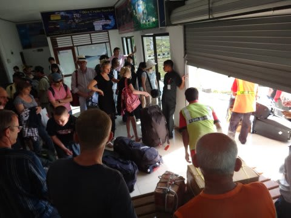

# 子連れコモドダイビングクルーズagain　その2

📅 投稿日時: 2011-08-28 01:16:12

🏷️ カテゴリ: [ダイビング日記](ce3a7a8d424d112fce83ee85c81a0e344.md)

さて．

乗船日．

朝4時半にモーニングコールで起こされて，5時15分ホテルピックアップ．

このとき，薄暗いホテルのロビーに集まったのは…

我が家族を除くと．

わずか5人．

ええ？

お盆時期のクルーズなのに，これだけですか？？

18人定員のクルーズ船，われわれ含めて，8人だけですか？

＃その理由は，後で明らかにされるのだった…

我が家族を除く5人．

2人が知り合い，3人が単独参加．

うーん．クルーズはやっぱり，一人旅って人が多いなぁ．

んで．

ピックアップの車で空港に向かい，

6時前に空港でラブハンバジョー行きの飛行機にチェックイン．

あ，この空港では，一人当たり40000ルピアの使用料がとられます．

インドネシアルピアの現金を忘れないように！

で，バゲージは20kgを越えると超過料金が取られることがあります．

1kgあたり10000ルピア．大体100円ちょいですか．

で…7時発のラブハンバジョー行き飛行機に乗り込みます．

飛行機は，去年から変わった，Bae-146というマニアにしか分からない高翼4発ジェット機．

搭乗後すぐ…

また，寝ちゃったよ．

我が娘は．

こいつは，乗り物に乗るとすぐ寝るんだよなぁ．

しかし，到着前に目覚め，しっかりと機内食として

配られたケーキみたいなのを必死に食べる娘．

で，約1時間半のフライトで…8時半には，ラブハンバジョー到着！

定番の看板前で写真を撮って…

空港ターミナルへ．

相変わらず機内預け荷物は人力で出てくるのね．

ここで久しぶりに，K澤さん＆K村さんと再会～！

お久しぶりです～！！

で．久しぶりの挨拶を交わしたあとは．

なんと．

ここで．

また衝撃的(?)な発言が．

K澤さん「今回，『しまじ』(サザンスタークルーズの船の日本名)

　のゲストは8人だけなんですよ」

S「それだけ少ないと，ゆったりしてていいですね～

　お盆時期なのに，ゲスト少ないんですね～」

K澤さん「いや…実は13人の団体さんが入ってて，『しまじ』に

　乗りきらなかったので，団体さんには別の船をチャーターして，

　同じルートで回ることにしたんですよ」

S「へぇぇ．2艘で並行ですか～．それで『しまじ』は8人だけになったんですね」

K澤さん「で，申し訳ないんですが…(しばらくの間)…

　実は，私はもう一艘の方に乗ることになってまして…

　基本的に同じルートで回るので，夜は合流できると思いますが」

S「ええええ～！！！また，K澤さんが乗らないクルーズですか！」

…はっきり言って．

4回，『サザンスタークルーズ』に乗船したリピーターゲストで．

そのうち3回が，マネージャー兼メインガイドである，K澤さんが

乗船しないクルーズに当たった人，というのも記録ではなかろうか…

まぁ，残念ながらK澤さんは乗船しませんが．

その代わり．

娘から絶大な信頼を勝ち得ており，

勝手知ったるK村さんが『しまじ』を仕切ってくれるので良しとしましょう．

ということで，5分ほど車に乗って，港へ向かいます．

港までの道からの景色は，道路もほとんど舗装されていないような，

きわめて素朴ないかにもローカルな風景が広がります．

こんなところに，ホントに観光客がいるんだろうか？

コモド方面の観光の中心地，ってのが信じられないような

寂れた漁村，といった感じの景色です． 

何をしているんだね？君は…

で，港に到着．

港でボートに乗り込み…

約1年ぶりに，『しまじ』と再開！

いやー．

変わってないなぁ．

＃細かなところは改修されてるけど

なんか，乗り込むとホッとしますね～．

んで，乗り込むと，ウェルカムドリンクが出された後，

いつもどおりK村さんから船の使い方の説明が始まります．

しかし…

その説明の途中．

お待ちかねの，「はしごのお部屋」の船に乗った娘は，

我慢ができないのか．

娘「はしごのお部屋に行く～，行く，行く～っ！！！！」

ということで，乗船4回目の私はちょいと途中で説明を抜けさせてもらって，

われわれの割り当て，6号室へ．

帰ってきたよ～．6号室．

…やっぱり，クルーズ船の船室にしては，ありえないほど広い部屋だな．

この部屋は．

娘は大喜びで2段ベッドのはしごを上ったり降りたり．

…お前はそれがやりたかったのね．

とりあえず，娘を部屋で遊ばせておいて．

私は引き続きダイビングデッキなどの説明を受けます．

なんか…ダイビングデッキのトイレがさらに改装されている！

3個のトイレのうち，2個が簡易版ながら，ウォシュレットつきに

なっている！

インドネシアにウォシュレットがあるとは！

あー．

「インドネシアに良くある，ウォーターガンみたいなのがトイレの壁に

ぶら下がってるだけでしょ？」

と思われる方．

違います．

ちゃんとした，TOTO製のトイレです．

…ただ，電動じゃなく手動，というところがユニーク．

こんなものがあるのか…

知らなかった…
