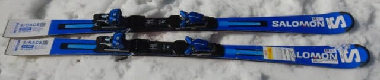
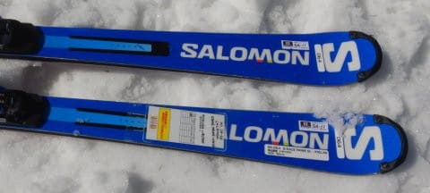
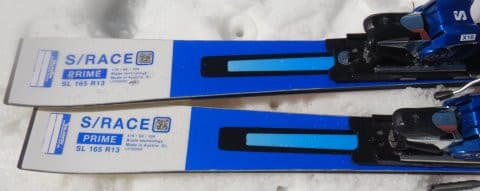
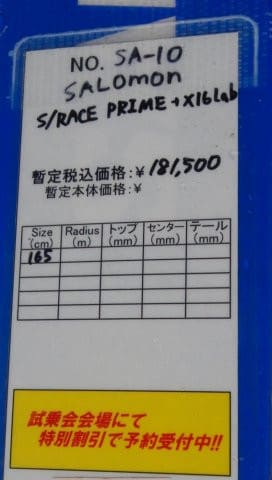
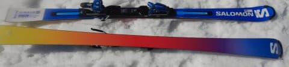
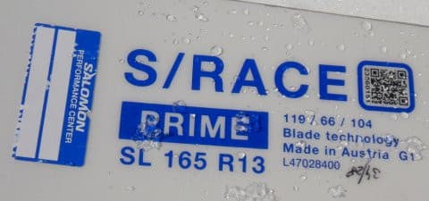
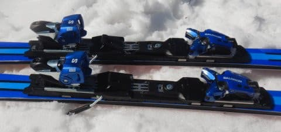
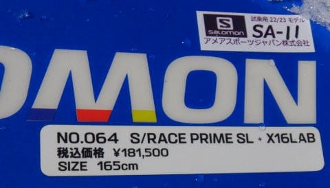

# 2023シーズンモデルのスキー板，試乗レポートその15…SALOMON S/RACE PRIME SL

📅 投稿日時: 2022-06-21 01:44:09

えー．

このBlog自体はまだ冬モードなんですが．

大変残念なことに，月山の滑り収めで

私のスキーシーズンももう終わって

しまっており（涙）．

…これからは，週末の土日のどちらか

更新を休む，夏モード更新で行かせて

もらいます…

いや．

記事を書くのが大変ってのもありますが，

週末にスキーに行かないこの時期．

やっぱりネタが不足気味で，毎日更新は

辛いんですよ…

（夏でもよくほぼ毎日記事書いてるよな…と，自分を誉めておく）

あぁ…なんで一年中雪が積もらないんだろう…

一年中スキーができたらいいのに…←だから，その場合は間違いなく身体と家計が破綻するって言ってるでしょ

ってなことで．

一応，まだ冬モードのこのBlog．

今日も2023シーズンモデルのスキー板の試乗レポート．

今回は，サロモン編です！

…しかし，すでに売り切れたという噂の

S/RACE PRIME SLの試乗レポートです．

では，どうぞ～！

○SALOMON S/RACE PRIME SL165cm

SL競技・基礎小回り用

来シーズンモデルからフルモデルチェンジする

SALOMONの競技・基礎向けスキーですが．

昨年同様，基礎用とSL競技用の区別は特になく，

SL系の板だとトップから

S/RACE PRIME SL

S/RACE PRO SL

S/RACE 12 SL

S/RACE 10 SL

と4種類ありますが，これはその中でも

最上級モデルになります…

そして，SALOMONのSLシリーズでも，

PRIMEだけ，滑走面がえらくハデですね…

で，SALMONはフランスのブランドで，

昔はフランスで板を作っていた気がしますが…

この写真，Made in Austriaと書かれていて．

今はトップモデルはATOMICと同じオーストリアで

作ってるんですね…

履いてみた感じ…

ビンディングがX16 LABという

かなり重めのビンディングなので，

結構足元にどっしりとした重さを

感じます．

そして，板にはかなりしっかりとした強い

張りがあります．

最初，SL板の割には曲がらず，まっすぐ行くな…

と思いましたが．

スピードを出すと，強烈なエッジグリップで

結構グイグイ回ってきます．

‘谷回りの最初はサイドカーブで回り始め，

そこからさらに踏むと粘りが出て，

板のたわみで回っていきます．

板の張りが強いので，スピードが出ても

板がそんなに簡単にはたわまず，

板をしっかりたわませるには，スピードと

ある程度の脚力が必要です．

ただ，ある程度のスピードが出てきて，

横Gがかかるようになってくると，

板が「しっとり」した感じでたわみます．

なんというか…粘りがあって，実に

しっとりとした感じでたわみ，そして

SL板らしい旋回半径で回っていきます．

ただ，板をたわませるには，そこそこの

中速域以上のスピードが必要です．

なんとなく，張りがかなり強い硬めの板が，

ガッチリグリップして，サイドカーブで

比較的小さい半径で曲がっていく…

という，HEADのSL板に近い性格を感じるかな？

この感じだと，ガンガンに硬い斜面で

かなり気持ちよくハイスピード小回りを

決められそうですが．

春先の荒れた斜面には向かないか…？

と思うところ．

しかし実際，荒れた春先の斜面を

滑ってみると．

意外なことに，ずらしていった時に

かなりきれいな旋回力が発生します．

ガッツリグリップ系の板だけど，

雪が柔らかく板がずれてしまったときも，

そのズレの中で板が旋回し続けます．

板が硬いので，深いコブは厳しいと思うけど…

意外と春先の柔らかい雪でも滑れちゃうよ！！

いや．

来年のSALOMON，結構いいじゃないか…！

板の重さもあり，求めるスピード域は高いので

気楽に履ける板ではなく，かなりの体力と

技術を求める板ですが．

かなりの脚力があって，結構なスピードを

出す人であれば，この板，かなりいいと

思います…

けど…

税込み18万1500円！？？？？

…これは，私が買える値段ではないですね…（涙）

（どっちにしろ，もう売り切れているようですが）

## 💬 コメント一覧

### 💬 コメント by (ikkun)
**タイトル**: Unknown
**投稿日**: 2022-06-25 15:34:34

スキーヤー減少が拍車を掛けているかもですよ(・・;)しかも戦争のせいでヤバい？とか？早く終息してと願いますが！

### 💬 コメント by (Skier_S)
**タイトル**: ＞ikkunさま
**投稿日**: 2022-06-26 21:32:08

戦争もかなりの影響を与えてるみたいですね（涙）

早くコロナも収まって，戦争もなくなって平和になってもらいたいものです…

