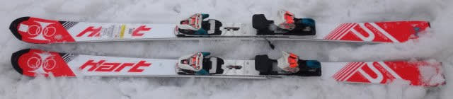
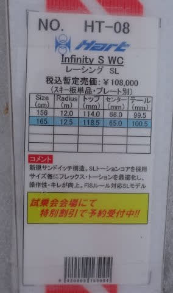
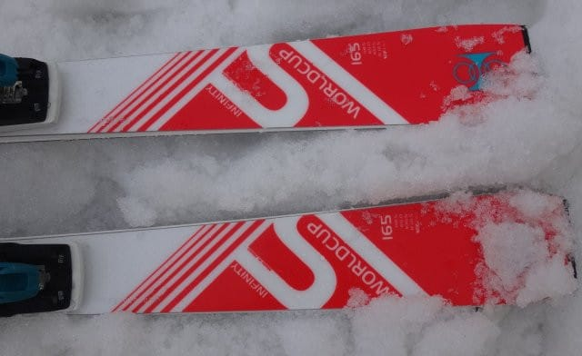
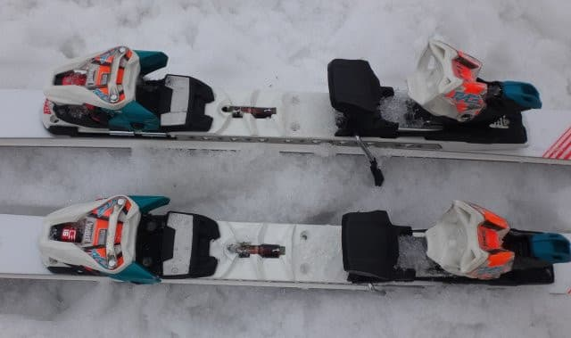

# 2018シーズンモデル，スキー試乗レポート第21回…Hart編

📅 投稿日時: 2017-06-22 03:09:06

🏷️ カテゴリ: [スキー板試乗](c0bd8048615710cee890e403a36cc9a2b.md)

本日．

某関西方面へ出張へ行ってたのですが．

新幹線が止まってひどい目に…（泣）．

遅れまくった新幹線．

新横浜駅着が深夜12時半過ぎで．

終電も完全にアウト（涙）．

それでもちゃんと帰宅して．

こんな時間にBlogを更新するSkier_Sです．

ってことで．

本日はスキー試乗レポート．

今日はハート編です．

ハートのSLモデルになります．

では，どうぞ～！

------

◎HART Infinity S WC 165cm

SL競技用．

ピュアな選手用モデルのようですが．

履いた感じ…

ずっしり重いです．

ピストンプレートが重いのかな？

スイングウエイトも，SL板と思えないほど重く．

あまり軽快感は無いです．

…が．

しかし．

その代り，雪面張り付き感ばっちり！

張り付いた中で安定してきれいに振動なく

小回りができます．

この重量感お陰で，試乗したのは昼近くの，

かなり荒れた斜面でしたが．

そんな荒れ気味の斜面でも，どっしりとした

安定感でゲレンデを切り裂いていくカービングマシンです．

決してずらす板じゃありません．

板の反動は，そんなに早くない感じ．

板の反動をもらって切り替えるような，

軽快さを感じる板じゃなく．

どっしりと板が回っていく中で切り替えていく

感じだったのですが．

反動をそんなにもらえなかったのは，

自分がたわませきれなかった可能性が…

谷回りでトップをたわませると，トップから

回ってきますが．

しっかりとした足場が作れないような柔らかい雪で

履いていい板じゃないです．

…これは．

かなりレベル高い人が，攻めるための板ですね．

私には履きこなせない板でした…（涙）

## 💬 コメント一覧

### 💬 コメント by (yama)
**タイトル**: よく帰宅できました。
**投稿日**: 2017-06-22 22:36:04

ニュース見ましたが、大変だったようですね。終電後に新横浜から自宅まで帰るのはかなり無理したのではないでしょうか。お身体御自愛下さい。

### 💬 コメント by (Skier_S)
**タイトル**: yamaさま
**投稿日**: 2017-06-23 02:48:21

いやーーー．

大変でした…

満員のデッキで大阪から新横浜までたち続け．

途中何度か止まりましたし…

新横浜から先，遅れた新幹線の接続用に

終電の時間以降なのに，電車が動いてました…

だもんで．

電車で無事帰宅できました．

いやー．

助かった．

