# 12月21，22日の週末の志賀高原スキー場の天気予想…今週末までに雪が積もってくれるのか？この週末は，ちゃんと天然雪で滑れるのか…？？

📅 投稿日時: 2019-12-19 01:23:55

🏷️ カテゴリ: [スキー天気予想](c6554f5c3c106093b511a8daae23757e8.md)

えー．

昨晩は更新が無く．

「ついに本当にSkier_Sは死んだか？」

と思った方も，2-3名ほどいらっしゃったか

もしれませんが．

生きてます．

…かろうじて…

普段から深夜帰宅が続き，毎晩の家での

滞在時間が8時間を切っているような

私ですが．

さらに最近，某国との時差のために

早朝電話会議が突っ込まれ，

さらなる睡眠時間の著しい時短が

進んでいる今日この頃．

昨晩は，帰宅後，Blogを書きかけていたのですが．

Blogを書き上げる前に，机に突っ伏して

朝まで寝てました…（涙）

また，明日・明後日と2連チャンで早朝電話会議があり．

さらに明日・明後日は2連チャンで忘年会という，

地獄の計画なので．

もし，また明日も更新が無かったら，

「あぁ…たぶん，死んでるんだな…」

と同情してやってください…

ってなわけで．

かねてから予想していた通り．

昨日17日火曜は，残念ながらスキー場は

雨になり．それも，かなりの降り

だったようで…（激涙）

さらに18日水曜も，午前中は雨が

残ったようですね…

一の瀬は，朝の段階で気温+5℃の雨だったようで（涙）

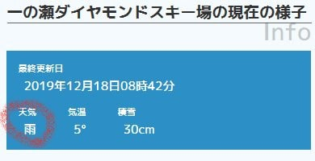

（志賀高原索道協会HPより）

そして，焼額山も朝は残念ながら

雨だったようですが．

昼ごろには，山頂は雪になったようです…

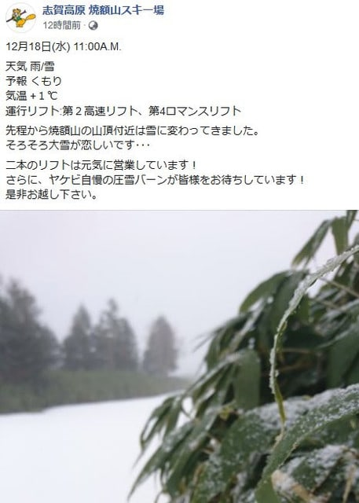

（[焼額山Facebook](https://ja-jp.facebook.com/yakebitaiyama/)より）

という感じで．

雪が降るどころか雨になってしまい，

滑走エリアが増えるどころか，

雪がさらに減っていく状況になったという

悲惨な17，18日だったわけですが．

…これから週末にかけ，冷え冷えで，

ドサドサ雪が積もってくれそうなのか？？←かなり期待薄

木・金の2日間で1mほど積もって，

ゴンドラが動いてくれそうなのか？？←ほとんどありえない

そのあたりを，予想してみましょう…

まずは，19日木曜の850hpa気温図を

見てみますが．

何とか，赤い0℃線は志賀高原より南まで

下がってくれましたね…

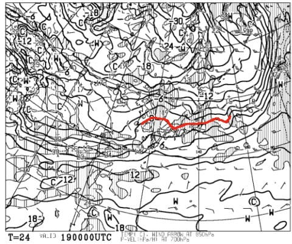

でも．

せっかく冷えてくれたのに，この日の

地上天気図を見ると，志賀高原での

降水量は無く．

数年前の雪不足の時の，

冷えると降らないの法則

のパターンにはまり込んでいる気が…

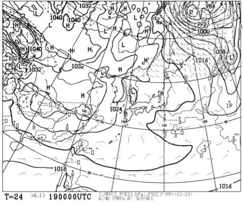

なぜ．17，18日の気温が高い時は

降るのに．

気温が冷えると降らないのか…

そして，20日金曜の850hpa気温図を見てみると．

この日も，無事赤い0℃線は志賀高原より北．

激冷えではないけど，雨の心配はなく，

降れば雪の天気図です…

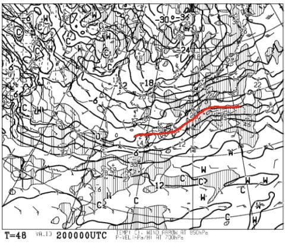

が．

この日の地上天気図を見ると．

やっぱりこの日も，水色の降水域，

志賀高原にかかってませんね（涙）

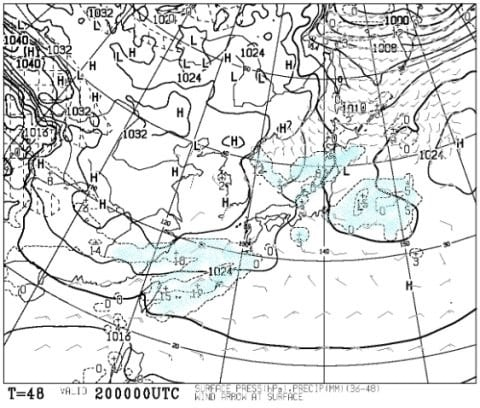

あぁ…やっぱり，冷えると降らないの

法則か…！？？

で．

肝心の週末，21日土曜の850hpa図を見ると…

この日も赤い0℃線は志賀高原より南．

志賀には-3℃線がかかっているので，

朝は-5℃以下．

昼間も0℃を超えることは無さそうで．

降れば雪の気温です！

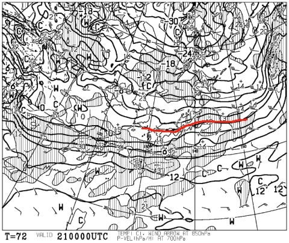

が．

21日の地上天気図を見ると．

水色の降水域，ギリギリ志賀に

かかっているかどうか，という

感じなので．

ドサドサ降ることは無さそう…（涙）

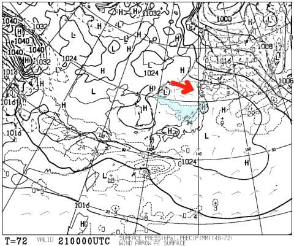

ってか．

朝鮮半島の付け根から伸びてる

降水域．

一本の筋のように[JPCZ](https://n-kishou.com/corp/corporate/technical-info/support/pdf/tec180213.pdf)が伸びて

いるのが分かります．

JPCZが出てるってことは，

そこそこ冷えてるってことなんですが．

このJPCZ.赤矢印で示したように，

かなり東に向かってたなびいているので…

結構な西風ということですね．

これは，志賀では降らない西風パターン…（涙）

で．

翌22日，日曜の850hpa気温図をみると．

この日もなんとか志賀高原は0℃線より

北にありますね…

この日も，降ってくれれば雪なのですが．

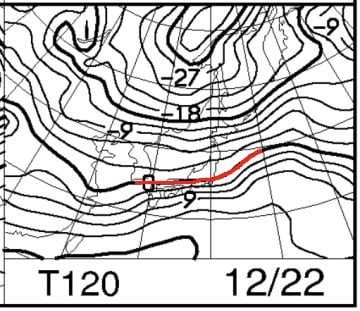

…地上天気図を見ると．

きわどい．

ギリギリ志賀高原は網掛けの降水域に

かかるかかからないか…

まぁ，この日も降ってもパラパラ程度．

とても積もってくれる天気図では

ありません（泣）

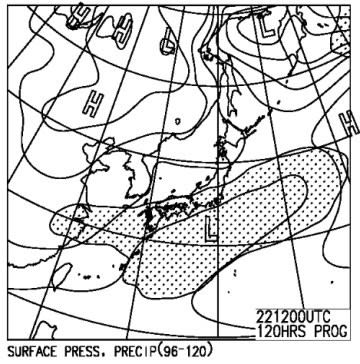

あぁ…

冷えると降らないの法則か…（激涙）

ってなことで．

まとめると．

19日（木）　朝の気温は-5℃以下に冷え，久々に

　人工降雪機稼働！昼間も0℃以下．

　天気は終日曇り空．積雪全く無し

20日（金）　この日も朝の気温は-5℃程度．この日も

　昨晩から人工降雪機フル稼働可能！

　がんばれ，人工降雪機！

　天気は曇り時々雪がぱらつくが，

　積雪の気配全く無し（泣）

21日（土）朝は-5℃以下に冷え込むか…

　一晩雪がぱらつくので，もしかしたら

　朝までに2-3cm積もってるかも？？

　とりあえず，天然雪は少ないけど

　この日も終日人工降雪機稼働可能！

　…でも，天然雪コースのオープンは

　期待できず…

　天気は曇り，朝のうちは雪がぱらつくかも．

　午後は時折日も射すタイミングもあるか…？

　昼間も，気温は0℃を超えない程度．

　雪質は硬めの人工雪．

　朝のうちはコロコロがいっぱい出て．

　午後は急斜面部分は削られて硬く

　なっていきそう…

22日（日）　朝は-5℃前後．昼間は0℃近くまで上がる．

　天気は朝から曇り空で，昼ごろから時折雪が

　ぱらつくタイミングも．

　全く積もる気配のない，弱い降りなので

　期待しないよう．

　この日も人工降雪のコースしか滑れないので，

　朝は硬めのバーンで，コロコロが出て．

　午後は所々ツルツルになっていくパターンか…

…という感じで．

これから週末まで，

天然雪の積雪は全く期待できない

感じです（涙）

とはいえ．

この1週間．

赤矢印で示した19日から24日にかけては，

だいたい平年並みの気温が続いて

くれそうなので．

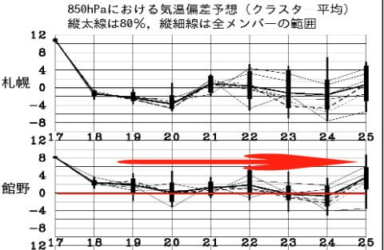

この一週間，雪が降らないまでも，

雨になって雪が解ける

という心配はいらなさそう…

そして，人工降雪機もずっと動かせる

気温ですので．

まだマシと思って，自分を慰めないと…

あぁ…

次に天然雪が積もるのはいつなのか…

少なくとも，25日までの天気図を見る限りに

おいては．

25日まで，ドサドサ雪が降ることは無さそう

です（激涙）

…踊ってもダメ．

歌ってもダメ．

寒いギャグを言ってもダメなら…

もう，普段やらないような珍しいことを

やって，雪を降らせるしかないか…？？

…もしかしたら．

私が今週末，志賀高原に行くのをやめたら，

雪になったりして…

## 💬 コメント一覧

### 💬 コメント by (みゆき)
**タイトル**: Unknown
**投稿日**: 2019-12-19 08:02:42

安否を心配した１名です（笑）

Sさんが志賀に来ないと珍現象過ぎて夏になってしまうかも知れないので、やめてくださいね‼️

ご無体が続いているようですが、降れ降れ踊りはお忘れなくお願いします

### 💬 コメント by (Skier_S)
**タイトル**: ＞みゆきさま
**投稿日**: 2019-12-20 02:58:02

とりあえず，生きてます…

死にそうですが（笑）．

今週末は灼熱の夏にしないよう，志賀高原に現れます～！！

