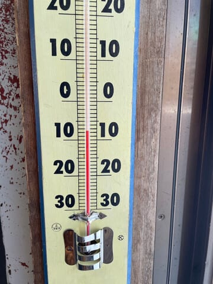

# 1月24日(金)の志賀高原スキー場の特派員情報…予想外に午前中からおおむね晴れの一日！そして私は土曜はスキーに行けず(泣)

📅 投稿日時: 2025-01-25 03:14:11

えー．

本日も，仕事をサボってお休みをとって

志賀高原へ行った特派員がいたようで，

写真が送られてきましたが…

どうやら焼額山は，朝のうちは昨日の

予想通り曇り空で．

また，朝の気温も-7℃と予想に対し，

-7.5℃とかなり正確に当てたようで．

そして朝イチの雪は，1-2cmの積雪は

無かったようですが，割としっかりした

圧雪だったみたいで．

ここまではおおむね予想を外してないな…

と思っていたところ．

なんだか…

朝9時くらいには中腹はまだガスっている

ものの，山頂付近は日が射し始め．

そして，その後しばらくですっきり晴れの

いい天気になったようです…！！

うーん…

晴れる予想じゃなかったんだけどな…

曇り時々小雪が舞うって予想だったのに，

予想外したか？？？

…と思ったら．

午後2時半過ぎからにわかに掻き曇り，

雪も舞い始めたようです…！

ふははは．

そうだろう，そうだろう．

そこまで私が予想を外すわけが

ないのだ…！！←これまで何度も予想を外してるけど，

都合の悪いことは忘れてるな

ということで．

昼前後はすっきり晴れるというところで

ちょっと予想を外したものの．

まぁそこまで多外しではなかったとして

自分を慰めた本日だったのですが．

土日の予想も，ちょっと天気図が変わって

来たので微調整しておきます…

土曜は曇り時々小雪と予想しましたが．

新しい天気図では，ほぼ降りませんね．

むしろ晴れ間も出てくるかも…

というところなので．

土曜は曇り時々晴れ間．夕方から夜は

ちょっと雪がぱらつくかも．

それ以外の気温・雪質は昨日の予想通り

日曜は，朝のうちわずかに雪がぱらつく

かもしれないけど，基本的に曇り．

朝の積雪はほとんどなし．

昼を過ぎて午後に向かって晴れていくか…

といった感じでしょうか．

ということで．

明日からの週末．

Skier_Sはまた志賀高原に行っていると

お思いでしょうが…

残念なことに，明日は仕事です（激泣）

休日出勤です．代休無しの廃休です（涙）

そして，今日ももう午後3時過ぎ…

明日，朝早くに出なくてはならないのに…

スキーじゃないのに睡眠が削られて．

それでいてスキーに行けないこの

くやしさ…

ってなことで，明日の志賀高原．

激烈吹雪になったあとに槍とミサイルが

立て続けに降り続け，

そして暴風でゴンドラとリフトがすべて

止まる

って，予想を書き換えておこうかな…←あなたが志賀高原の

天気を決めてるんじゃないから

とりあえず．

明日，焼額に行っても私はいませんので…（泣）

## 💬 コメント一覧

### 💬 コメント by (レインボー77)
**タイトル**: Unknown
**投稿日**: 2025-01-25 07:47:59

金曜日の志賀高原情報

朝の蓮池-4℃。曇り。視界は十分。道路に雪なし安全道。

10時頃から予想外に晴れてきたけど、13時30分の蓮池は-2℃。

朝の白樺、唐松は、やや硬の快適バーン。すぐに三高で仲間レッスンを受ける。今楽しく新しい課題に挑めるのも、超遅進歩のおかげ

ダイヤで昼食のあとは、ダイヤを廻して終了。最後のサウスはガタガタでした。

### 💬 コメント by (Skier_S)
**タイトル**: >レインボー77さま
**投稿日**: 2025-01-26 00:45:57

今日も結構よかったみたいですね…

うらやましい…

今日はハイスピードバーンになりそうだったから，朝大回りしたかった…

明日も滑りに行けません（涙）

また明日も報告お願いします…

