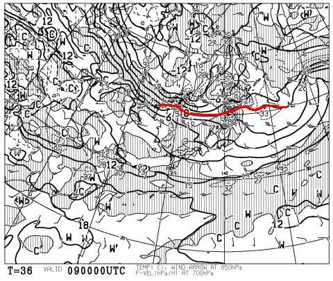
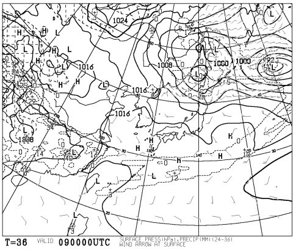
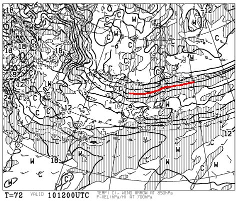
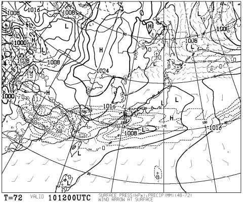

# 祝！通常モード復帰！今週末の志賀高原の天気は…典型的な春スキーの日かな…

📅 投稿日時: 2016-04-08 03:49:49

はいはいはいはいはい．

お待たせしました～っ！！

今日から，通常モード復活です！

…長きに渡った，このBlogの引っ越しモード更新でしたが．

＃それでも，毎日更新していたところがえらい！←自分で自分を誉めておく

ようやっと，自宅のデスクトップPCの接続が．

たった今完了しました…

＃もう深夜3:30を過ぎてる気がするんだが…？？

とりあえず．

今日は深夜1時に帰宅してから，家のネット環境を立ち上げ，

LANケーブルを廊下をまたいで張り渡し，

PCのケーブル類をつなぎこんでたらこんな時間に

なってしまいましたが…

PC復活がうれしいので．

今日から通常更新しますっ！

ではさっそく，今週末の志賀高原の天気予想，行ってみよう！

えー．

まず．

土曜，9日の850hpa気温から見てみると…

うーむ．

やはり，さすが4月．

0℃線は津軽海峡まで北上し．

志賀高原は+3℃線と+6℃線に挟まれる感じ…

で，9日の地上天気図はこんな感じなので．

うーん．南北に低気圧に挟まれているものの．

まぁ，高気圧に覆われて晴れそうかな．

だもんで．

朝は放射冷却で冷えて，

早朝は固いゲレンデで滑れそう…

でも．

午前中早い段階で雪は緩み．

強烈な日差しと相まって．

雪は強烈な勢いで悪くなり．

ゆるゆるザブザブの，板が潜っていくような

雪になっていくかな…

そして，日曜ですが．

うむ．やっぱりこの日も，志賀は+3℃線と+6℃線の間．

そして，地上天気図は…

あー．

南側から低気圧が迫ってきており．

うす曇り程度の，雲が多い朝で始まりそう…

放射冷却はあまり期待できず，朝から

緩めの雪でスタートかな…

でも，夜まで雨が降るようなことはなく．

終日曇り気味の天気でしょう．

雪の緩みは土曜よりましだろうけど．

やっぱり，湿ったザラメっぽい，この時期の

雪になりそう…

ってことで．

まとめると．

土曜：朝から晴れ！早朝は固めのスピードが出せるバーンでスタート．

　でも，強い日差しで午前早い段階で雪は緩み始め，

　昼ごろには板が埋もれるようなザブザブ雪になりそう．

　午後は急斜面は荒れ荒れ斜面かな．

　現時点では，終日晴れそう．

日曜：朝はうす曇り．朝も雪はそんなにガッチリ固まらず，

　緩い感じの雪でスタート．

　天気は終日曇りで，朝早いうちは太陽も見える

　タイミングもあるかもしれないけど，午後は雲が厚くなっていく．

　日差しは弱いけど，気温は上がるので，やっぱり昼間の雪は

　ザブザブに緩む．

…って感じでしょうか．

うーむ．

先週滑りに行ってないので．

今週末のゲレンデ状況がどうなっているのか…

かなり雪は解けちゃうのかな～（涙）．

とりあえず．

久しぶりの通常更新でした！
