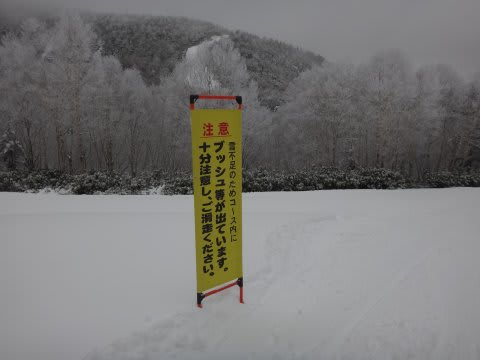

# 12月5日の志賀高原…2016シーズン営業初日の焼額は予想より良かったよ！

📅 投稿日時: 2015-12-05 20:18:06

🏷️ カテゴリ: [2016スキー滑走日記](c70c67ed5248e9432b899dcd5747048bb.md)

ということで．

今シーズン初の志賀高原へやってきているわけですが．

焼額は，高速リフト含め2本滑れるので．

まぁ，この雪不足の中を考えれば，かなりいい条件かな！

でも，一の瀬・焼額エリアで動いているのは，

高天原下半分のトリプル

一の瀬ファミリーの下半分のペア．

焼額第2高速，第4ロマンス

の4本のみで，ちと寂しい感じですが…

ってことで．

本日朝．

志賀高原を上る道は…

…予想通り，かなり本格的な雪道でスタート．

うーむ．実に久しぶりの雪道運転だな．

でも．正面に見えるサンバレー．

雪がかぶってますが，まだ下地の草が茶色く

透けて見えてて，ちょっと雪が少ない感じ…

ってことで．

焼額に到着すると…

ふむ．

気温はマイナス6度！

冷えてますっ！

そして，超久しぶりに戻ってきましたよ～．

焼額，第2高速リフト．

ああ…戻ってきた．

7か月ぶりに，帰ってきたよ～！！

…これまで，ずっとイエティだったので．

こういう雪景色のリフトは新鮮…

そして，山頂に着くと．

こんな看板がありましたが…

でも，ゲレンデに出ると．

ををっ！

ををををっ！！！

新雪が15～20�くらい乗ってるかな？？

意外と積もったんだなぁ…

ただ，人工雪がないところは，昨日積もった

この20�だけなので．

うーん．

ちょっと地雷原…

でも．

コースはしっかり人工雪がっ！

人工雪がついているコース幅も予想より広く…

4ロマ側はほぼ幅いっぱい滑れるよっ！

雪も，上に載った新雪が圧雪された，いい感じ！

大回りができるよっ！

今シーズン初の大回り…（感泣）

しかし，昨日急きょオープンが決まった第2高速側は…

人工雪がついてるのは，コース幅の半分くらい．

この写真だと全面滑れそうだけど…コースの真ん中に

棒が立っているのが見えますが，それより右側は

滑れません（残念）．

そして，そのコースも…

なんだこれは！

時によって殺人兵器と化す，氷のコロコロが…っ！

殺人兵器が大量にばらまかれた，硬めのバーンです…（ちょっと涙）

なので．

コースは気持ちいけど，リフトが遅くて時間がかかる4ロマを滑るか．

コースは硬くて狭いけど，高速リフトで効率よく滑れる2高を滑るか．

うーむ．

究極の選択状態だな…

コース上は，ちょっと人が多くなるタイミングもあったけど…

終日リフト待ちはなく．

大体がこんな感じのコース状況で．

いやーーーー．

Yetiと全然違う！

人が少ないし．

リフト待ちはないし．

快適だわ…

そして．

昼前からは，予想通り←強調するところ

日が差すタイミングもあり．

午後は時折雲がかかったり晴れたり，ごくたまにパラパラと

雪が舞ったりという．大体予想通りの天気で．

結構日が差したので，気持ちよくスキーができました～！

ただ…

第2高速側は．

夕方になってくると，ちょいと雪が荒れて．

凸凹＆アイスバーンで滑りにくくなったかな…

第4ロマンス側は，夕方になっても気持ちいい

雪質だったんですが…これでリフトが速ければ…（ちょっと惜しい）

ってことで．

この日は，焼額に戻ってきた喜びに打ち震えながら．

さらに，数日前までの予想よりずっといい，リフト2本運転，

新雪が圧雪された滑りいいゲレンデを，日差しの下滑れるという．

かなーーり満足して，16時の最終リフトまで

滑っていたのでした…

…今も志賀高原，冷え込んでいて人工降雪機

フル稼働中です．

明日，またコース幅広がってないかな～
