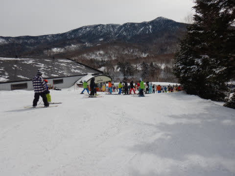
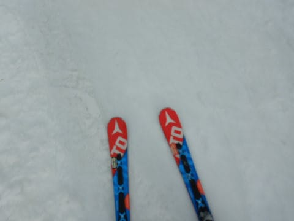

# 2021/3/27(土)の志賀高原スキー場は…うす曇り～晴れ，午前良かったけど午後はほぼ全面ストップ雪(涙)

📅 投稿日時: 2021-03-28 00:38:54

ということで．

今回，緊急事態宣言も解除され．夢や幻じゃなく．

リアルに志賀高原に戻ってきました～！！！

いやー．

ってなわけで．

今日は特派員レポートじゃありませんよ！

Skier_S本人自らのレポートですっ！！！

特派員レポートの方がおもしろいとか

言われたらショックですが

ってなことで，久々の本人による志賀高原

レポート，行ってみよう！！

…まず．

前日の昼間に15cmほど雪が積もりましたが．

昨晩からも，1-2cm積もったのかな？

そして．

いつも通り8:30の営業開始前から並びますが…

緊急事態宣言が解除されたし．

春休みだし．

ものすごい混むんじゃないかな？

と思ったら，営業開始前の列は，

それほどではないですね．

で．

山頂の気温は，朝イチですでにプラス気温と

かなり高め（涙）

山頂の天気はうす曇り．

気温が高いので，ガンガン青空より

うす曇り程度で日差しが優しい方が

雪が解けなくていい感じ…！

で，朝イチは…

うほーーーー！！

シマシマ！！！

ぐはーーー！！

久々．

実に久々の，

涙があふれ出るレベルの

やわらか雪のシマシマっ！！

ぐおおおおおーーー！

やっぱりこれだ．

久々のやわらか雪の，最高シマシマ！！

私のゲレンデ復活前日に雪を降らせて

くれた神様，ありがとう～っ！！！

やはり神様は．

日頃の行いが良い私がゲレンデに復活すると

聞いて，最高の雪を準備してくれたに

違いない！←違いまくり

朝イチガチガチかゆるゆるザラメを覚悟してたのに，

こんなやわらか雪のシマシマを滑れるなんて…！！

と，気持ちよく滑っていたら．

3本目にはかなりゴンドラの待ち行列が長くなり…

そしてその次，4本目の9時半には…

なんじゃ，この列は(涙)

後ろを振り返ると…

かなり列が伸びてます(涙）

…これは．

今日は奥志賀エキスパートは早朝営業をやっていて

雪が荒れてるだろうから．

寺子屋方面へ移動かな…？

と，一の瀬方面へ移動しますが．

朝の9:30の段階では，まだどこも

柔らかいいい雪で．

この時期としては，恵まれた感じ！

一の瀬パーフェクターも，ちょいと硬い

下地があるものの，良かったし．

雪も結構やわらかくて，

朝のうちはこの時期としては

いい感じの雪だったけど．

午前10時頃には，上に乗った雪が

緩んでくる気配があったので…

標高の高い，寺小屋へ！

昼に向かって気温が上がって，

暑いくらいになってきましたが…

寺小屋の雪は，まだ全然いい感じ！

一の瀬，高天ヶ原も，

午後になると雪が緩んで

下半分はストップスノーが出てきた

みたいですが…

寺小屋は緩む気配がなく．

昼過ぎても，ちょっと緩んでは

来たものの．

ザブザブになったり，ストップスノーに

なる気配は無し！

でも，他の場所がすべてダメダメ雪に

なってしまったので．

寺小屋のリフト，昼休み時間を除くと

ちょっと待ちが多かったですが…(涙）

午後は寺小屋を除いて，

全面ストップスノーの危険ゲレンデに

なったらしく．

顔見知りも全員寺小屋に集合してました…

今日は，寺小屋があって良かった，

といった感じかな？

ってなことで．

午後3時ごろまで寺小屋を滑ってましたが．

それまで，雪はちょっと緩み気味になった

もののゆるゆるにはならず．

ストップスノーにもならないまま，

いい感じで滑れました～！

が．

寺小屋を脱出しようと，一の瀬に出て

みると…

正面バーンはすごいコブコブ（涙）

下半分は，時々板が突っかかるような

ストップスノーで…

これは怖い(泣）

ところどころ水を吸ったような，

板が吸い付く雪になってます…(涙）

焼額に戻りましたが．

こちらも全面ストップ雪というわけで

ないけれども，滑っている途中，ところ

どころ突っかかるような感じで，

ちと怖い…

まぁ，気温が+5℃と高かったので，

朝のやわらかい雪が解けちゃうと…

板に張り付いちゃいますよね(泣）

雪はそれ程荒れておらず，いい感じで

大回りできそうなだけ…

ところどころ突っかかるストップ雪が

惜しい…！！

営業終了4時ぎりぎりには，日が陰ってきて．

雪が冷えたので，張り付きがなくなったのが

救いだったかな…

ってな感じで．

今日も営業終了の16:00まで

滑り倒しました…！！

うーん．

今日は寺小屋があってよかった…

久々の本格志賀復活なのに．

ほとんどホームゲレンデの焼額を滑らなかった…

で．

ここしばらく，何回か雨が続き．

3月はまともに雪が降ってなくて，

積雪量が心配だったけど．

今のところ，焼額はまだ土が出てくるような

デンジャラスゾーンはないので，

まぁ，平年並みの積雪量をまだ

キープしてくれているのかな…？

そして．

明日はやっぱり．

朝から気温が強烈に高く．

風が強めで．

焼額2ゴンとかはヤバいかも…

朝から雪はゆるゆるだろうし．

午後は風がさらに強まり，他のゴンドラや，

ヘタすると一部リフトもヤバいかも…

で．

やっぱり液体が来ます(涙)

皆さんの日頃の行いが悪ければ，午後1時ごろ．

日頃の行いが良ければ，リフト営業終了の

4時ごろに降り始める感じ…

ということなので．

明日スキーをする方は，自らの

日頃の行いを振り返って，

雨が降る時間を予想してください…

明日スキーをするのが私だけなら，

きっと私が帰るまで雨は降らずにいて

くれるはずなのですが←あなた普段の行いを鑑みるに，朝から雨になるくらいのレベルなんじゃないかな？

## 💬 コメント一覧

### 💬 コメント by (レインボー73)
**タイトル**: Unknown
**投稿日**: 2021-03-28 15:43:34

日曜日の志賀高原情報

今日は強風が恐怖。難敵南風が強そう。午後は雨予報だし。でも昨日は山菜採りのため、有給（？）休暇をとったので元気一杯。

今朝の上林はなんと８℃　蓮池７℃　高すぎやろ。

ゴンドラは当然休止。西たてに狙いを定めて、高天に駐車。あれっ、高天のクワッドが早めに動いてる。

滑り降りるとちょうど西たてが動いた。西たてを一気降り。あれっ、風がない。平和です。全く諦めていた今日が、こんなに気持ちよく滑れるなんて、エス様に感謝するしかない（？？）

昔からのことわざ『荒れたら西たて』が生きている。

数本滑ってブナへ。意外やブナが本日のベスト。ザラメっぽいけど滑る雪。ブナを何本も回したことは記憶にございません。

エス様を探しにヤケビヘ戻ると、サウスは快適だけど、カラマツは過過密。エス様はどこか雲の上。

雨も降り出したので帰ろうと。でも、パーフェクタ一本。途中でゴーグルを拭かないと危ないけどまずまずかな。

タンネ３本もベストにはほど遠いけど、この時期贅沢は言えない。

今日を諦めなくてよかった。吉田松陰先生はおっしゃったとさ。『まずはやってみろ』

昼過ぎに業務完了して、湯田中の関英ドライブインへ。そこで何人もの知人と遭遇。ゲレンデ友達はなかなか顔の全貌がわからないので、いい時間を過ごせました。

### 💬 コメント by (ゴン太＆なり＠SALLOT CLUB)
**タイトル**: 関英ドライブイン
**投稿日**: 2021-03-28 21:25:35

強風でゴンドラ休止、稼働リフトは待ち長し、雨も強くなりそう、今日は自宅に帰る日だし、早目に下山するかとの思考に至った「一般」スキーヤーの我が家は関英へ。

満席で、席待ちしていると、任務を終えたレインボーの皆さんも来店。ゴンドラやリフト相乗りで聞き切れないノウハウを、相席で聞くことが出来ました。

その後も続々と「一般」スキーヤーの皆さんが来店。ゲレンデなら直ぐ判るのに、スキーウェアから私服に、メットor帽子を取った素顔に、お互い「？？（どなただっけ）」の後「！！！（ああ～）」なランチタイムでした。

### 💬 コメント by (レインボー73)
**タイトル**: Unknown
**投稿日**: 2021-03-28 21:44:09

ゴン太様、素顔の私は、いつも裕次郎と間違えられるのですが、よくわかりましたね。

### 💬 コメント by (さち)
**タイトル**: Unknown
**投稿日**: 2021-03-28 22:54:00

土曜日は寺子屋が正解だったのですね…

ヤケクソでパルスゴンドラ乗りに下方面に行ってしまいました。

### 💬 コメント by (Skier_S)
**タイトル**: 志賀は4週連続週末雨(涙)
**投稿日**: 2021-03-29 00:39:49

＞レインボー73さま

『荒れたら西舘』が昔からのことわざだったとは知りませんでした(笑)．

ブナ，下の七曲りも雪は有ったんですか？

西舘の穴の開きっぷりを見ると，ブナの七曲りもヤバいかと

思ってました…

そして，関英ドライブインで皆さん合流したんですね(笑)．

＞ゴン太＆なりさま

今日の関英ドライブインは，ヤケビ朝礼メンバー含め全員集合してたみたいですね(笑)．

でも，ウェアを脱いだ皆さん，良く分かりましたね…

＞さちさま

ストップ雪になったら寺小屋です！

寺小屋良かったので，みんな集合してましたよ(笑)．

志賀にいらしてたんですね…お会いしたかったです．

ダイヤモンドで某氏とはお会いできましたが．

