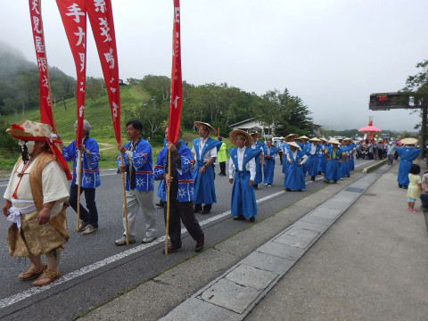
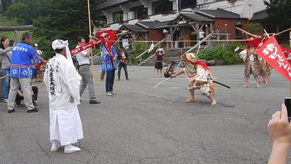
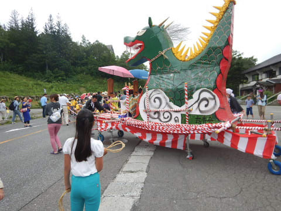
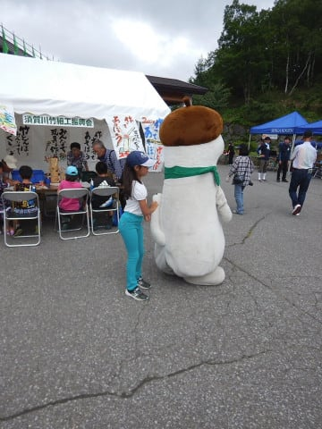
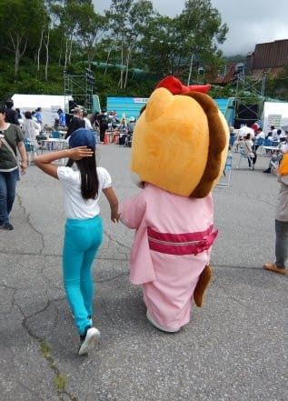
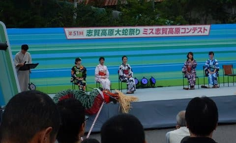

# 1泊2日の夏の志賀高原から帰宅…大蛇祭り楽しんできました～！

📅 投稿日時: 2017-08-21 02:17:44

🏷️ カテゴリ: [日記](cc4b5682fb7b8b144980957a978653fb0.md)

ということで．

明後日からパラオに行くにも関わらず．

昨日・今日と1泊2日で志賀高原へ

行ってきたわけですが．

志賀高原の夏のイベント，大蛇祭り．

楽しんできました…

今日は朝からおねり行列があったわけで．

その行列の出発の際の神事，「しめきり」．

出発点のしめ縄を切って出発するんですけど…

切られたしめ縄は観客に渡されるのですが．

なんと．たまたま，

横で見ていた娘がそれを受け取っていました…

なんだか，ちょっといいことあるかも…？？

おねり行列は，お祭り会場の98会館前でゴールで．

そこには，なぜかゆるキャラが大集合．

そこで，ゆるキャラと触れ合いまくっていた，

わが娘．

…娘にとっては，ゆるキャラとの触れ合いが

意外と楽しかったようです…

…まぁ．

娘にとっては．

このお祭りのメインイベントであるらしい

ミス志賀高原コンテストに，興味はないわな…

という感じで．

娘がかなり楽しめたらしい，大蛇祭り．

「また来年も行きたい～！」

といっているので．

今後恒例化するかも…

そして．

もし，私の気が向いたら．

また，詳細レポートするかもしれません…

とりあえず．

今日もいつも通り，帰宅が遅いので（笑）

まるでスキーシーズンの如くの，

今日の志賀高原速報レポートでした．

## 💬 コメント一覧

### 💬 コメント by (しんちゃん)
**タイトル**: 忠誠度高いですね
**投稿日**: 2017-08-21 22:22:47

夏も志賀高原で楽しんでいるなんて、なんと忠誠度が高いんでしょう。。。猛暑猛暑と街では暑いですが、高原なので、過ごしやすいんでしょうね。

もしも詳細レポートがあるなら、ゆるキャラコンテストとミス志賀高原の結果が気になります。

また、長野名物ジンギスカンは果たして入手できたのかも気になっています(笑)

この春、Goku様に教えていただき志賀高原おりきったところのイオンで買って帰ったジンギスカン、おいしかったですよ!(^^)!広めたいです～。。。

### 💬 コメント by (ゴン太(gonta))
**タイトル**: 10年後には
**投稿日**: 2017-08-21 23:12:24

娘さん、ミス志賀高原にエントリーでしょう！

### 💬 コメント by (Skier_S)
**タイトル**: 志賀高原忠誠度はかなり高いです（笑
**投稿日**: 2017-08-22 03:16:12

＞しんちゃんさま

いやーー．

もう，スキーシーズンが終わってから

タケノコ採り，大蛇祭と，もう2回志賀高原に

行ってますし．

どれだけ志賀高原が好きなんだ…

って感じですね（笑）．

長野名物むさしやジンギスカンのロースは，

ツルヤにもイオンにもなく（ロースじゃないやつはあるのですが…），

3件目のスーパーのユーパレット（江部交差点そば）で

やっと発見しました…

まさか3件もスーパーを巡るとは…！

でも，無事Getできて．

タケノコ狩りの時にGokuさんにごちそうになって

これのおいしさを知った娘は，超大喜びでした…

＞ゴン太さま

お久しぶりです～！

冬の志賀高原常連のゴン太さま，

夏の志賀高原には行かれないのですか？？

ミス志賀高原ですが…

うちの娘にはとてもとても．

もし，家の娘をエントリーして，

選ばれるようなことがあれば，

それはおそらく，

「人選ミス・志賀高原」

と呼ばれることになります（笑）

