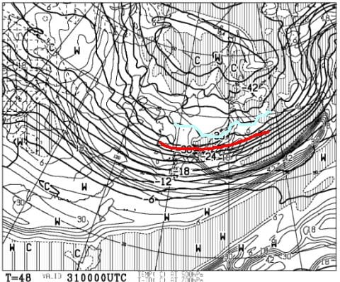

# この年末年始，12月30日から1月3日までの志賀高原の天気は？…ひたすら積雪が続く5日間．太陽は拝めないけど，冷え冷えで雪はいいよ！

📅 投稿日時: 2020-12-29 22:26:21

🏷️ カテゴリ: [スキー天気予想](c6554f5c3c106093b511a8daae23757e8.md)

えー．

おそらく，かなり多くの人が，

29日もSkier_Sは志賀高原で滑っているに違いない

と思ったことでしょうが．

残念ながら，29日は滑ってないんですね～．

26，27，28日と2泊3日で滑ってましたが，

29日は用事をこなすために一旦K奈川県に

戻ってます～！

…そして．

30日からまた数日間ぶっ続けで志賀高原に

滞在です！

中1日で志賀高原へ舞い戻ります…

ってなことで．

このBlog読者1億2000万人が気になって

昼間に寝られなくなってしまっているらしい←それ，普通だから

この正月の志賀高原の天気．

どうなるのか，予想してみましょう…

えー．

まず，30日朝9時の850hpa気温図ですが．

うーむ．

ギリギリ赤い0℃線が志賀高原にかかる程度…

朝はちょっと高めの気温でスタートしそう．

そして，等温線の密度が高いので．

…もしかしたら，朝はちょっと風が強くて．

うーん．ゴンドラは減速運転．

奥志賀ゴンドラは営業開始が遅れるかも？

そして，この日の地上天気図は…

全面降水量が予想されていますね…

うーむ．

30日は，朝からちょっとだけ重い雪が

降りそうで．

…標高が低いところは朝のうち

雨っぽいかも？

ただ，午前中から午後に向かってガンガン

気温が冷えて行き．

午後はかなり激しい雪になっていきそう！！

そして，大晦日の31日は．

850hpa気温図を見ると．

うおおおお！

0℃線は沖縄より南まで下がってますよ？？

沖縄にも-3℃線が近づいているので．

これ，沖縄でも雪が降りかねない感じ…

志賀は水色の-12℃線が近づいてるので，

朝は-15℃を下回り，

冷凍庫の中の方が暖かい

という気温になります…！

この日の地上天気図を見ると…

うおっ…

見事な冬型．

そして，日本海は完全に水色の降水域で

覆われていて．

離岸距離が異常に短いという，

典型的な大雪になる天気図…！

さらに，この日の500hpa気温図を見ても，

大雪の目安である，水色の-36℃線が志賀高原に

近づいているので．

これは…降ります．

31日朝までに，むっちゃ積もります！

そして，31日は一日中降り続けます…

で．

明けて1月1日の元日ですが…

850hpa気温図は相変わらず赤い0℃線が

沖縄近辺，志賀高原には水色-9℃線が

かかるレベルの激冷え！

朝は-10℃を余裕で下回りますね…！

そして．地上天気図は…

相変わらず，日本海側は離岸距離が短い

寒気の吹き出しの雲に覆われ．

激烈な大雪になりそう…

元日あさイチは，冷え冷えパウダーで

スタートですね…！

そして，続く1月2日は．

850hpa気温図を見ると，志賀は相変わらず

水色の-9℃線が近づいているレベルの

冷え冷え！！

地上天気図は，この日はちょっと

冬型が緩みそうだけど…

日本海側に降水域を示す網掛けが

かかっているので．

志賀高原は，雪が降ったりやんだり…

って感じかな．

ドサドサ雪ではないけど，太陽は

拝めなさそう…

で．

正月休み最終日，1月3日は．

水色の-9℃線が志賀より北に上がり，

志賀高原は-6℃線がかかるレベルなので．

これまでの数日に比べれば気温が

上がりそうだけど…

でも，昼間も-5℃程度の冷え冷えデー！

そして，この日も日本海側に網掛けの

降水域がかかっているので．

志賀高原は雪が降る天気でしょう…

ってなことで．

まとめると．

12月30日：朝は6時ごろから標高が低いところは雨，

　標高が高いところは重い雪が降りはじめ，

　あさイチは硬めに締まった圧雪の上に，

　うっすら重い雪が乗った状態でスタート．

　朝はちょっと風が強く，ゴンドラは減速運転．

　そこから気温が昼間に向かって下がっていき，

　昼から雪が本格的に降り始める．

　午後は激烈に冷え，雪が時折強く降る．

　夕方には雪がゲレンデにも積もりはじめ，

　ゲレンデは荒れ荒れに．

　夜は-10℃以下に冷えひたすら雪が降り続ける

31日：朝は20～30cmの積雪！

　あさイチの気温は-15℃くらいまで冷え，

　非圧雪コースは脛パフ，運がよければ膝パフ！

　昼間も気温は-10℃程度までしか上がらず，

　視界が悪くなるほどの感じで雪が降り続ける．

　ゲレンデは，午後には柔らか雪が蹴散らされた

　荒れたゲレンデになっていくが，雪質は

　冷え冷え最高！

　激烈に寒くて雪が降り続けるので，

　防寒対策をしっかりと…！

1日：この日も朝は30cm以上の積雪か？

　朝は-11～12℃まで冷え込み，ひたすら

　雪が降り続ける．

　非圧雪コースは膝パフ，圧雪コースも

　圧雪の上に軽い新雪が乗っている．

　終日雪降りで，この日も寒くて

　視界が悪いほどに雪が降り続ける一日．

　この日も終日雪質はいいけど，午後は

　ゲレンデはちょいと荒れ気味…

2日：朝イチは-10℃程度か？

　朝の積雪量はまだ予測不可能だけど，

　10cmくらいは積もりそうかな？

　あさイチはやわらか新雪に圧雪がかかった，

　かなり柔らかめのシマシマバーン！

　この日も終日冷え冷え，最高気温も

　-5℃程度．

　一日中雪が降ったりやんだりで，

　太陽は拝めなさそう．

　ゲレンデは全面柔らか雪に覆われ，

　午後はやっぱり荒れ気味に…

　

3日：この日は雪降りはちょっと

　一息ついて，降りは弱くなるものの

　曇り時々雪降り．

　あさイチの気温は-7～8℃程度，

　朝は柔らかシマシマ圧雪バーン！

　昼間は-3℃程度か．

　残念ながらすっきり晴れにはならないけど，

　2日までに比べれば気温も上がり，

　冷えた雪が楽しめるいい感じの一日．

…という感じでしょうか．

うーむ．

とりあえず，30日以降，4日ごろまで

平年比-6～-2℃低い，冷え冷えウィークと

なりそうです…

ってな感じなので．

正月休み，30日午後から1日まで，

-10℃以下の激冷えのふわふわ

激軽パウダーが楽しめそう…！

…

だけど，逆に言うと，太陽は拝めず．

寒くて雪が降り続ける，

根性の無いスキーヤーふるい落とし機能

が全力で働く正月休みになりそうです（ちょい涙）

一日くらい晴れてほしかった…

## 💬 コメント一覧

### 💬 コメント by (かず)
**タイトル**: Unknown
**投稿日**: 2020-12-29 22:49:46

30日修行の予感ですね…妙高も完全雨っぽい  今後に備えて休んでもよさそうですがやることないです…笑

### 💬 コメント by (Northfox)
**タイトル**: 志賀高原入りしました
**投稿日**: 2020-12-29 23:28:09

いつもは1ゴン前にトーテムポールのように建っているS様の板が見えなかったので今日はお休みなのかな？と思っていました。 

私は今日から志賀高原入りしました。今日のゲレンデコンディション良くて楽しめました。

しかし明日からどうなるか．．．．

### 💬 コメント by (そとく)
**タイトル**: Unknown
**投稿日**: 2020-12-29 23:31:12

ほぼ修行ですね。

年末年始の4日間しか行けない志賀高原なので、楽しみたかったのですが…

明日は、焼額山滑ろうと思ってます。あえるかな？（笑）

根性でぶっ飛ばしてる人がそうなのかな？

### 💬 コメント by (西館)
**タイトル**: あれ？読者数は1億3000万人の筈ですが？
**投稿日**: 2020-12-30 00:31:19

お時間無いなか、詳細な天気予報ありがとうございます。心より感謝しております。

そう言えば、昨シーズン、雪不足で天気予報を探してSさんに辿り着いたのでした。

そして、あっという間に『エス化』が進み、板を買いまくり、シーズン券を買い、3月末頃まで毎週末の宿予約を済ませ。

凄まじいまでの感染力！新型ウィルスよりも『エス化』パワーの方が数十倍勝ってる！！

ところで、お宿の皆さんの期待に応えるべく、1ゴンへ行って「布教用ステッカー」を受け取る使命が我々にはありますが、宿から脱出するためには、まずは非圧雪のWCコースを通らねばならず、太板を使いたくなるのですが、それだとゴンドラ内持ち込みになってしまうし、太板だけでは飽きてしまうかもだし、もしかしたら小回り板抱えて太板で脱出かな。

### 💬 コメント by (Hide)
**タイトル**: 修行僧
**投稿日**: 2020-12-30 01:40:23

S 様

年末年始は修行僧のみ生き残れる環境ですね。

K奈川県も風雨が強くなってきました・・・・。

次回は年明け3日に突撃予定です。

よろしくお願いしまーす。

### 💬 コメント by (ikkun)
**タイトル**: Unknown
**投稿日**: 2020-12-30 06:22:52

おはようございます❗  土日からやっとお客様が帰って来ました❗まだまだ少ないですが ……「こうでなくちゃ」と叫んだ私しでした約三日間？の晴れ間には先輩に教わりながらも昨年買ったフォルクルGSデモも気持ちいい(笑)  てか  一億??おめでとうございますm(__)m(笑)

### 💬 コメント by (みほ)
**タイトル**: Unknown
**投稿日**: 2020-12-30 09:39:33

詳細な天気予報ありがとうございました。

すごく参考になります！

風は結構強そうですが、各ゴンドラの運行予想をお願いできればうれしいです。

### 💬 コメント by (Skier_S)
**タイトル**: 明日は新雪パフパフデー！
**投稿日**: 2020-12-30 21:38:50

＞かずさま

志賀高原は微妙ながらも，午後はかなり冷えてプチパウダー行けましたよ！

このままいけば，明日は膝パフくらいの新雪が行けるかも…！

＞Northfoxさま

今日はお疲れさまでした．

今日は根性の無いスキーヤーふるい落とし機能が働く日でしたね（笑）．

でも，私はまぁまぁ楽しめました…

また明日，焼額でお会いしましょう！

＞そとくさま

今日は焼額で滑ってらしたのでしょうか？

謎のSkier_Sは発見できたのでしょうか…

意外とすぐわかるらしいのですが（笑）．

もし見かけたら，お声がけください．

＞西館さま

着実に『エス化』が進んでますね（笑）

そして…ショート板抱えて滑るんですか！？？

それはすごい根性ですね…

たぶん，その状況だと太板を楽しめないと思うので，

素直にショート板で脱出がよさそうな気が…

＞Hideさま

年明け3日から志賀来訪ですね．

お待ちしております～！

＞ikkunさま

志賀も土日は混みましたが，GoToが使えず大雪予想の本日は

ガラガラでした…

宿もキャンセル続出で厳しいようです（涙）

＞みほさま

この年末年始は，風はおそらく焼額のゴンドラが止まるほど

強くなることはなさそうです…！

奥志賀が止まることがごくわずか考えられますが，

正月休み期間はほぼ問題なくゴンドラが動くと思いますよ！

