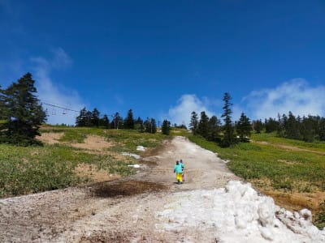

# この週末は渋峠で滑れず(涙)．だもんでシーズン初の山登りの足慣らしへ行ってみた

📅 投稿日時: 2022-06-06 03:57:39

ってことで．

本当ならこの週末に渋峠に滑りに行こうと

思っていたのに，週末まで雪がもたず，

悲しい思いをしていたわけですが…

どうやら，この土曜に．

某特派員は，渋峠まで様子見に行った

ようです…！！！

なんと，志賀高原への忠誠心が

高いことよ…

…でも．

営業終了翌日の土曜でこの状態って…

前日の金曜まで営業していたとは

思えないコース状況なんですが！？？

リフト降り場も…

これ，昨日まで営業してたんですよね？

一晩でこれだけ消えちゃったのか…(涙)

で．

この特派員は根性があるのか，

ネタを提供するのが好きなのか，

ここをハイクアップで滑ろうと

思ったようですが…

いや，それはやめた方がいいでしょう…

ってなことで．

渋峠で滑るのは諦めて．

少し草津方向に行った，山田峠近辺の

雪渓でハイクアップして滑ってたようです…

ってか．

そこまでやって滑ろうと思うとは…！

この特派員は，もう終わってる人認定しても，

誰も異論がないんじゃなかろうか…

うん．

この日滑りに行かなかった私は，

やっぱり普通の人だったんだなぁ…

やっぱりヤケビに集まる人はおかしいすごい．

狂ってる…すごすぎる…

ちなみに私は，この週末はスキーを

諦めて，山歩きに行ってきました…

今シーズン初の山歩きなので，

どんな感じだったか思い出す程度の

リハビリ登山で．

あんまり険しくない，2000mちょい超え

程度のこんな感じの山と…

向こうの右手に見えるとんがった

山をとかを登ってきました．

この週末は天気も良く，山頂からの

景色はけっこう良かったし．

聖地（？）志賀高原方面も見えたし．

結構楽しめたかな～．

シーズン初リハビリ山歩きなので，

無理をせず，まずは長くないコースで

カンを取り戻そう…と，標準コースタイム

5時間弱の短めのコースをチョイス

したんだけど．

さすが約8か月ぶりの山歩きってのもあり，

最初はやっぱり，山を歩くときの

効率よい歩き方を忘れてたものの…

1時間もすると，歩き方を思い出してきて．

休憩時間を入れても，3時間ちょいで

走破してしまったのでした…

で．

「まだまだ体力も時間も残ってる…

というか，全然物足りない…！」

と．

ついつい目の前にあったゲレンデを

1時間ほど登って．

斜面を下りながら，スキーのイメトレを

していたのでした…

しかし．

ここはいくらハイクアップしても

滑れないので．

雪渓をハイクアップで滑っていた，

いろいろ終わっている素晴らしいスキー愛の某特派員が

うらやましい…

なんてことは．

私は普通の人だからちっとも思わなかった

と，自分に言い聞かせるように

ここに書いておく，Skier_Sなのだった…

## 💬 コメント一覧

### 💬 コメント by (マルハバ)
**タイトル**: Unknown
**投稿日**: 2022-06-06 06:24:16

湯の丸ですかね？

### 💬 コメント by (モイストシルバー)
**タイトル**: Unknown
**投稿日**: 2022-06-06 07:05:04

私も湯の丸かな～と思いました。反対側にメインゲレンデが見えるので、第1ゲレンデ側を登られたのでしょうか。最後のリフトは第6ゲレンデですね。今シーズン湯の丸は何日か行きました。山頂から、志賀が見えるんですよね。

### 💬 コメント by (Skier_S)
**タイトル**: 正解！
**投稿日**: 2022-06-07 06:00:27

＞マルハバさま，モイストシルバーさま

正解です！

湯の丸山と烏帽子山登ってきました…

