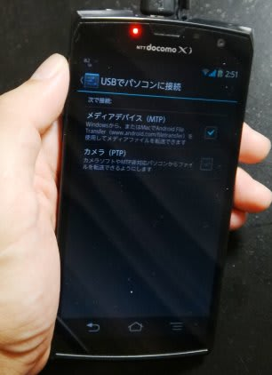

# プロジェクトX第2章…ナビのAV機能

📅 投稿日時: 2013-07-11 01:45:48

🏷️ カテゴリ: [車](cba0e8330b3f2ded7c1addfacc75d4547.md)

えー．

ってことで．

いつもと毛色が違った記事の後は．

また，プロジェクトX第2章が続きます…．

んで．

新しいカーナビ，KenwoodのMDV-Z700の[ナビ機能について，先日報告](eac22cf3800a1d89554e986745b92218e.md)しましたが．

今回は，ナビのAV機能について，ちょいと報告を…

まぁ．

最近のカーナビで大きな変化といえば，ナビよりむしろAV機能．

数年前までは，高級機といえばHDDナビで．

複数CDをHDDにコピーできます…ってのがメインでしたが．

ここ2年ほどで，一気にメモリナビがメインになり．

SDカード，USB，iPod，スマホ…

と，いろんなものが繋げるようになってきましたね～．

当然，今回のナビも，いろんなソースに対応してます．

こーやってみると，地デジやチューナー含め，かなり多くの

ソースに対応してますね～．

CD/DVDを再生できるのは当然として．

SDカードやUSBの中に入っているMP3などの音楽と，

mp4やWMVのH.264の動画が再生可能なのだ．

スキー場で撮ったSDカードの動画が，そのまま見れますね～．

＃でも，再生可能な動画サイズは1440x760まで．

＃フルハイビジョンサイズが再生できないのが痛い…

＃.mpgのMPEG2ファイルも対応しておらず，再生不可(涙)．

あー．

そうそう．

USBにつながるのは，USBマスストレージメモリとして

認識されるデバイスだけです．

USBハードディスクが使えるかな～，って試したけど，

USBディスクデバイスはダメでした…

ってことで．

スマホとUSB接続でつなごうとした場合．

スマホのUSBが，マスストレージメモリに見えないとつながりません

私のスマホは，USBメディアデバイス(MTP)として見えるので，

残念ながらUSBでナビとつないでも，認識してくれませんでした…(残念)．

で．

USBではつながらなかったスマホですが．

このナビは，スマホと繋ぐのに，

1．USBでつなぐ

2．Bluetoothでつなぐ

3．MHLでつなぐ

…って，3種類もの方法があります．

USBでつながらなくても，あきらめなくていいのだ．

2．のBluetoothは，スマホの音楽再生ソフトで音楽再生して，

ナビにBluetoothで飛ばして聞く方法．

前後のファイルやフォルダへのスキップは，

ナビから操作できますが…

ナビ側にファイル名や音楽情報は表示されません．

…ただし．Bluetoothを音楽を聴くのに使うと，

Smartloop情報やその他の情報を，スマホから

Bluetooth経由で取れなくなっちゃう…

って欠点があるのだ．

3．のMHL(HDMI)接続ですが．

これが，一番便利なんですよ．やっぱり．

…詳細は，明日に…

＃今日の日記は面白くなかった…(謝)

## 💬 コメント一覧

### 💬 コメント by (山田)
**タイトル**: Unknown
**投稿日**: 2015-01-13 15:10:55

運営者　様

初めまして、山田と申します。

様々な分野でのメディア運営や大手企業様のWebプロモーションなどのサービスを提供している会社で勤務しております。

このたび、貴媒体から有料で広告リンク掲載して頂けないかご相談をさせて頂きたくご連絡差し上げました。（相互リンクが難しいため）

弊社は現在、クライアント様のウェブプロモーションをしております。

現時点ではクライアント名を述べることはできませんが、世間一般に名の通った大手企業様です。

そこで、有料契約にて貴媒体からの広告リンク掲載をお願いしたくご連絡差し上げました。

貴媒体は有用な情報を掲載されており、是非広告リンク掲載をお願いしたいと考えております。

クライアントも、貴媒体からの広告掲載・タイアップを熱望しております。

是非、掲載位置や料金等のご相談をさせて頂ければと考えておりますが、ご意向をお知らせ頂ければ幸いに存じます。

誠にお手数ではございますが、ご返信は下記連絡先にご連絡頂きますようお願い致します。

E-mail： yuki.yamada.1985@gmail.com　　山田

（メールアドレス自動収集ロボットなどの対策のため、上記メールアドレスには全角の「＠」を記載しております。

　お手数ですが、お返信の際は半角の「@」に変更してください。）

何卒宜しくお願い致します。

### 💬 コメント by (Skier_S)
**タイトル**: 山田さま
**投稿日**: 2015-01-13 23:44:05

すいませんが，このBlog．

広告リンクをする予定はありませんので，

ご容赦願いたく…

