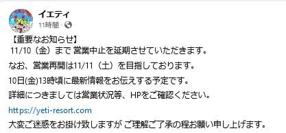
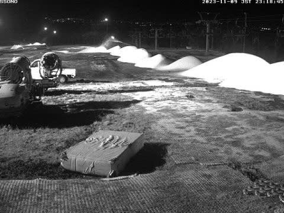
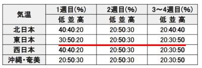
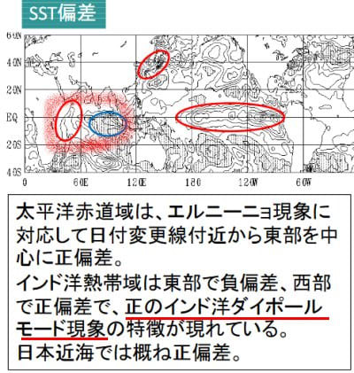
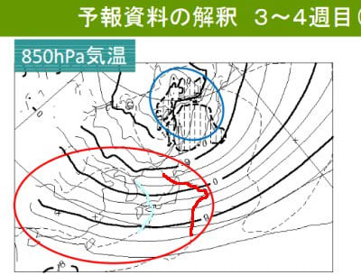
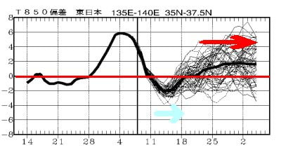
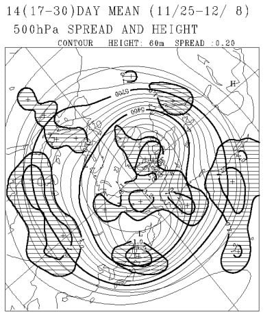

# 気象庁の1か月予報を見てみたが…11月下旬から12月は気温が上がるかも．そしてイエティはやっぱり10日の営業はあきらめたみたい．

📅 投稿日時: 2023-11-10 01:03:35

今週は暇じゃないのに月，火，水と

3日連続ですごい長い記事を書いてしまい，

睡眠時間が削られているSkier_Sです…

そして．

今日もまだ宿題が終わっていない…（涙）

ってなことで，ちょいと短めに更新！

えー．

まずはイエティの状況ですが…

昨日の予想通り．やっぱり10日のオープンは

あきらめたみたいです…

（[スノーパークイエティFacebook](https://www.facebook.com/YetiSnowtown/)より）

で．

9日木曜深夜現在のライブカメラを見ると…

うーん．

雪山は増えたけど，まだコースがつながる

ほどではないですね…

これ，明日雨が降ったら，11日のオープンも

ヤバいかも？

（[WNIイエティライブカメラ](http://webcam.wni.co.jp/KAC24326/loop.html)より）

うーん．

11日には何とか無事オープンしてほしいけど…

再オープンしても，10月20日のオープン

直後と同じ，また狭いコース幅に

戻っちゃうんだろうなぁ…（泣）

ただし．

昨日書いたように，11日から冷える！

少なくとも15日までは冷えるので，

そこに期待するわけですが…

皆さんご存じ，毎週木曜日は気象庁の

1か月予報が発表になる日．

いつも通り，[FCCX92](https://www.sunny-spot.net/chart/FCXX92.pdf)を見てみましょう！

まずは気になる気温傾向ですが…

まぁ，15日くらいまで冷える予想なので．

11日から17日の第1週は，平年並みが50％，

冷える確率が30％と，ちょっと冷えるかも？

という予想．

そして，2週目は逆に気温が上がる確率が

30％に増えているものの，まだ50％は平年

並みで，ほぼ平年通りかな…という予想．

しかし…11月25日から12月8日の3，4週目は

気温が上がる可能性が50％になっちゃって

ます（涙）

これは．

この1か月も引き続き，[正のインド洋ダイポール
モード](eba6aabb82183f8425d6fed8f647d087e.md)が継続するようで…

正のインド洋ダイポールモードといえば，

10月ごろから12月ごろにかけての高温を

招く，スキーヤー殺しの現象．

そのために気温が高くなるっぽい

です（涙）

いや…

スーパーエルニーニョとか言ってるけど，

スキーヤーにとっては，エルニーニョより

正のインド洋ダイポールモードのほうが怖い…

とりあえず．3，4週目にあたる

11月25日から12月8日の850hpa気温予想は，

本州中部は赤色の平年比+1度の線と

水色の平年比+2度の線に囲まれているので．

志賀高原あたりは大体平年比1.5℃くらいの

感じかな…

…2週間平均が+1.5℃というのは，かなりの

高温です（涙）

1か月の気温傾向を見ても…

11日から18日ごろに，水色矢印で示す

わずかに冷える期間がありますが…

その後，20日以降は気温が上がりそうで，

平年比+2℃くらいまで行きそう…（泣）

うーん．

平年比+3℃とか言ったら，焼額の

オープンが12月2日の予定から遅れる

可能性があるけど．

平年比+1.5℃程度なら，第4ロマンスだけ

にはなると思うけど，予定通り12月

第1週にオープンできるかな…

ただ，このままの予想だと．

第2高速やゴンドラがオープンの

週から動くという，恵まれたシーズンの

状態は期待しないほうがよさそうな

感じ…（泣）

でも．

しかし．

このBlogではいつも書いていることだけど．

気象庁の1か月予報，第3，4週の予想は外れる

ことも多いのだ！

[QXVV13](https://n-kishou.com/ee/image4/lfax/fcvx13_202311082100.png?x=21&y=15)のスプレッドを見ると，一見

日本付近は北海道を除いてスプレッド

（初期値ばらつき感応性…つまり，予想が

　どれくらいずれそうかの目安）は

それほど大きくなく，予想のズレは

少なそうに見えるけど…

でも，

予想スプレッドが小さくても，3，4週は

大外れしたことが何度もあるのだ！！

だから，3，4週が高温予想でも．

予想を裏切って激冷えになる可能性も

あるのだ！！

そう．

このBlog読者2億4000万人のみんなで

祈れば，3，4週を激冷えにすることも

可能なはずなのだ！！

みんな，祈り，踊り，

そして寒気の歌を歌うのだ！！←だんだん怪しい宗教化している…
