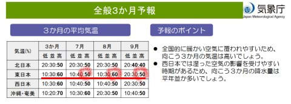
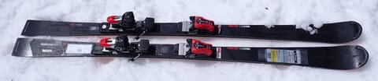
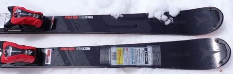
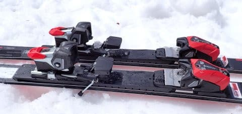
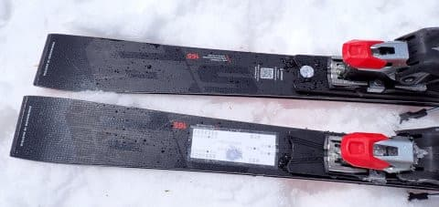
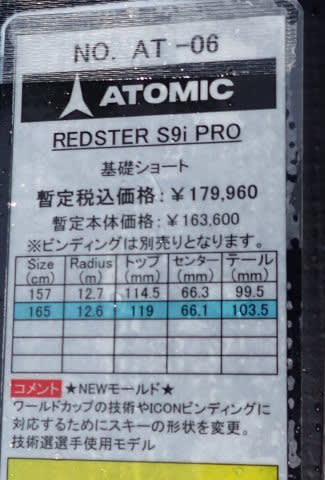
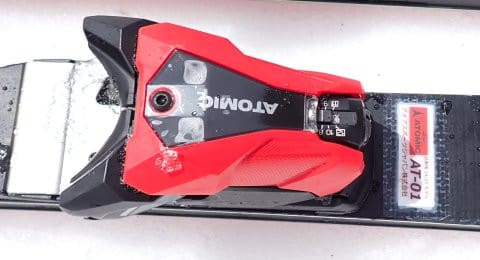

# 2025シーズンモデルのスキー板，試乗レポートその20…ATOMIC REDSTER S9i Pro

📅 投稿日時: 2024-06-28 03:51:36

えー．

6月25日に，[気象庁の3か月予報](https://www.sunny-spot.net/chart/FCXX93.pdf)が出ましたが…

…これを見ると．

7月は気温が高くなる確率が50％，

8月に至っては60％！

9月も50％と．

ｋの7，8，9月とも，気温が上がって，

暑い夏になりそうです…（涙）

でも．

夏が暑いと，その次の冬は冷えることが

多いので…

来シーズンの冬は，今シーズンよりちゃんと

冷えて雪が積もってくれることを期待…！

ということで，本題へ．

今日も2025シーズンモデルのスキー板の

試乗レポート，

今回は2025シーズンモデルのレポートとしては

初登場のアトミック編です！！

〇ATOMIC REDSTER S9i Pro 165cm 

基礎小回り用

基礎小回り用トップモデルのS9i PROですが．

見た目はあんまり変わってないっけど，

昨年からモデルチェンジしたようです…

そして，SALOMONのSL PROと同じく．

こいつもICONビンディングになってました！

SL PROは開放値10までのビンディング

でしたが，こいつは開放値12までの

ビンディングですね…

ICONビンディングもモデルが増えたみたい

ですね．

履いてみると…かなり重くてしっかり

していて，硬さを感じる板で…いや，

硬い斜面スペシャルの感じ．

しっかり硬めの板なので，

春のザク雪では雪が柔らか過ぎて板を

たわませることができず，サイドカーブ

なりに落ちてくる感じでしか

滑れませんでした…．

そして，どっしり感を感じるほどの重さが

あるので…感覚的には，SL板というより

サイドカーブがちょっと小さめのGS板の

ような感じ．

エッジグリップはかなり強く，

重い春の雪の中でずらすには強い筋力が

必要だけど…

ずらせないわけではないです．

板を動かしていこうと思えば動かしていけます．

板をずらしていってのコントロール性も

あります．

どっしり感があるので，スピードが出た中でも

安定感は高いし，トップからテールまでの

エッジがしっかり効いた中でも旋回半径も

大きめで…

ホントにGS板っぽい感じ．

普通にカービングで滑ると中回りが精いっぱい

ですが，スピードを出してちょっと硬めの

斜面に出ると，傾きを出せて小回りっぽく

持っていけます．

でも，カービング小回りをするのに求められる

スピードと落差はかなりのモノです．

人のいない硬いバーンを，かなりの

ハイスピードで大きな落差を取っていけば

小回りっぽく見せられる，かなり求める

レベルの高い板．

技術選とかのクローズドバーンで点を出す

とか，そういうレベルの板なのかな～…

うーん．

2024モデルより，ちょっと手ごわくなった

感じ．

普通のゲレンデで小回り用として履くのは

厳しいか．

私にとってはレベルが高すぎて，ちょっと

履きこなせないかな…

と思った板でした．

ただ，硬いフラット斜面で滑ってみたかった…

硬い斜面だと評価は一変するかも．
