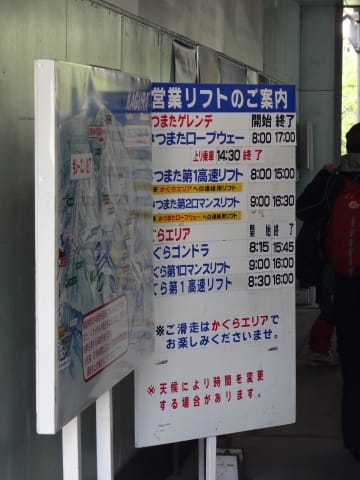
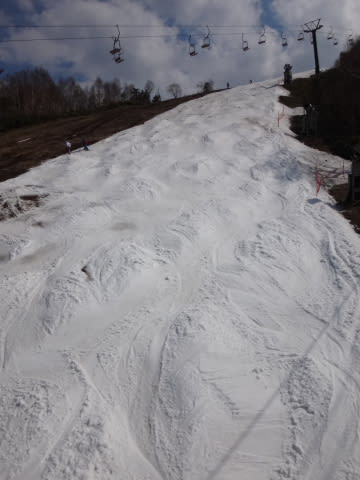

# 5月15日，日曜のかぐらスキー場詳細レポート…コース幅狭くなり，雪も薄いけど，神楽魂（?）で営業中！

📅 投稿日時: 2016-05-17 02:48:28

ということで．

GWのころは．

「かぐらスキー場の営業，もって15日の週末までだろうなぁ…」

と思っていたところ．

涙ぐましいスタッフのゲレンデ維持の努力により．

ペアリフトのみですが，15日の週末を乗り越え，

[22日までの営業が決定](http://blog.princehotels.co.jp/ski/kagura/035444.php)したようですっ！！！

…すごい．

すごいよ，かぐら…

でも，

なんとなく，最後の土日は．

[昨シーズンのラストのような感じ](e9753bbf1ba9fc522203b6e02fde04340.md)かな～，

…ヘタすると，それよりひどいかも…？？

＃すでに今週で，先シーズンのファイナル並みのような気が…

＃ってか，先シーズンはファイナルまでクワッドが動いてたし．

という気がする今日この頃．

皆様，いかがお過ごしでしょうか．

って時候の挨拶のあとは，さっそく昨日速報した，

この日曜日のかぐらの詳細レポートへ…

えー．

この日はすっきり晴れて，天気に恵まれていたのに．

こんな状況になってまで滑ろうというバカはそれほど多くないのか．

駐車場はガラガラで．

朝イチロープウェーもこの程度の待ちしかなく．

…さらに，雪不足のせいか，先週までは土日は7:30

スタートだった営業時間，8:00からスタートに

変わってました…

で．

ロープウェーを降りたら，

いつもの

「あれ？ピスラボって白色じゃなかったっけ？」

っていうピスラボの上を滑って…

みつまた高速リフトに乗り…

リフトを降りたら，

またピスラボを滑って，ゴンドラ乗り場へ…

という道筋で，ゴンドラに乗って

かぐらゲレンデに上がるわけですが．

やっぱりピスラボを滑ると，板が汚れだらけに…（涙）

とりあえず，ピスラボを滑って移動しようとする人は，

やはりどうなってもいい板を履いてきたほうが良いですな…

…ということで，はるかなる道のりを超えて，

やってきました，かぐらメインバーン！

って…

これ…

すごい雪減ってない？？

和田小屋からリフト乗り場への道は

こんな廊下になっちゃってるし…

そして，メインバーンも…

あり？

ありりりり？？

コース幅がかなり狭くなってる…

ゲレンデ維持のために，雪寄せした

みたいですね…

全体的なコース幅はこんな感じなので．

大回りはさすがにつらいか…

リフト降り場からの道幅も，かなり

ダイエットが進んだ感じですね（涙）．

でも．

朝イチは，多少凸凹していたものの，

コースにまだ土も出てないし．

人も少なく，そこそこ滑れるかな！

パークもまだ健在！

…と，朝の数本滑ったら．

うむ．

コース幅が狭いから，コース上の人口密度が

かなり上がってきましたね…

そして，1時間も経つと．

ザブザブの柔らかい雪なので，ゲレンデが

あっという間に凸凹になり始めますね…（涙）．

でも．

コース上の人は多いけど…

クワッドリフトは終日ほぼ飛び乗りで，

待ち0！

まぁ，

リフト待ち0だから，許せるかな…

と，思っていたら．

Oh！！！

10時ごろには…

コース上，ところどころ雪が薄いところが…（泣）．

そして，だんだんすごいことになり始めてきてますよ～（涙）．

しかし．

ここがかぐらのすごいところ．

大量な人海戦術により…

まず，硫安撒き部隊が出動し．

そして，ゲレンデ脇には雪出し部隊が登場！

このみなさんが，こんな風になったゲレンデを…

なんとか復旧させるべく，人力による穴埋め

大会を繰り広げます！

すごい…

すごいよ，かぐら．

普通のスキー場で，ここまで人員をかけてコース整備

するなんて，見たことないよ…

水が溜まってしまうところには，水路を切って

水はけを改良したり．

…いろいろ，涙ぐましい努力を繰り広げてくれてます…

…しかし．

大変残念なことに．

人海戦術も，偉大なる自然の力の前には無力であり…

昼ごろには．

ああ…

うぅ．

コース幅いっぱい，かなりデンジャラスゾーン化…（涙）．

…こ，これをどう滑ればよいのだ？？？

必死にスタッフが雪付けしてますけど，

これは，ちょっとやそっとの雪付けでは，

すでに回復困難な状態のような気が…

…でも，

コース全面の長さに渡ってこんなにひどく

なってるわけでは無く．

ひどかったのは，この写真で茶色く見える，この部分．

ここ以外は，コブ溝にところどころ穴が開いてる

ところがあったものの．

壊滅的に泥だらけってわけでは無いです．

他の部分は，こんな感じで，まだ滑れそうな

感じです…

あ，でも，この部分も．

あっという間にすごいコブになってきて，

午後遅くにはコブ溝に土が出てきてましたが…

でも．

デンジャラスゾーン以外は，

夕方になってもこんな感じで．

まぁ，コブ溝数か所アウトになっているものの．

なんとか滑れるかな～．

ってことで．

雪が薄いデンジャラスゾーンは不可避だけど．

そこ以外は．

スキー禁断症状に苦しんでいるか，

滑らないと死んじゃう人レベルであれば．

夕方まで，何とか滑ることはできる…という感じかな～

…ということで，夕方まで滑ったものの．

とりあえず，この写真の上の方に茶色くなっている部分，

ここが壊滅的状況だったので．

この日でクワッドの営業をあきらめたようです．

まぁ，極めて常識的な判断ですね（笑）．

今週は，ゲレンデ上部に残った雪を下して，

下部のペアリフトで何とか営業を続けるみたいですが．

…今週末まで，ゲレンデが切れずに維持できるのかなぁ…

…しかし．

志賀高原ですらほとんどのゲレンデが4月中に

終わっちゃった今シーズン．

この週末までゲレンデを維持しただけでも驚きなのに．

さらに今週末まで営業するとは…

コースの幅寄せのタイミング，

雪出しに使うためのコース閉鎖の判断，

人海戦術によるコース維持とか．

かぐらの執念，すごい！

## 💬 コメント一覧

### 💬 コメント by (Goku)
**タイトル**: やっぱり・・・
**投稿日**: 2016-05-17 20:09:29

予想通り夕方まで滑ったのですね(笑)

２時にリタイヤした20000ｍシルバー会員の私と、20000ｍ会長の差はココですね。

シーズンオフにトレーニングでもしない限り、ゴールド会員にはなれそうもないな～・・・

### 💬 コメント by (Skier_S)
**タイトル**: Gokuさま
**投稿日**: 2016-05-18 01:14:23

あ，この日は4時のリフトストップまで滑らず，

3時半には切り上げました…

＃30分早く帰っただけか！というツッコミを入れたくなるところ

会長と言っても，私は昼間だけで20000m行けない

エセ20000mですから（笑）

