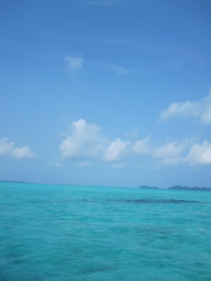
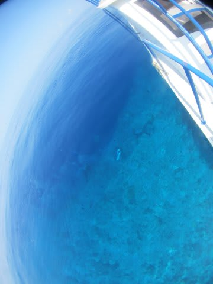
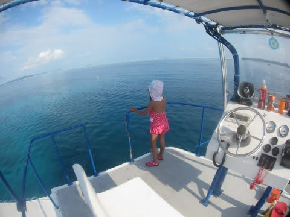
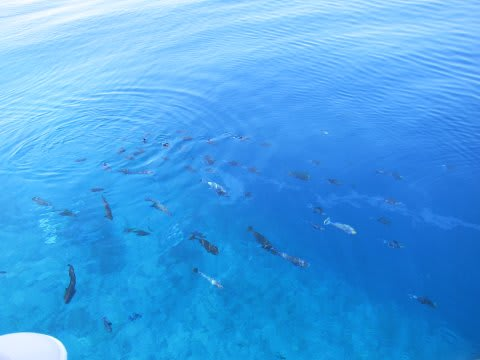
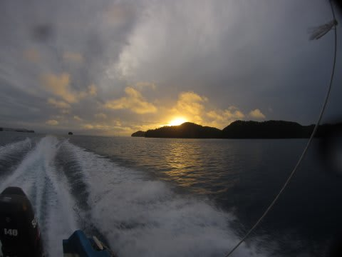
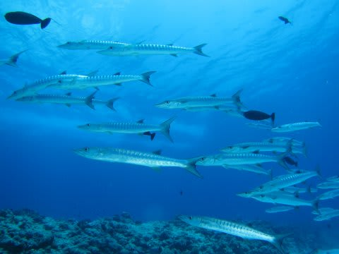

# 2014年10月，小学生の子連れでパラオへダイビングに行ってみた，プロローグ2…旅行のプランは？

📅 投稿日時: 2015-07-14 01:45:11

ということで．

子連れでパラオ旅行に行く！

…と，決めたわけですが．

飛行機の日程を見ると．

なんと．

ちょうど，秋休みにドンピシャ，

JAL直行チャーター便が出るじゃないですか！

JALチャーター便なら，直行なので，移動は楽だし．

ユナイテッドやデルタを使うより，ずーーーーっと安い．

さらに．

JAL直行便は，行き，帰りともに深夜便なので．

出発日は普通に出勤して，退社後に空港に行って間に合うし．

帰りの日も，早朝に帰国して，その日のうちに出社できるはず…←また，無理な日程を…

だもんで，

6日間の日程でも．

実質中4日．

3連休+1日休むだけで，行けてしまうじゃないか！！

とゆーことで．

往復は，JAL直行便で確定！

＃JAL直行便がある時は，パラオのダイビングショップが

＃かなり混むので，昔は避けていたものだが…

あとは，ホテルだけど…

お値段安めで，

ダウンタウンまで歩いて行けるところで．

まぁ，子連れで行っても問題ない程度の

きれいさのところって，どこかいな…

と，いろいろ調べたところ．

ウェストプラザ系列の，

ウェストプラザ・デセケルがそこそこきれいで広そうで，

かつスーパーが1Fにあるってことで，

子連れには便利でよさげだったので，そこを選択．

あとは，ダイブショップだ．

…子連れ乗船可能なところ…

うーむ．

なさそうだなぁ…

とりあえず．

いろいろと伝手をたどってみると．

デイドリームさんが，今回は特別に子連れ乗船を

認めてくれるとのこと．

＃しつこいようですが，普通は子連れ乗船は受け入れてません．

うーむ．

いつも利用しているのと違うショップだけど…

まぁ，最後の難関，子連れ乗船をみとめてくれた

ショップがあったってことだけで，ラッキー．

ということで．

子連れパラオの予約，すべて完了っ！

…あとは，出発日を待つのみ！！

…と，安心して過ごしていたのだが．

なんと．出発の前日になって．

妻から職場に，

「パラオ旅行行けないかも！！？？」

という．

全く思いもかけぬ，緊急事態を告げるメールが

やってきたのだった…

（続く）

