# 今度は2022/2023シーズンの志賀高原全山リフト券価格が発表されたよ…え？一日券6500円？4時間券でも5500円！？？

📅 投稿日時: 2022-10-07 06:47:04

🏷️ カテゴリ: [スキー雑談](c1f9d2cb7478308da16419928ea3945e9.md)

というわけで．

ホントはこのネタ，昨日記事にしようと

思っていたんですが…

昨日は記事を書かずに寝てしまったので．

一日遅れの記事になりますが…

今日も夜中に床で寝てしまい，朝に更新（泣）

…学習能力の無いヤツ…

で．

何があったかというと．

昨日，

志賀高原索道協会ページに

志賀高原の2022/23シーズンリフト券価格が掲載

されました～！！

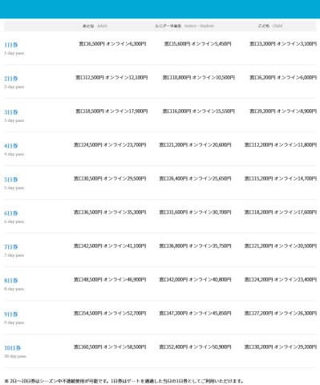

（[志賀高原索道協会ホームページ](https://www.shigakogen-ski.or.jp/winter/ticket/)より，以下同）

…だもんで．

当然，どのくらい値上げしたかを見てみるわけですが…

まずは一日券の値段を見ると…

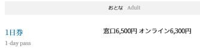

…な，なぬ～！！！

6500円！！？？？

昨年6000円から500円アップです！！

一日6500円は，もう普通の人が

「今日はスキーに行こうか」

と気軽に買えるお値段じゃないですね…

来シーズン，志賀高原はガラガラになるんじゃ

なかろうか…

ただ，昨年は無かったオンライン割引が

あるみたいで…

オンラインでリフト券を買えば，

200円割引の6300円になるみたいです！

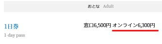

このオンライン割引ってのは．

[Webketのホームページ](https://webket.jp/pc/ticket/index?fc=00304&ac=0301)からクレジットカード決済で

チケットを購入した場合，割引になるようで．

志賀高原のICカードをすでに持っている人なら，

そのカード番号を入力すればリフト券窓口に

並ばなくて済むようです！

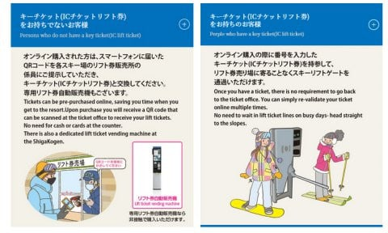

志賀高原のICカードを持ってない人は，

窓口に購入済みのスマホのQRコードを

見せれば発券してくれるようです…

オンライン割引が普及すれば，

窓口の混雑が減っていいかも？？

で．

一日券以外のリフト券がいくらになったかを

見てみると…

4時間券が5500円…（激涙）

ちょっと半日だけ滑ろうとしても5500円！！

それもこっちはオンライン割引なし！？？

…これは，もう…

半日だけ滑ろうか，と言って払える値段じゃ

ないですね…

ホントに次のシーズンは，志賀高原

ガラガラになるかも…？？

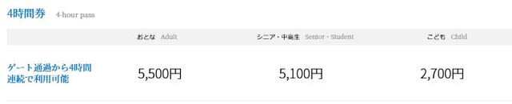

そして．

他の日数券を見ると…

2日券は12,500円（オンライン割引12,100円）

3日券は18,500円（オンライン割引17,900円）

と，一日ごとに6000円（オンライン割引だと5800円）上がっていく

システムです．

昨シーズンは一日5500円ずつ上がっていくシステム

だったので，一日500円値上げ！！！

（ちなみに2日券以上は連続で使わなくても，とびとびで

　シーズン中の好きな日に使えます）

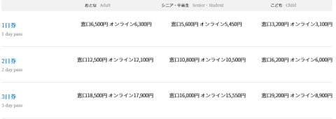

なので．

10日券は…

60,500円（オンライン58,500円）か…（激涙）

ちなみに，これが昨シーズンの価格表．

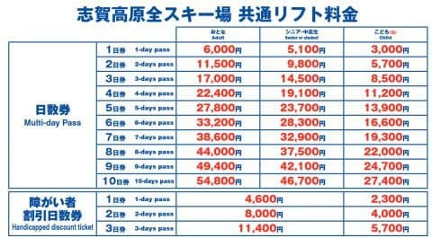

これが2シーズン前の価格表なので…

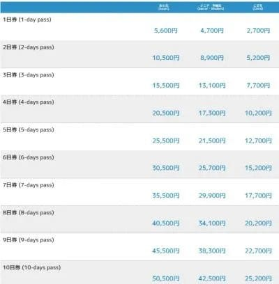

今シーズンの価格表と比べると，

この2シーズンでめちゃくちゃ値上がり

した感じが半端ない…

そして．

大人1人，小学生1人の2人分のチケットを

もらえる「大人，子供パック」が

昨シーズン同様に設定されていて．

こちらはまだちょっとリーズナブルな価格に

感じますね…

でも，これ，オンライン割引ないんだ…

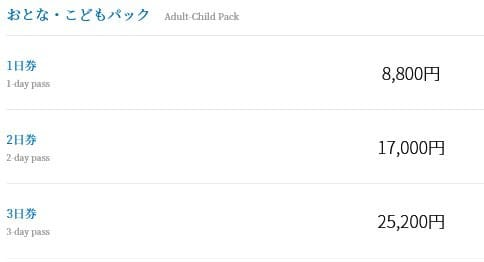

で．さらに．

今年は新しく，ハイシーズン（12/21～3/31)は

食事券付きセットってのが出るようです！！

これは，一日1000円分の食事券がついて，

オンライン割なら一日7000円．

うーん．

これなら，昨シーズンと同じ一日6000円で

滑れる換算か…

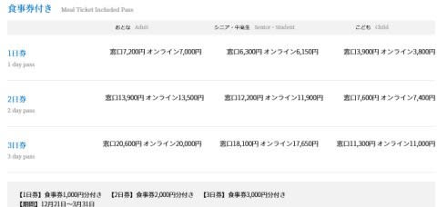

ちなみに．

トップシーズン以外の，初滑り・春スキー期間は

ちょっと割引になります！

12月20日まで，あるいは4月1日以降は，

一日5500円．

2日券は10400円．

うーん．

これならギリギリ許容できる値段だけど…

この時期は，中央エリアは一の瀬と

高天ヶ原，寺子屋しか滑れないことを

考えると…

微妙な値段…

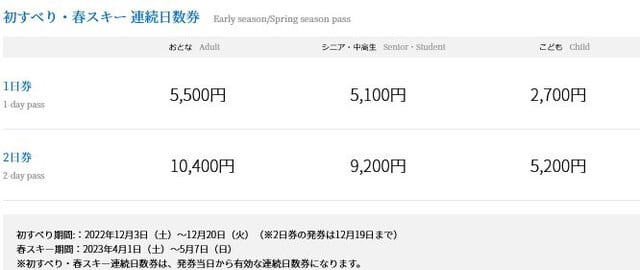

いや．

燃料費が高騰したり，

円安でいろんなものが値上がりして．

リフト券を値上げしないといけないのは

「そうなんだろうなぁ…」

と思うけど．

スキーがもう，選ばれしお金持ちだけか，

普段の生活を削ってでもスキーに行く！

っていう終わった人

のどちらかだけしかやれないスポーツに

なっちゃった感…

「ちょっとスキーに行こうか」と

お気軽にいけるスポーツでは

無くなりましたね（涙）

せめて値上がりした分，

昨シーズン動かなかった一の瀬ファミリー第3クワッドを運転する

とか．

崩落してクローズになった西舘中級コースを復活させる

とか．

ブナ平の下の七曲りをまっすぐなコースに戻す

とか．

値上がりした分，納得できるサービスを

してくれればまだ救われるけど…

おそらく．

志賀高原中央エリアは，そんな気の利いたことを

してくれないだろうな…

と，

諦めの境地に立つ，Skier_Sなのだった…

来シーズンは値上がりした分むしろお客さんが減って，

逆に売上が落ちる未来が見える…

## 💬 コメント一覧

### 💬 コメント by (たぉ)
**タイトル**: Unknown
**投稿日**: 2022-10-07 08:04:19

Sさんの言う通り標高も高いですが値段も高いですよね。私もですが年に数回のスキーヤーには痛いです(-_-;)コースの良さは別にして、他県の安いリフト券の2倍近いと考えちゃいますよね～。

### 💬 コメント by (かず)
**タイトル**: Unknown
**投稿日**: 2022-10-07 11:03:25

海外の人からすると超激安です  プラス円安でとんでもないことになるという都市伝説もありますよ……

### 💬 コメント by (副院長)
**タイトル**: Unknown
**投稿日**: 2022-10-07 13:51:25

値上がりだけでプラス効果してほしいですよね。第3クワッドとか西舘中級コース、七曲りもですが、僕は高速リフトは高速で、ゴンドラもフルスピードで、運転してもらいたいものです。

### 💬 コメント by (northfox)
**タイトル**: Unknown
**投稿日**: 2022-10-07 17:44:02

> スキーがもう，選ばれしお金持ちだけか，

普段の生活を削ってでもスキーに行く！

っていう終わった人のどちらかだけ

志賀高原は終わっちゃった人の蒸留濾過装置になりつつありますね。。。

あの人いつもいるなぁ、って人ばかりになるんでしょうかね❓

### 💬 コメント by (志賀スキ男)
**タイトル**: Unknown
**投稿日**: 2022-10-07 23:03:36

そんなにインパクトありますか500円の値上げ。逆にもっと値上げしてインバウンド需要も取り込めるハイクオリなリゾートを目指して欲しいものです、それだけの資源、価値があるわけですから。最高の雪質を謳っているにも関わらず宿は民宿レベル、食事はレトルトカレー。一方で一泊3万の宿は既に予約で満室という事情。そういう客層にターゲットを変える方が志賀高原の価値も上がるのでは。

### 💬 コメント by (Skier_S)
**タイトル**: 日本は物価安いですから…
**投稿日**: 2022-10-08 04:43:26

＞たぉさま

一日6500円となると，おそらく志賀高原には地元の人は来なくなりますよね…

他のスキー場に比べ，それだけの価値があると感じられればいいのですが．

とりあえず，スキーは庶民のスポーツではなくなったのかも（涙）

＞かずさま

そうなんですよね…USやカナダだと，一日$100余裕で超えますから，激安ですよね…

海外は，一日15000円くらいの感じですよね．

日本は円安もあり，物価が異常に安い国になっちゃいましたね…

最近，私の職場でも海外出張が復活してきたのですが，向こうのありえない

物価にみんな驚いてます…

＞副院長さま

確かに，リフト運転速度も戻してほしいところ…

ここ数年，普通の平日の志賀では滑ってないのですが，平日はゴンドラ

すごい遅いみたいですね…

＞northfoxさま

おそらく，志賀高原はシーズン券の常連さんとインバウンドのみが

生き残る，選ばれしサバイバーだけの地になるのかも（笑）

＞志賀スキ男さま

コメントありがとうございます～！

500円の値上げがインパクトあるというより，じりじり積み上がりついに

6500円になった…という値段がインパクトです（涙）

経営的には，ニセコのようにもっと値上げして，選ばれし富裕層＆インバウンド向けにする

戦略もありだと思います．

ニセコはシーズン券13万円超えますし，一日券も8500円ですから…

ハイクオリティなリゾートを目指すためには，海外や大手資本による

スキー場や宿泊施設への投資＆リファインが必要なわけで．

私も大手や海外の投資がガンガン入り，志賀高原がリファインされれば

もっと価値のあるリゾートになるんじゃないか？

その場合は多少値上げしてもお客さんがつくのでは？

と思ってますが…

今の和●会が仕切っている志賀高原でそれは無理…（おっと誰かが来たようだ）

ちょっと今の中央エリアは残念な感じがあるのは，志賀の常連は強く感じてるかと．

そこそこのグレードのホテルが奥志賀，ヤケビにしかないのも，

大手や海外資本が入れるのはここだけという制限によるものですから…

でも．

志賀高原のリフト代や宿代がニセコみたいな値段になったら．

残念ながら学費がかかる子供がいる我が家の家系状態では，

このBlogは，冬は志賀高原以外のスキー場のレポートをすることになりそうです…（涙）

### 💬 コメント by (なるなる)
**タイトル**: Unknown
**投稿日**: 2022-10-08 20:10:12

さすがに高いですね…

今年もシーズン券買うしかないかw

いくら高くても、人少ない方がい良いのが本音ですが…www

それよりも、ブーツを何とかせんといかんです

長岡まで行くのか、神田で済ませるのか

### 💬 コメント by (Skier_S)
**タイトル**: ＞なるなるさま
**投稿日**: 2022-10-09 23:02:20

私も，人が少なくて混まない方がいいな…と思いながらも．

あまりにも人が少なすぎて，経営がヤバくなるのはちょっと困るので…

やっぱりほどほどがいい感じですね．

で．ブーツですが…

私としては，スキーのレベルアップをしたいのならば，長岡に行くことを

おススメします…

### 💬 コメント by (うえいと)
**タイトル**: Unknown
**投稿日**: 2022-10-10 12:02:53

昨年同様　タイムズカードとJAFの割引500円が、ある様ですので現地で購入の際にはこれが、マシですね

並んでも空いてそうだし。

問題は、昨年どうように地区で売ってないところがある点ですね

### 💬 コメント by (Skier_S)
**タイトル**: ＞うえいとさま
**投稿日**: 2022-10-10 21:02:25

JAF割引500円続くんですね…！いいニュースです．

ただ，これ1日券しか使えないので，シーズン3日以上滑るなら，

オンライン購入の3日券以上の方が安くなるんですよね…

