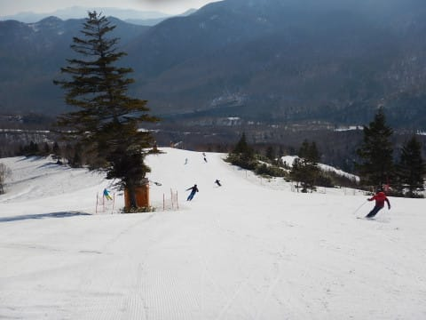
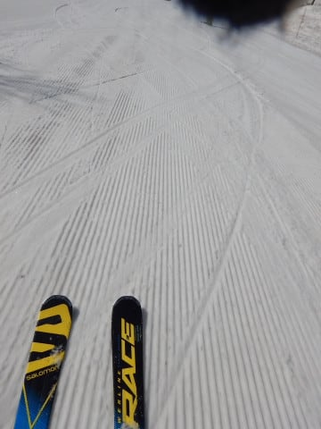

# 2019/5/4(土)，GW残り3日の志賀高原スキー場レポート！…そろそろ飽きてきたころだろうけど，今日は終日晴天．暑いくらいで雪は滑らず（涙）

📅 投稿日時: 2019-05-04 21:04:43

ということで．

このGW期間中．

「あれ？今日更新されてるんだっけ？」

と読者の方が思ってしまうほど．

ほぼ毎日同じような内容が続く，

このGWレポート．←マンネリ化してることを自覚していたんだ…

読者の皆さんも飽きたころとは思いますが．

Skier_Sが倒れたとか，死んだとかの

事件がないかぎり，明後日まで淡々と

続きますので．

諦めて読み続けてください…←マンネリ記事を読むのが苦痛じゃない奇特な人だけ読んでくださいね（笑）

ということで．

本日の志賀高原は焼額山スキー場．

この時期は，一番コンディションのまともな

早朝が勝負！

ってなわけで．

いつも通り，早朝からの参戦！

今朝もすっきり晴天で始まったわけで．

朝は放射冷却で，車のガラスが

ガッツリ凍り付くほどに

冷え込んでました…

朝から天気が良かった本日．

早朝オープンを待つ人の列は，このGWで

一番多かったんじゃないですかね？

ゴンドラで山頂に行くと…

気温は早朝から+3℃と高めですね（涙）

だけど．

明け方の冷え込みのおかげで．

バーンは硬めのシマシマ！

朝の一本目は，いい感じのハイスピードバーン！！

あぁ…GWまでこんな気持ちいいバーンが

滑れるなんて，シアワセ…（早朝限定）

昨日あった圧雪の凸凹も今日は少なく，

シマシマの仕上がり具合は最高！

いや…やっぱりこの時期は，

早朝に限る！！！

ビバ，早朝っ！！！

…と，気持ちよくシマシマバーンを

2本ほど滑りましたが…

3本目からは…

朝7時を過ぎたばかりというのに．

強い日差しが照り付けるので．

雪が緩み始めます…（涙）

そして，今日は人も多い！

朝6時半から滑ろうってバカ素晴らしい方が，

こんなにもいるんだなぁ…←あなたがバカ筆頭でしょ

でも．

雪は緩み始めたものの．

まだ下地はしっかりしてるし．

雪はまだまだたっぷりあるし…

GWでこんなバーンを滑れるなんて．

昨年を考えると，なんて恵まれているん

でしょう…！！

ただ．

早朝営業終了のころは．

ゲレンデ表面の雪はかなり緩んで．

バーンも荒れ始めて来ましたね…（涙）

ちょうどそんなとき．

通常営業開始タイム！

…そう．

通常営業開始と同時にオープンする

パノラマコースにとびこんで，

またシマシマを堪能しますが…

なんだか，すでにかなりやわらかめの

シマシマです（涙）

そして，第2高速リフト側，

唐松コースに行ってみると…

最後の落ち込み部分，土のエリアが

緒と広がってきましたね…（涙）

でも．

あと3日は問題なく滑れるでしょうし．

焼額全域で，ここ以外コース上に

土が出ているところはまだないので．

まだまだ滑れる，焼額山なのですが…

ただ．

午前9時を過ぎると．

雪の滑りが悪くなってきました…（涙）

大変残念なことに．

もう，午前10時ごろになると．

雪も重く，かなり雪の滑りも

悪くなってきちゃったので…

ゲレンデを滑る人はムチャクチャ減りました．

いや．

この時期．

やっぱり早朝がいいから，

昼間より早朝の方が人が多いですね…

リフトももう，さみしいくらい

ガラガラです．

そして．

昼間の気温は+12℃と．

ここ数日なかった高温に

なっちゃいました（激涙）

まぁ，このくらいの気温が，GWとすれば

平年並みなんですが．

ここ数日，気温が低かったので．

スキーウェアだと暑くてたまらない

感じは，今シーズン初かも…

この高温＆強烈な日差しで．

午後の雪は，大変残念なことに．

かなり滑りが悪い，残念な感じの

雪になってしまいました…（激涙）

もう，やっぱりこの時期は．

早朝勝負ですね…（泣）

滑っている人は少ないので．

午後になっても，ゲレンデは荒れずに，

結構フラットなままなんですが．

しかし．

いかんせん，板が滑らない…（涙）

ということで．

ほぼ無人となった，午後の焼額山．

GSコースの一部は荒れたものの．

そこ以外は結構フラットなのに．

天気もすごく良くて，

雪もいっぱいあるのに．

滑らない雪にやられて，

午後は楽しさ半減だった，

今日一日だったのでした…

明日は，もしかしたら，通り雨みたいな

にわか雨が一瞬だけ降るかもしれませんが．

基本的には今日と同じような終日晴れで，

気温が+10℃以上まで上がる一日に

なりそうです．

この時期．

日が差すと，昼には滑りが悪くなって

いっちゃうので…

…やっぱり明日も，早朝勝負ですね…

ということで．

明日も焼額の早朝から滑ってます～！

## 💬 コメント一覧

### 💬 コメント by (naoちゃんねる)
**タイトル**: Unknown
**投稿日**: 2019-05-05 20:51:12

早朝営業終盤に、娘だけ連れていって頂きありがとうございました。やはりこの時期は通常営業スタートではだめですね😢

いよいよシーズンの終わりが見えてきてしまいました…

あ、Sさんはまだ２ヶ月続きますねっ(笑)

### 💬 コメント by (なんちゃってレーサー)
**タイトル**: Unknown
**投稿日**: 2019-05-05 20:59:17

(この名前で誰かわかりますかね....)

この週末は久しぶりに会えて嬉しかったです。

あの滑らない雪の状況で、午後まで滑ったのですね。

滑走面をブラッシングして、フッ素を塗れば少しは良かったかも知れません。

それはそうと、早朝オープンを待つ列の写真、よく見ると私が写ってますね。

### 💬 コメント by (FCAMEL)
**タイトル**: 今シーズンもお世話になりました。
**投稿日**: 2019-05-05 21:24:20

今朝、後ろ髪をひかれつつ志賀高原を離れ、一足お先にシーズンに幕引きしました。今シーズンも数々の貴重な情報をありがとうございました。来期も引き続きよろしくお願いします。（オフも是非！）

### 💬 コメント by (Skier_S)
**タイトル**: なんと，明日がGW最終日！
**投稿日**: 2019-05-05 23:55:14

＞naoちゃんねるさま

もう，やっぱりこの時期は早朝勝負ですから．

しかし，明日で焼額終了とは信じられません…

とりあえず，来週からはかぐら通いです～！

＞なんちゃってレーサーさま

今回は久しぶりにお会いしましたね．

このBlogをちゃんとチェックしていたとは…

さすがというかなんというか．

私は当然のごとく，ラストゴンドラまで滑りましたよ～！

しかし，この時期の張り付き雪って，フッ素系ワックス効きますか？？

なんだかすぐに効果が落ちて滑らなくなるんですが（涙）

＞FCAMELさま

今シーズンもお世話になりました～！

私はまだまだシーズンが続きますが，

また来シーズン（またはオフ）にお会いしましょう～！

