# 2016年8月　子連れで再訪！モアルボアル旅行記その12…2日目の1本目のダイビング

📅 投稿日時: 2017-09-08 02:22:15

えー．

昨日は久々のスキーネタだったのですが．

スキーネタをやると．

このBlogの読者数が跳ね上がるのが

よく分かった今日この頃，みなさま

いかがお過ごしでしょうか．

…しかし，例年なら，9月に入るとスキー場

オープン情報や，新シーズンの施策などの

情報がいろいろ出始めるものですが…

今シーズンは，まだあまり情報が出てきませんね～

ということで．

スキーネタが続かないので．

今日は不人気なダイビングネタ←開き直り

しばらく中断していた，モアルボアル旅行記です．

では，どうぞ～！

---

ということで．

船は1本目のダイビングポイントへ到着！

ポイントは，「トンゴサンクチュアリ」という，

サンゴのきれいなポイントで，

サンゴにスズメダイ・ハナダイ系がいっぱいついている

らしいのですが…

とりあえず，エントリー！

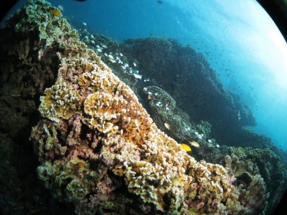

…うむ．

確かにサンゴに魚がいっぱい！

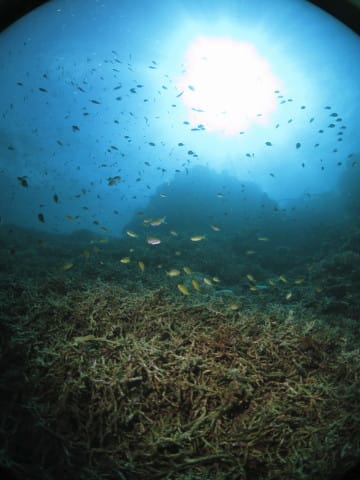

メラネシアンアンティアスが群れる中…

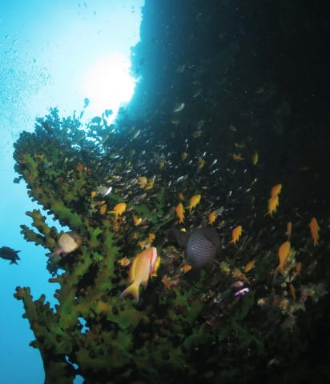

時折，パープルビューティーが群れでわーっと

泳いでいきます…

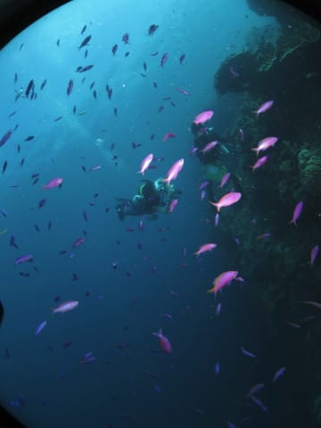

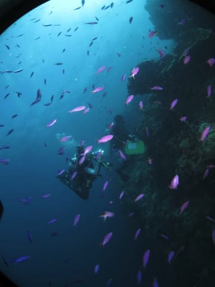

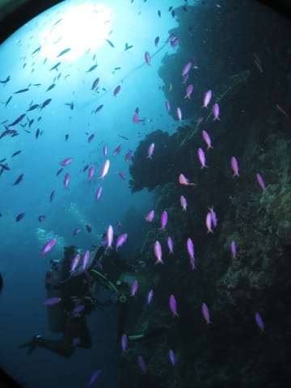

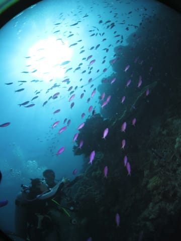

そんな魚密度の高い中，サンゴの間を覗くと．

ハナビラクマノミがいるけど…

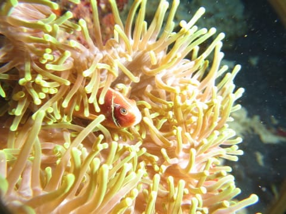

なに？ちょっと目の上に変わった模様！？？

ガイドは，「眉毛付き」と言ってましたが，

確かに，このハナビラクマノミ．

目の上に，眉毛みたいに白い模様が…

そのほか，「ピクタスブレニー」

と紹介されたカエルウオ．

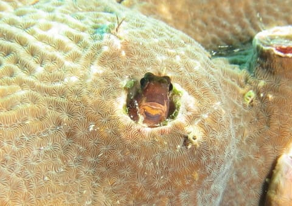

頭だけしか出してなかったので，

種類の同定は難しかったけど…

写真を見ると，これ，ホントに

ピクタスブレニーかな？？

そして，再びスロープ沿いを進んでいくと…

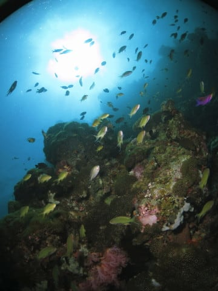

いやー．

いかにも熱帯の海っぽい，カラフルな世界が

広がってます…

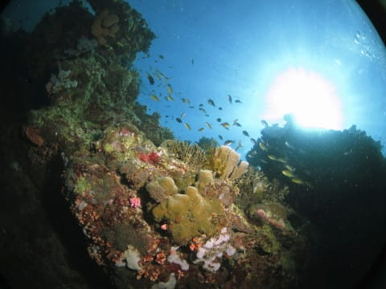

カラフルなハナダイ類やスズメダイがごっちゃりの

サンゴの海で癒されたければ．

モアルボアルは，結構いいところだわ…

そして．

こんなクマドリカエルアンコウちゃんがいましたが…

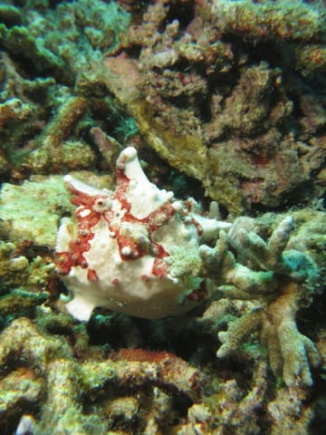

さぁ．

どれが頭か分かるかな？？

って感じで．

ダイビング後半，浅瀬にやってくると…

そこに広がるのは，元気なエダサンゴの群生！

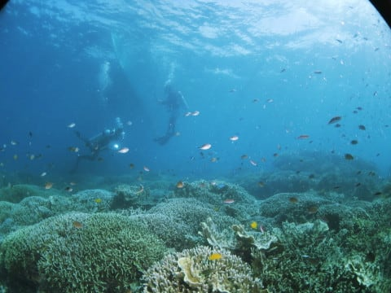

そんな浅瀬で，サンゴに群れる

魚たちを眺めていると…

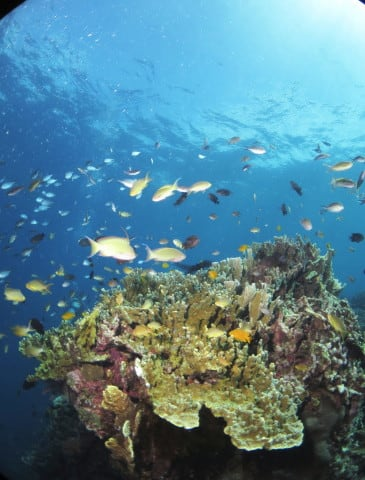

エグジットタイムです．

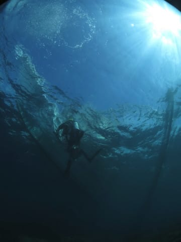

あぁ…

こんな穏やかな癒しの海から，上がりたくない…

しかし．

きれいなサンゴとお魚たちにたっぷり癒された

45分のダイブタイムでした～！
