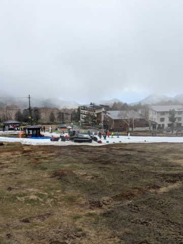
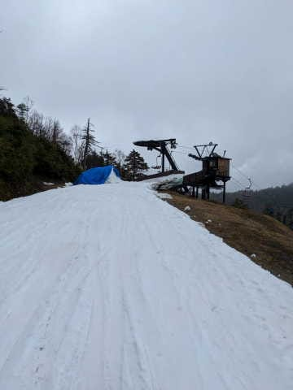
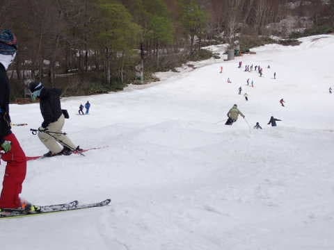
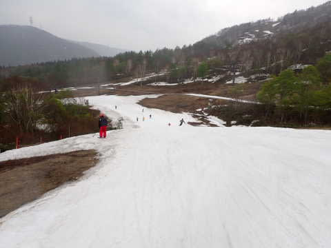

# 2023/5/13(土)のかぐらスキー場，ゲレンデ状況の詳細写真追加…そして5月14日(日)の志賀高原スキー場特派員情報！

📅 投稿日時: 2023-05-15 00:27:19

ってなことで．

本日のかぐらスキー場は，悪天候のため

営業休止になったわけですが…

悪天候にもかかわらず，渋＆横手は

営業したようです！

まず，渋峠は…

朝はそれほど雨はひどくなかったみたいですが，

強風で7時営業開始予定が7:15からスタートに

なったようですが…

ガスで視界も悪く，風も強くてリフトも

時折止まるような状況で．

あんまり状況はよくなかったようですが…

でも，リフト乗り場付近もまだ雪はいっぱいあるし．

リフト降り場周りもまだ行けそうだから…

例年なら，まだ気合で営業を続ける

レベルですね…

ただ，強風のせいで8:30で渋峠は営業を

打ち切ったみたいです…(涙)

あぁ…

これにて渋峠，今シーズンの営業終了です．

で．

渋が強風で営業中止しても，横手山の海和ゲレンデは

営業していたようです！！

リフト乗り場付近も，たっぷりとは言わない

までも，まだ雪はついてますし…

降り場もきわどいけど，まだ何とか

もっているようで．

一見，まだ数日はもちそうな感じ…

ただ，メインゲレンデ部分．

雪が一部薄くなってるみたいに見える

ところもありながらも…

渋と違ってここは人工雪を付けてあり，

下地が硬いので，すぐには穴が開かない

感じ．

バーンの幅もあり，下地も硬めで，

バーンは悪くはなかったみたいで．

人もそこまで多くなかったみたいですが…

ただ，11時ごろまでは雨風がそれほど強く

無かったけど．

11時を過ぎると雨が降り出し，暴風雨に

なっていったようです（涙）

しかし．

それでも，暴風雨で誰もいなくなった

ゲレンデをラストまで滑っていたのが，

今回の写真を送ってくれた，某志賀高原

特派員らしいところ…

ということで．

渋峠は終わったものの．

海和ゲレンデはもう少し持ちそうな

感じでしょうか…

20，21の週末までもってくれると

いいなぁ…

というところで本題へ．

昨日の土曜のかぐらスキー場．

昨日の記事にだいたいの状況は書きましたが…

今日はゲレンデ状況の写真を追加です！

まず，あさイチの段階では…

人も少ないし，バーンもフラットでいい感じ！

ただ…

コース幅はもう狭くなってきてますが…

でもこれだけ幅があれば…

かぐらメインバーン，高速リフトでグルグル

できるし，やっぱり今一番コンディションがいい

ゲレンデなのでは…？

雪自体は緩めだけど，フラットなあさイチの

うちは気持ちよく滑れます！

リフト乗り場前も，整備状態はよく

雪の厚みは十分だし．

和田小屋からリフト乗り場までの，

いつもなら薄くなって穴が開く

コースも，今シーズンはまだ厚みが

十分確保されてます！

リフト降り場近辺も，まだ大丈夫そうな

雪の厚みが確保されてますね～…

ただ…

ジャイアントコースは滑走不能なレベルで

剝げてるし．

テクニカルコースも全く雪が無い

ですね…（涙）

この状態で，滑れるコースだけは

しっかり厚みが確保されているのは

コース整備力のすごさだと思います…！！

ちなみに，ペアリフトの降り場は

なんとかメインバーンから雪を運んで

繋いでいる感じですが…

ペアリフト乗り場の方はまだまだ雪が

たっぷりあって，全然大丈夫そう．

この日はクワッドが空いてたので，ペアには

ほとんど人が乗ってませんでしたが…

とはいえ…

いつもなら巨大キッカーがあるパーク．

キッカーはもうないし．

おそらくキッカーを崩してこのあたりの雪を

かくほしているようで…

例年より苦労してコース維持している感．

で．

昨日も書いたように，リフト待ちは

それほどでもなかったですが．

昼前にはゲレンデの人口密度がかなり

すごい感じになってしまい…

雪も春のすごい重いザブザブ雪なので…

当然のごとく．

10時過ぎにはかなりのコブ斜面に

なってきます…

時間が経つにつれ，コース幅すべて

避けようのない深いコブコブ化が進行して

いきます…

そのせいで，コースの雪の薄いところ．

掘削されて，下地がかなり薄くなった

部分もいっぱい出てきましたが…

人工雪の硬めの下地があるからか，

完全地面まで貫通しているのは

まだ少なかったかな…

でも，コブラインとかの深いところは，

ところどころブッシュさんが顔を出す

ところも…（涙）

とりあえず，石ころ踏み用の捨て板を

履いてきた方が，精神衛生上いいです…

とはいえ．

営業終了に近い時間で，いつもなら穴だらけに

なることがある和田小屋からリフト乗り場の

コースはブッシュもなく，全然大丈夫だったし…

雪が薄いながらも，この雪不足の年に，

当初の営業終了予定1週間前にこれだけ

雪があれば，まだ良かったと言えますね…！！

ってなことで．

この週末はまだ楽しめたかぐら．

今日から15日までの暴風雨と，

17，18日の「夏か！？？」という超高温に

耐えて，20，21日の週末までゲレンデが

もってくれるのか？？

かぐらファイナル予定の21日まで滑れる

ことを祈りましょうっ！！！
