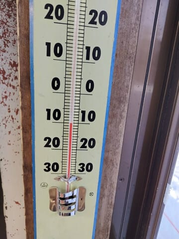
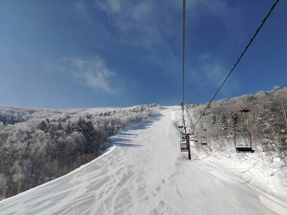
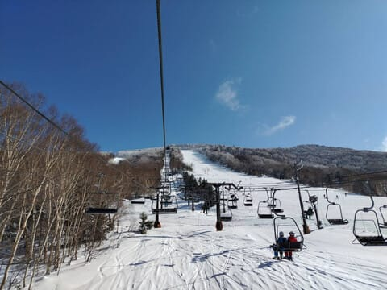

# 2月2日の志賀高原もいいコンディションだったみたいで…明日もコンディションよさそう！土日も志賀高原で滑ってます～！

📅 投稿日時: 2024-02-03 00:15:39

ということで．

今日も，志賀高原の特派員から

写真が送られてきましたが…

ええ！？？

見事な快晴じゃないですか！！！

そして，-10℃と冷え冷えで…

見事なサンピラーが見えるほどの，

晴天冷え冷えだったようです…！！！

うーん．

ここまで晴れる予想じゃなかったんだけどなぁ…

午後はちょっと曇るタイミングもあった

みたいだけど，基本的に晴れの一日で…

朝は晴れていても，昨晩から5cm程度の積雪が

あったらしく．

冷え冷え新雪が圧雪されたバーンで，

コンディションはすごい良さそうに見えますね…

2日深夜0時現在で，志賀高原はまたちらちら

雪が降ってるみたいなので．

明日の土曜も朝までに1㎝程度の積雪があるかな…

土曜は今日ほどはすっきり晴れなさそうだけど．

冷え冷えの曇り時々日も差すタイミングも

ありそうで．

明日もトップシーズンらしいゲレンデが

楽しめそうです…！！

日曜も，すっきり晴れとは言えなさそう

だけど．

朝はかなり冷え冷えで雪は締まって

いい感じのシマシマになりそうだし．

土曜と同じ曇り時々晴れ間…といった

天気ながら，日曜もバーンコンディションは

良さそうな感じ…！！！

ってなことで．

いつも通り，今週末も志賀高原で滑ってます～！！

なのに．

帰宅がほぼ深夜12時というのはどういう

ことだ…

これからお風呂入って準備したら，

また3時間睡眠で出発です(涙)

では，また明日志賀高原でお会いしましょう～！
