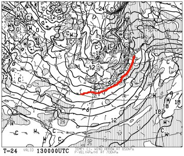
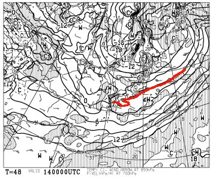
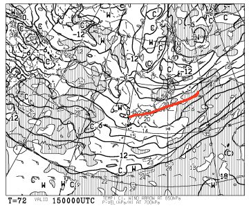
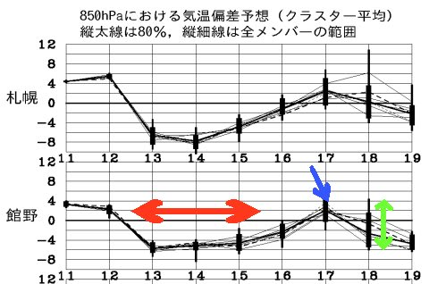
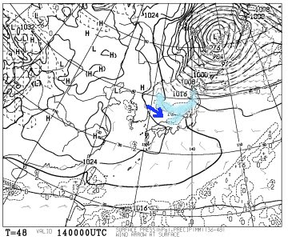
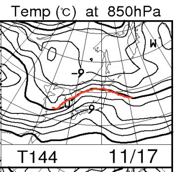
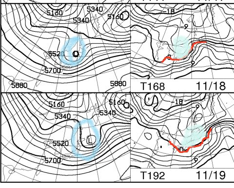
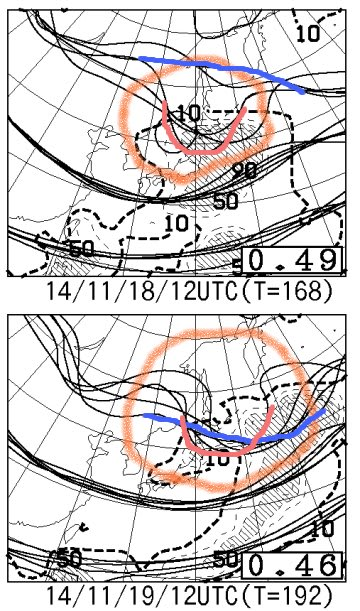

# これから一週間，雪が降ってくれるのか？それとも…？？

📅 投稿日時: 2014-11-13 01:15:23

🏷️ カテゴリ: [スキー天気予想](c6554f5c3c106093b511a8daae23757e8.md)

えー．

コアなスキーヤーにとっては．

そろそろ．

雪の便りを，

今か…今か．．．

と．

待ちわびる，今日この頃．

そして．

逝ってしまったスキーヤーにとっては．

そろそろ．

雪の便りがないと．

し，死んでしまう…！！

と．

うめき苦しむ今日この頃．

みなさま，いかがお過ごしでしょうか．

…という，時候の挨拶が終わったところで．

んでは，専門天気図を読み解いて．

これから一週間，雪が降るのか否か…

占ってみましょう～！

ふむ．

ふむ！？

ふむむっ！！？？

…ということで．

一番上から，13日，14日，15日の850hpa図ですが．

13日～15日の間．

850hpaの0度線は，信州より南まで下がってますねっ！！

これは，11月のこの時期としては，いい感じの冷え方ですっ！！

ということで．

こんな感じで，赤矢印で記したように…

13日から15日まで．

平年比で，4～6℃ほど気温が低い日が続きますね～．

で．

この間，こんな感じで，

地上天気図は冬型となり…

降水予想域は，水色で示したように．

「日本海上空の歓喜寒気の吹き出しの雲」が

日本海側に向かって，流れ込んでいます！

日本海側の山沿いでは，雪になりそうな気配ですっ！

…

…

なんですが．

残念ながら，風向きが青矢印のように，かなり西から

入っているので．

信州のスキー場では，ちょいと天然雪は期待できなさそう…

まぁ，とはいえ．

この3日間，冷えるので．

人工降雪機はガンガン動かせそうな気配では

あります．

…ただ．

この3日間が過ぎた後は…

あら．

ちょっと，850hpaの0度線は

かなり北に上がっちゃいますね…

この図でも，青矢印で示した17日は．

こんな感じで，ちょっと気温が上がって．

雨で雪が溶けちゃうかも…（涙）．

でも．

そのあとは．

こんな感じで．

18，19日は．

左の図で青く印した「トラフ（特定高度線の南側への張り出し）」に対応して，

右の図で水色に印した寒気が入り込んで．

また，0度線が南側に下がってくれて．

このままなら，18，19日は再び冬型になり，

山沿いでは雪になりそうな

気配ではあるのですが…

…ただ．

この18，19日の「トラフ」の予想．

予想のクラスタ間ばらつきを見ると，

赤く囲ったこんな感じで…

運が悪ければ，青い線のようにほとんどトラフは無く．

運が良ければ，赤い線のようにかなり南に張り出す…

という．

…まだ，予想のばらつきが大きい状態．

そのため．

この図の緑の矢印で示したように…

18日以降の，温度予想のばらつきはまだ

大きいです…

という感じなので．

これからの1週間をまとめると．

13日～15日の土曜にかけては，結構冷え込みますが．

そんなに降雪量が無いので，滑れるほどには

ならず．

でも，まぁ，ガンガン人工降雪機を動かせる

冷え込みにはなりそうかな，という感じ．

で．17日の雨で，その下地が溶けてしまいそうだけど…

そのあと．

18日以降．

皆さんの日ごろの行いが良ければ，冷えて，雪

日ごろの行いが悪ければ，それほど冷えこまず，雨…

ということになりそうです．

とうことなので．

みなさん．

11月3連休のGoodコンディションのために．

これからの日ごろの行いには，くれぐれも気を付けましょう…
