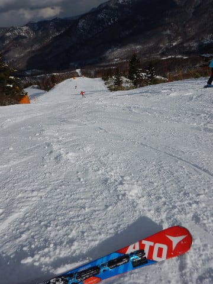

# 12月23日土曜日の志賀高原は…午前ちょっと雪もちらついたけど，晴れの一日！でも，ちょっと雪が減ってきたかな

📅 投稿日時: 2017-12-23 22:09:43

🏷️ カテゴリ: [2018スキー滑走日記](c11b88dc181f34079ab41db74a3587646.md)

ってなわけで．

今日もいつもの週末定番，志賀高原にやってきているわけですが．

まず，今日の朝は…

ピカピカ晴天でスタート！！

そして．

気温は…

-6℃ですか．

これは，水曜に予想した，

　朝からすっきり晴れ！

　（略）山頂で-5℃程度

ってところから，気温は1度ずれたけど…

ほぼ予想通り！！

＃朝8時頃までかなりの雪で「予想外したか…？」と

＃焦っていたのはナイショ

そして，ゲレンデは…

うはははは！シマシマ！！

これは…

いい感じの，締まり気味のシマシマ！

うひょーーーー！！

今シーズン一番！

最高のフラット圧雪！

スピードが乗るのに，がっつり傾ける絶妙

シマシマ圧雪…

シアワセ…

あぁ…シアワセだよ！！

…と，思い切り幸せを満喫していたら．

…あれ？

なんか，雲が出てきたんですが…？？

そして．

10時半ごろになると…．

ええ？？

いきなり雪？？

それも，かなり降ってきたんですが…（涙）

今日は終日晴れの予想だったのでは？？

…誰だ？

今日は一日晴れるといったやつは～っ！？？←自分でしょ

いや…

今日は雪が降ってはいけない日のはずだ．

雪が降らない日のはずだ！！

…晴れる．

私が晴れると言ったのだから，晴れるのだ！！

と念じたところ…

じき，雲が切れてきて．

ふはははは．

すっきり晴れてきましたよ～！

そして，11時半過ぎには…

すっかり晴れに！

そうです！

私が晴れると言ったら晴れるのだ！

志賀高原の天気を決めているのは，

私だ！←違うから．断じて違うから

ってなわけで．

昼前にはすっきり晴れの白樺コース．

コースもフラットで．

昼を過ぎても，超快適ハイスピードバーン！

先週よりはちょっと人は増えたけど．

でも，第1ゴンドラは搬器数台待ち程度だし…

リフト待ちもほぼ無いし…

いや，いいね～！

と，思っていたけど．

今週1週間，ほとんど雪が積もってなかったので．

ありゃ？

オリンピックコースや

ゴンドラ乗り場前のごく一部．

雪が薄くなってきて．

浮石が…

でも．

浮石があるのはごく一部．

晴天ぴかぴかの中．

ほとんどのコースでごごまで雪質も良いままで…

いや，午後まで楽しいよ！！

…でも．

GSコースやサウスコース．

午後はちょっと荒れてきたかな…

とはいえ．

最後までぴかぴか晴天の中．

いつも通り，夕日が暮れるまで．

たっぷりと滑り続けたのでした～！

いやーー．

今日もよかったな！

…でも．

ちょっと雪が薄いところも出てきたので．

そろそろ積雪が欲しいところ…

明日も晴天ぴかぴかになりそうなので．

嬉しくもあり，そろそろ積雪も欲しくもあり…

## 💬 コメント一覧

### 💬 コメント by (横須賀のウルトラセブン)
**タイトル**: やっと徒然さんと～
**投稿日**: 2017-12-24 07:27:38

お話しできました！徒然さんの姿は何回かヤケビでお見掛けしてたのですが、今回ご挨拶かないました。ゴンドラ内でもご一緒できてバンザイです！20000m倶楽部正会員である徒然さん、極楽さんご夫妻の豪快で華麗な滑走シーンも見ることができました。僕達はゴンドラ3回でのどカラカラ休憩(;^_^A～午後2時終了です。また志賀でお会いした時はヨロシクです！！（そうそうブログの写真に私を入れてくれてありがとうございました。）

### 💬 コメント by (michi)
**タイトル**: 昨日はありがとうございました
**投稿日**: 2017-12-24 12:15:15

午後からずっと一緒に滑って頂きありがとうございました(^^)

やはりあのペースで滑り続けるのは疲れるけど楽しいですね。

しんちゃんさん、KENKENさん、Gokuさん、奥様、、、との最後の白樺コース集団暴走までとても楽しませて頂きました（爆）

また宜しくお願いします。

### 💬 コメント by (しんちゃん)
**タイトル**: 今週末のお礼
**投稿日**: 2017-12-24 22:39:11

今週末はご一緒頂きましてありがとうございました。

 何とか無事に帰宅できました。

しかし日曜の朝一シマシマバーンは最高でした。

集団暴走についていけるよう、ワックス合しておきますね。

また味わいに行きますので、その時はまたよろしくお願いします。

### 💬 コメント by (Skier_S)
**タイトル**: みなさん，お世話になりました～！
**投稿日**: 2017-12-25 01:53:04

＞横須賀のウルトラセブンさま

初めてお会いできましたね～！

朝はかなりのハイペースで飛ばしたのに，

しっかり同じペースで滑られてたので，

「速っ！」

と思いました…

焼額にお越しの際は，また一緒に滑りましょう！

＞michiさま

午後は大人数での集団暴走状態でしたね…

普通，大勢で滑りに行くとペースが会わなくて

大変ですが，このメンバーはみんな同じペースで

滑るので，すごい楽しいですね～！

大勢で滑るのがこんなに楽しいと思えることは

そうそうない気がします…

また年末にお会いしましょう！

＞しんちゃんさま

昼間といい，夕食タイムといい．

濃いぃ週末を過ごせたのではないでしょうか…

ぜひ，今後は朝イチシマシマを逃さないように

お越しください（笑）

また次も一緒に暴走（？）しましょう！

