# 八ヶ岳の阿弥陀岳・赤岳ピストン登山！その9…阿弥陀岳から下山！急な下りでペースが上がらず

📅 投稿日時: 2022-10-11 01:20:17

えー．

この週末も3連休だったわけですが．

ちょっと宿題が多かったものの，

なんとか1日は休んで，山に

行けるかな…？

と思っていたけど．

天気が悪かったので，山に行けず．

結局，3日間家で仕事して過ごしました…（涙）

でも．

先月みたいなクリティカルな状況

じゃないので．

3日間ずっと仕事をしていたとはいえ，

この3連休は，久しぶりに食卓でご飯を

食べられました～！

…いや…在宅勤務が続いてたというのに．

実に久しぶりに，家の食卓でご飯を食べたよ…

ってなことで，本題へ．

阿弥陀・赤岳レポートの続きです！

ーーー

というわけで．

2度目の阿弥陀岳登頂を終え，

ちょっと疲れ気味で，阿弥陀岳山頂から

下山スタートしましたが…

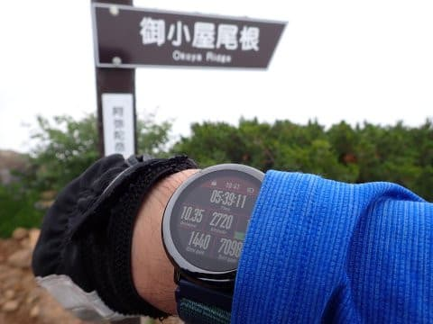

行きと同じルートを往復してるわけなので，

また，行きの時に通ってきた激しい

トンガリを通過しないといけないわけ

ですね…

前に見える梯子を上って，あの岩の向こうへ

抜けるわけですが．

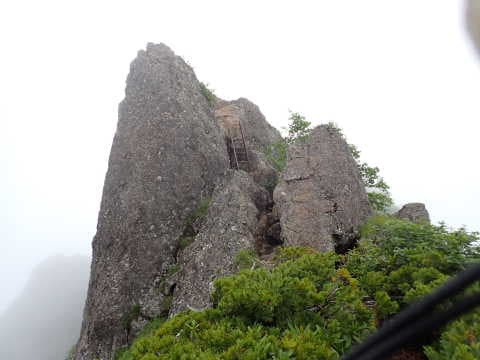

抜けた向こうは一枚岩の急斜面．

崖ってほど急斜面ではないけど，

張られているロープを手掛かりにしないと

下りるのは無理なところで…

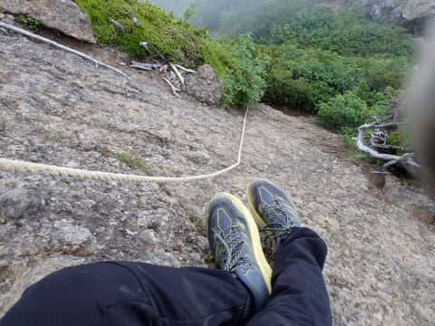

その先もしばらく鎖が続きます．

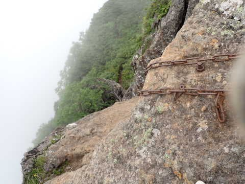

鎖を降りきって，トンガリ岩を通過すると．

行きの時にも通過した西の肩が見えますね…

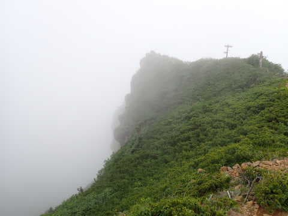

うわ．

もうかなり雲が迫ってきてます！

これは急ぎ下山した方が良さそう…

ペースアップだ！！

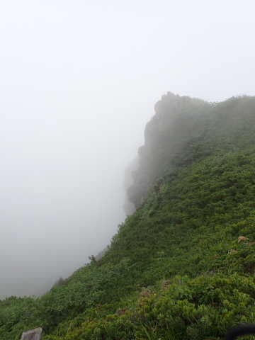

と，思うものの．

阿弥陀岳の山頂付近は急斜面なので，

またザイルやら…

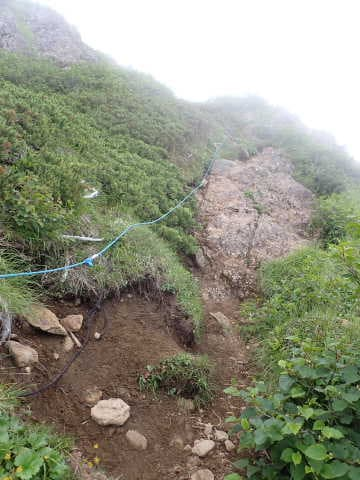

梯子やらを伝って降りて行かなくては

ならないので，そんなに速くは

下りられない…

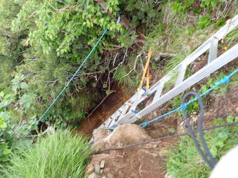

そうこうしている間にも，ガスは結構

登山道に迫ってきてます…

よし．

ここからはハイペースで行くぞ！

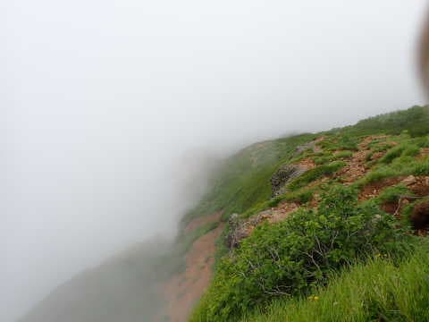

阿弥陀岳山頂から35分．

行きの時に通った展望台までやってきました…

標高は阿弥陀岳山頂から400mちょい下って

来たので，このあたりまで来るとガスは

おさまりましたが…

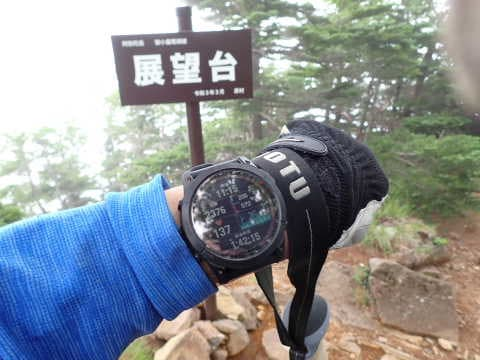

森林限界より下まで降りたここからも

まだしばらく，かなりの斜度のこんな

下り道が続きます…

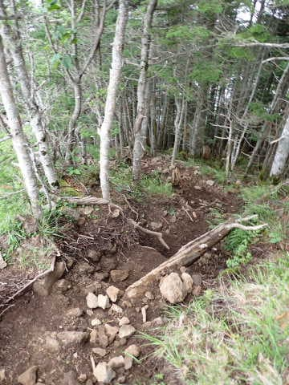

こんな感じのかなりの急斜面を

駆け下ることしばらく…

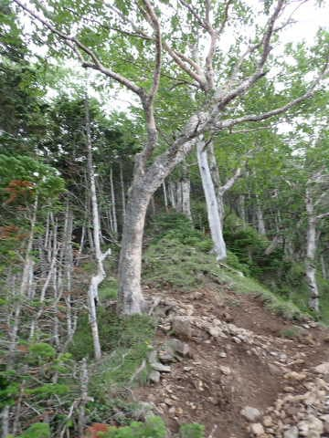

阿弥陀岳山頂から50分で不動清水分岐を

通過します．

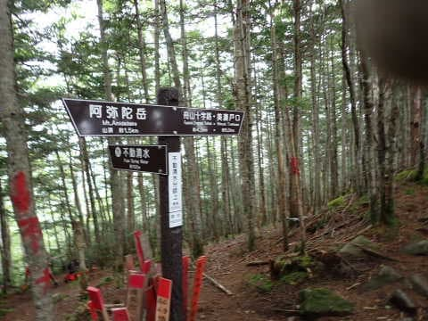

不動清水を通過すると，急斜面はもう終わり！

あとは緩めの斜面をひたすら下って

行きますが…

阿弥陀岳に2回登ったのが効いたのか，

足に疲れが来て，ちょっとペースが

上がらない…（涙）

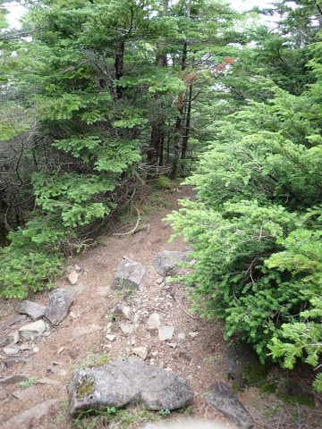
