# 2016シーズンインから2週間…11/3(祭)のイエティのゲレンデ状況は？

📅 投稿日時: 2015-11-03 22:24:00

🏷️ カテゴリ: [2016スキー滑走日記](c70c67ed5248e9432b899dcd5747048bb.md)

えー．

予告通り，本日Yetiに行ってきたので．

みなさんお待ちかねの←誰も待ってないから

ゲレンデレポートをば…

とりあえず．

朝イチは快晴っ！！

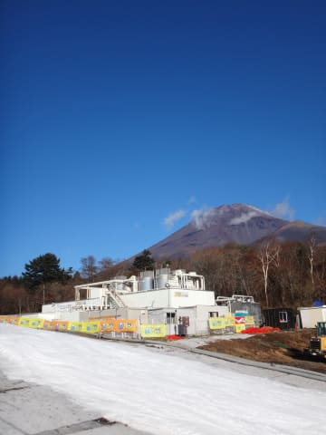

富士山もすっきり見えて，いい感じの天気っ！！

…でも．なんだか．

昨日から，リフト券のシーズンイン割引期間が終わって

しまったらしく．

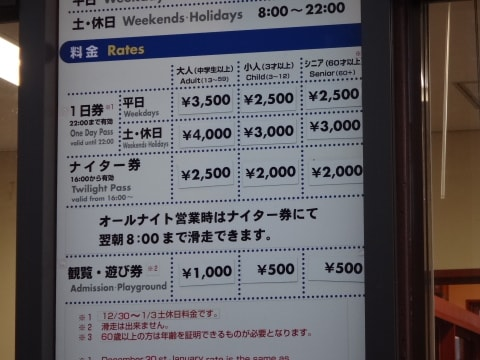

一日券が3000円⇒4000円に，1000円アップなんですが．

おーまいがーっ！

1日の日曜までは3000円だったのに…

この1000円は，痛い（泣）．

気を取り直して，ゲレンデに出ると…

おぅ！

ゲレンデの下は，見事な雲海っ！

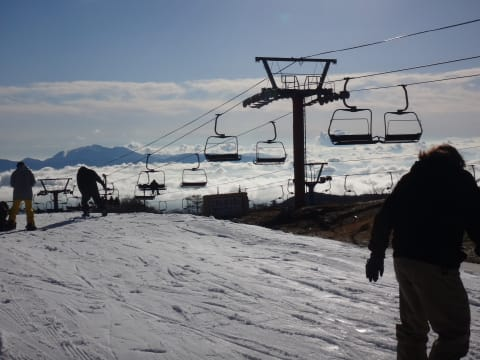

朝イチの数本は，雲海に向かって滑っていきます…

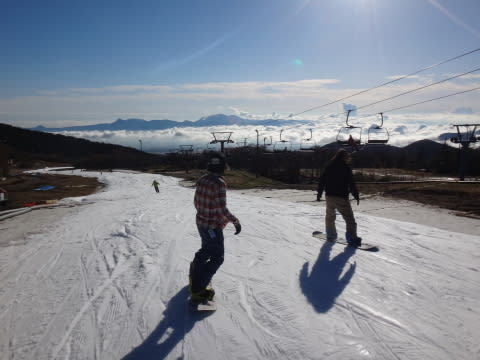

天気も良く，朝イチは人も少なく…

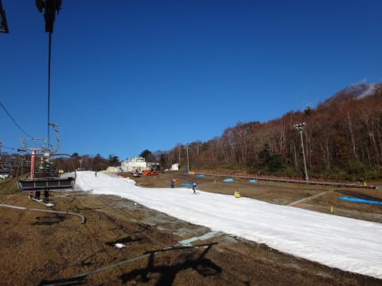

リフト待ちも9時過ぎまではほとんどなく．

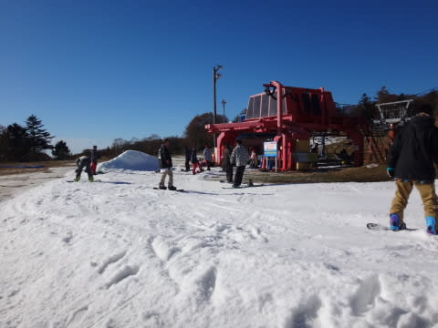

ふはははは！

快適！

いや，イエティは朝イチのためにあると言っても過言ではないっ！←それは，過言だと思う

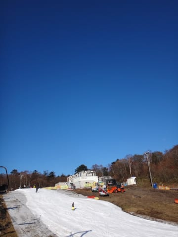

コース幅も先週よりひろがったかんじですね

と，気持ちよく9時過ぎまでは滑ってましたが…

ジャケットなくても大丈夫かな～，ってくらい

ぽかぴかと日が照っていたので，ちょいと雪も緩み始め．

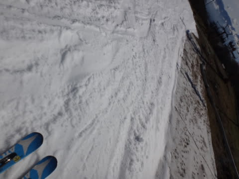

10時近くには，結構ゲレンデの人口密度も上がってきました…（残念）

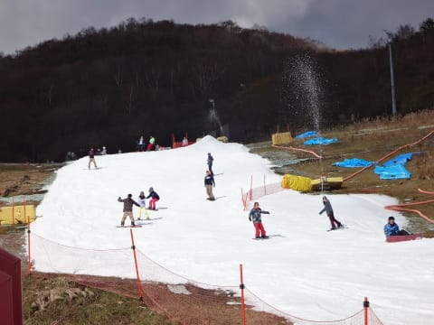

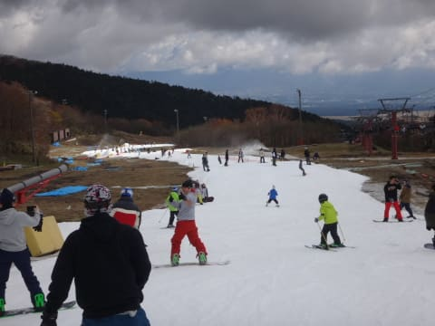

9時半には，クワッドはこの程度の待ち時間まで伸びましたが…

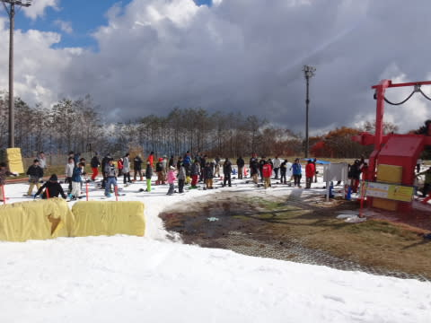

でも，すぐ並行してかかるペアリフトが動き出したので．

クワッドリフトは最大5分も待ってないかな？

ペアリフトは，終日待ち0ですよ～！

でも．

ゲレンデの人口密度は．

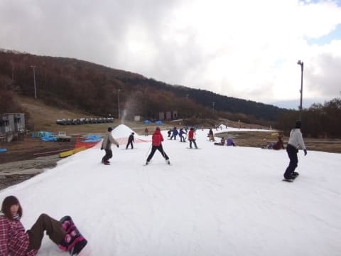

あう．

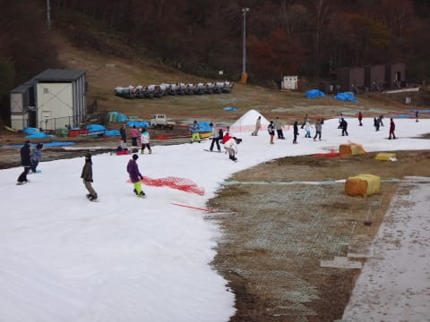

…あうううう．

…午後は，人のすき間を縫って滑る感じですね…

やっぱり．

でも．

まぁ．

リフト待ちが終日この程度，ってのが救いでしょうか．

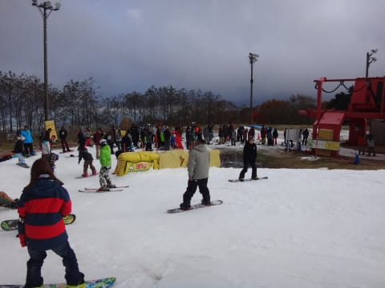

これで，2-3分くらいかな．

＃隣のペアリフトはちょっと歩くものの待ち0．

で．昼前から，なぜか雲が増えてきて，

日が隠れちゃいました…

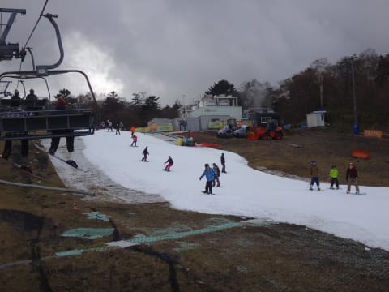

でも．

日が照っていると板に雪が張り付くけど．

このくらい陰っているたほうが板が走って，

いい感じ…

ということで．

午後もこの程度の人口密度が続いたものの．

危惧したリフト待ちはせいぜい3分程度

（ペアは待ちなし！）で．

なぜか，4時近くにはガスもかかってきましたが

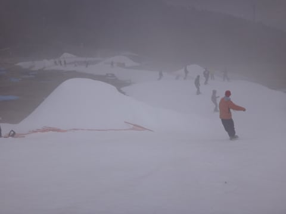

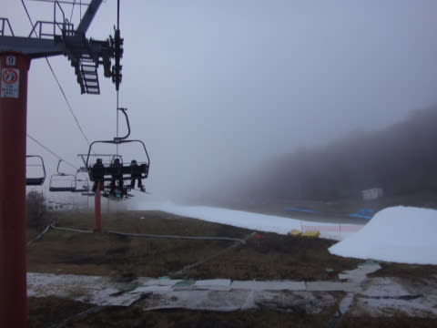

今日もしっかり，朝8時から午後4時のコース整備運休タイム（1時間休憩）まで，

たっぷり滑ってきたのでした…

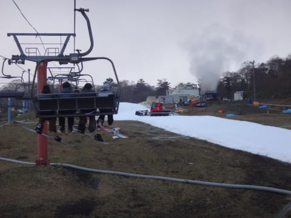

また，中3日あけて，

次の土曜にYetiへ戻ってくる予定です…

…

…が，さすがに飽きてきたかな（ぼそ）

## 💬 コメント一覧

### 💬 コメント by (Goku)
**タイトル**: Unknown
**投稿日**: 2015-11-03 22:31:54

えー！1日券が4000円ですか。

志賀や八方の5000円が破格に思えてしまう。

### 💬 コメント by (Skier_S)
**タイトル**: Gokuさま
**投稿日**: 2015-11-03 23:09:34

一応，朝8時からナイターの10時まで

滑れるので，ナイター券込と考えれば…

あと，メールマガジン会員とかで500円割引なので，

実際は3500円です．

…でも，このほかに駐車場代1000円と，スキー場までの

アプローチの有料道路代500円が取られるという，

恐ろしいシステムです．

…トップシーズンには絶対に来ません（笑）．

