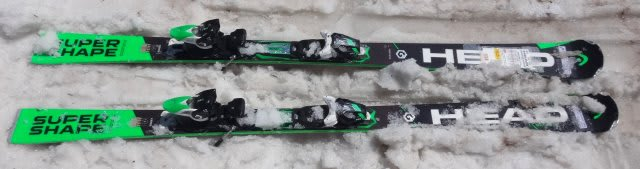
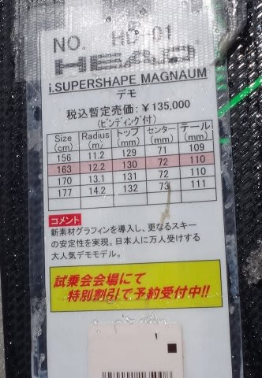
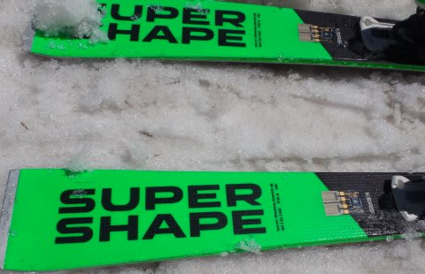
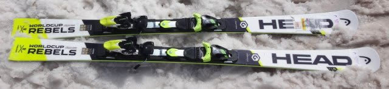
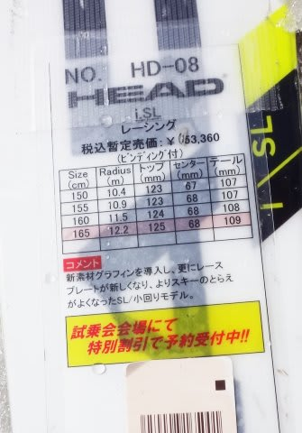
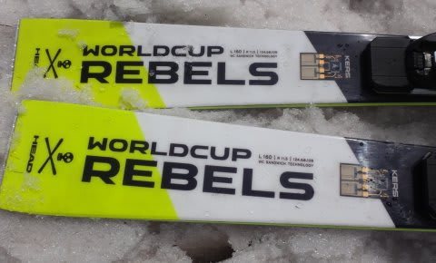
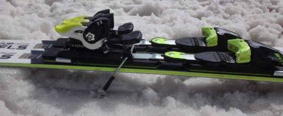

# 2017シーズンモデル，スキー試乗レポート第7回…HEAD編

📅 投稿日時: 2016-05-26 00:54:24

えー．

そろそろ，スキーシーズンも終わり．

物欲に駆られる人が増えてくる今日この頃かと

思いますが．

…物欲選手権に向かうために，いろいろ情報を

収集している人が多いのではないでしょうか…

…ってことで．

本日も，スキー板試乗レポートです．

今日は，ヘッド編．

では，どうぞ～！

○HEAD i SUPERSHAPE MAGNUM 163cm

基礎オールラウンド．

i Supershapeシリーズの中でも，センター幅

72mmとそこそこ広めで，いろんなゲレンデへの

適用性を持ったオールラウンド板としての

触れ込みのMAGNUMですが．

滑ってみると，かなり柔らかく感じ，良くたわみます．

力を入れなくてもエッジがしっかりとらえて

板がたわんでいき，楽にカービングで回れます．

去年より板がかなり軽くなったように感じますね～！

むちゃくちゃ軽くて取り扱い性も良く，

極めて簡単にしっかりしたカービングができるし，

軽いのでずらしていくのも可能．

柔らかくたわませやすい中でも，テールの張りがそこそこ

感じられるので，スピードを出していっても妙に

たわみすぎる感がなく，きれいに板が抜けていきます．

…でも，この日の雪ではあまりスピードを

上げられなかったけど…

もしかすると，スピードを出すとたわみすぎるかも…？

ガンガンにトップスピードを出す感じの板じゃない

感じです．

でも，普通のゲレンデで使うような速度域では

極めて扱いやすく，

良く曲がり，軽くて楽な良い板でした．

今日のような柔らかいザブ雪には良く合っていて，

いいフィーリングでした．

○HEAD i SL 165cm

SL競技用．

SL用のサンドイッチの板ですが…

結構板が薄い感じがしますね…

で，滑ってみたところ．

板の薄さもあるのか，履いた感じはすごく軽く

感じます．

荷重ポイントはセンター，

そこから谷回りでトップを抑えにいくと，

トップがインにステアして気持ちよく切れていきます．

板全体のエッジが均一にきれいで線で捉える感じで，

きれいに回っていきます．

グリップがしっかりしてるので，エッジの線に乗って

切れていくのに．

板自体は軽いので，操作性良く．動かしやすいです．

谷回りで自由にいろんなところに動かせます．

トップのエッジがしっかり食い込んで

きれいに回っていく板なのに，

軽快に動かせるので．

手ごわさがなく，かなり楽．

これ，普通のゲレンデ用としてもいいし．

コブでも行けるのでは？？

それなのに，SL競技用とあって，簡単にペタペタに

たわんでしまわず，たわみ止まり感もあり．

しっかり高速耐性もありそう…

…SL競技用ってなってますけど．

ゲレンデ小回り用として，

かなりイケてるんじゃないかな～．

結構気に入りました…

## 💬 コメント一覧

### 💬 コメント by (まいる)
**タイトル**: 私の板は
**投稿日**: 2016-05-26 09:39:34

Ｓさん、お疲れ様です。

既に私はスキーシーズン終わって１ヶ月

登山計画に忙しいです。

さて、ボートな私ですが、スキーもやるんですよ。で、板は二年前MAGNUMです。

よい板ですが、ICチップの効果が？？です。

### 💬 コメント by (Skier_S)
**タイトル**: まいるさま
**投稿日**: 2016-05-27 01:06:33

Magnumは，乗りやすくていい板だと思いますよ…

でも，来シーズンのMagnumはもっとよくなりました！

登山はどのあたりに行かれるんですか？

うちは夏は完全に海モード．

今，夏休みの旅行計画を必死に

立ててます…

