# 湯田中から志賀高原を通って苗場までのスキー場をつなぐ，壮大な計画が昔はあったんだよなぁ…

📅 投稿日時: 2020-10-26 00:49:09

🏷️ カテゴリ: [スキー雑談](c1f9d2cb7478308da16419928ea3945e9.md)

えー．

本日25日，日曜の朝．

志賀高原にまた雪が積もったようですね…！

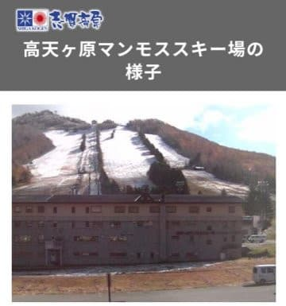

（[志賀高原ライブカメラ・高天ヶ原静止画カメラ](www.shigakogen.gr.jp//live/live_camera_manmosu.html)より）

いやー．

ここしばらく，いい感じで冷え込んでますね～！

…このまま11月下旬まで冷え込みが続いて

欲しい…っ！

と，全スキーヤーが心の底から願って

祈り，踊りまくっているころと思いますが．

はたしてこれからも冷え込みが続くのか？

…これから1か月の850hpa気温傾向を

見てみるわけですが．

うーむ．

水色で示す10月15日ごろから10月25日

ごろまで，確かに低温傾向が続いてますが．

その後，赤で示す10月30日から後は，

ずっと平年比+1～+2度の高温傾向の

予想です（涙）

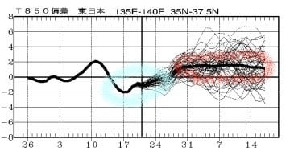

ということで．

残念ながら，この低温傾向．

そろそろ終わりのようです…（泣）

その後，志賀高原オープン予定の

11月14日まで平年より高温予想という，

かなり嫌な感じの予想（涙）

…この予想が外れるよう．

とりあえず踊っておきますので．

志賀高原が予想通り11月14日に

オープンできた場合は，

私のおかげだと思っていてください←いつも言うけど，

志賀高原の天気を決めているのはあなたじゃないから

…という，ちょっと心配な予想を伝えた後は，

本題へ．

以前，思いのほか盛り上がった，[焼額山スキー場の
歴史](eb31fb252fb6d7fa185336a9d094eaf1a.md)のネタでしたが．

そこで何人かの方から，

「湯田中のごりん高原スキー場と

　志賀高原，そして苗場までつなぐ

　壮大な計画があった」

というコメントを頂いて．

…私もかつて聞いたことがあるその計画．

今回は，その計画がどんな感じのものなのかを，

地図を見ながら振り返ってみようかと

思います…

えー．

まず．

これが志賀高原の衛星写真ですが．

改めて見ると，かなり南北に長い

広いエリアですね～

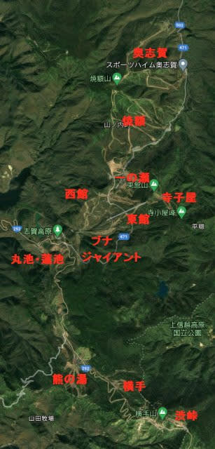

奥志賀の一番北，エキスパートコース麓から

渋峠の一番下，ペアリフト乗り場までの

直線距離で13km

という，広大なエリアです．

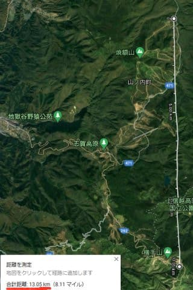

…そして．

この赤で記した岩菅山．

もしかしたら，ここが全面スキー場になり，

1998年の長野オリンピックがこの

岩菅山スキー場で開催されていた

可能性があったんですね～…

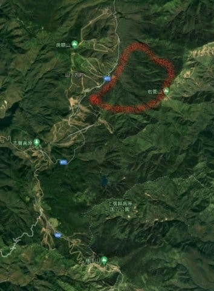

焼額の真正面．

この写真の向こう側に写っている

岩菅山の斜面に，ダウンヒルからスラローム

までできるコースを作り，アルペンスキー

全競技を志賀高原の岩菅山で開催する

計画があったのですが．

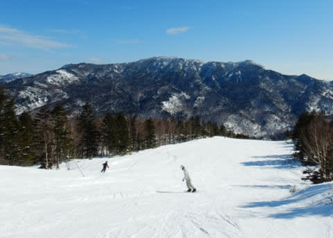

これが自然保護運動で頓挫し，結局長野では

ダウンヒルからスラロームまで，

全て一か所でできるスキー場が無く，

ダウンヒル・スーパーGが八方，

GSとSLが志賀高原と，

2か所分散開催になったというのは，

ある程度以上の年齢の方にとっては

懐かしく思う話かと…．

岩菅山もスキー場になっていたら，

今ごろプリンスは大赤字でもっと

大変だったかも…（ぼそ）

この，岩菅山スキー場計画とセットだったのが．

志賀高原ー苗場連絡計画

です！！

志賀高原と苗場を繋ぐのは無理…

と思うでしょうが．

この地図を見てみてください．

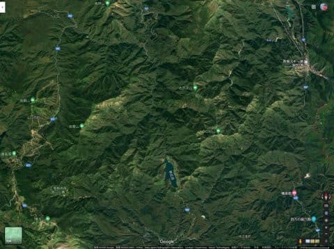

…分かりにくいので．この地図で，

志賀高原：赤

苗場＆かぐら・みつまた・田代：水色

で記してみたのが，この地図．

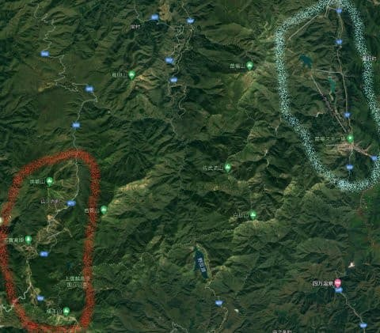

なんと．

両者，意外と近く見えますね…！！

この下の地図．

左側に赤く印した岩菅山のスキー場予定地と，

右に赤く印した今は無き「三国スキー場」．

三国スキー場は，私も1回しか滑った

ことが無いのですが…

（昔は石井スポーツがスキー場貸し切りで

　試乗会をやっていたなぁ…）

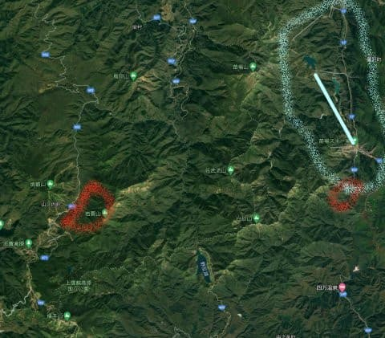

この三国スキー場．

今もGoogle Mapで跡地が確認

できますね…

上の方は，言うまでもなく苗場です．

苗場とここも，将来は繋ぐ予定が

あったという噂で．

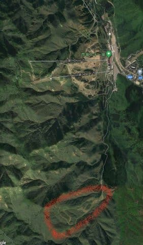

…三国スキー場も，苗場ー志賀接続

計画に沿って作られたスキー場だったと

いう話のようで…

この，三国スキー場と岩菅山頂の距離，

わずか18km！！

右上の水色の線，ドラゴンドラの

長さを考えると．

…確かに，無理をすればつながらない

距離でもない気がします…！！

…いや．実態は途中にかなりの尾根・川が

あり，結構むずかしいだろうけど…

でも．

もし，バブル経済が続けば．

この赤線の三国スキー場ー岩菅ゴンドラができて，

苗場スキー場と志賀高原がゴンドラで

行き来できた

という，歴史の大きな「IF」があったのです…！！

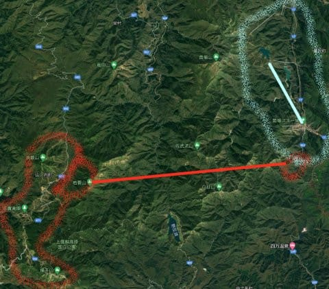

（続く）
