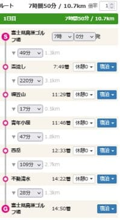

# 2020年10月，八ヶ岳の編笠山に登ってみた，その1

📅 投稿日時: 2021-08-03 01:48:31

えー．

先日，膝のサポーターのテストに，

八ヶ岳の[編笠山＆権現岳に登ってきた報告](e12c3a3b2ec073c3bbbc740b7eb3764cc.md)を

したのは，まだ記憶に新しいところかと

思いますが．

その前の，膝の痛みがひどかった頃にも，

同じ編笠山を登った経験があり．

…その時は，

積雪と膝の痛みのダブルパンチ

で，ひどい目にあったんですよね…

とりあえず．

それは昨年10月18日のこと．

富士見高原ゴルフ場を起点とする，

編笠山＆西岳の二つの山を

巡るコースを歩いたわけですが…

今年はこの図の右上で赤く囲った

権現岳まで行きましたが，

その時はそこまで行かずに折り返す，

比較的優しいコースで，

コースタイムは7時間50分と短いし．

歩行距離10.71km，

標高差1240m程度と，

まぁ天気とコース状況がよくて，

元気であれば何の問題もない

お気楽日帰り登山コース．

…ただ．

このころは登山での膝の痛みが結構ひどく．

コースタイム通りだと，朝7時スタートで

下山14:50のところ，

膝の痛みの緩和のため，編笠と西岳の山頂で

それぞれ30分ずつ休みを入れることを

考えると，下山は16時ごろ．

さらに痛みがひどくなって下りのペースが

遅くなると，+1時間くらいかかったりする

可能性も考えて．

最悪，ギリギリ17時下山だよな…

って感じのプランになっちゃって．

これ以上コースタイムが長い山には

登れない…（涙）

という悲しい状況だったんです…

これよりきつく，コースタイムが長い山でも

午前中で戻って来れるようになった

今となっては，

「そんな～時代も～ぁあ～ったねと…」

って感じですね…

サポーターは偉大だ…

で．

この時は．

膝の痛み以外に，いろいろ大変な目に

あったので．

ちょっと古いネタですが，この時の

登山レポートなど書いてみようかと…

まず．

前日の土曜は雨で登山に行けなかったので，

日曜に出かけたのですが…

日曜は天気も回復！

中央道を走っていると，これから登る

八ヶ岳がきれいに見えてきます！

…が…

…え？

なぬ？

八ヶ岳の山頂…

冠雪してる！！！？？？

…気のせいでなければ．

今から登るはずの，この写真の一番左の

編笠山もうっすら白く見えるけど…

ちょっと待ってくださいよ！！

まだまだ10月なんですけど？？

標高3000m級とか，日本海側ならまだしも．

普通，10月中旬に，八ヶ岳が冠雪するなんて

ほとんどないのに…！！！

まさか自分が登ろうと思う日に，

ドンピシャ雪が積もるなんて．

私はやはり，いろいろ引きが強い…

と思いながら．

…うん．

うっすら白く見えるだけだから大丈夫だよね．

もし積もってたとしても，

まだ10月中旬だから，昼間は気温が上がって

雪は融けるよね…

という楽観的推測の元，八ヶ岳に向かったの

でした…

（続く）
