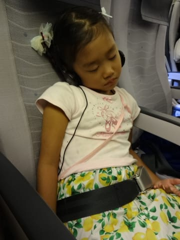

# 2014年9月　3連休，子連れ石垣ダイビング　その１

📅 投稿日時: 2014-11-03 00:08:53

🏷️ カテゴリ: [ダイビング日記](ce3a7a8d424d112fce83ee85c81a0e344.md)

えー．

この3連休．

Skier_SはまたYetiに行っているんだろう…

と，思ってらっしゃいますでしょうが．

…いや，自分も行くつもり満々だったんですが．

まぁ．

いろいろ．

大人の事情で．

この3連休，滑らずじまいです…（涙）

いや，潜りに行ってるわけじゃないですよ．

去年みたいに，スキーシーズンが始まってからの

11月に，もぐりに行ったりしてませんから…

まぁ，何があったかは．

おいおいレポートするとして．

今日は，石垣旅行記をば…

-------

ということで．

3連休の，前日．

…旅行の，出発日ですね．

「今日は，定時に上がります！

何があっても，定時に上がりますっ！！」

と．

あらゆる仕事やら．

同僚の冷たい視線やら．

いろんなしがらみやらを切り捨てて．

午後5時ごろ，会社を切り上げたわけで．

…なんだか．

気のせいでなければ．

上司から

「あぁ？いい根性してるな，お前」

って視線を浴びまくった気がしたけど．

そんなことはものともせず．

いつもより6時間以上早い（^^;定時に退社し，

学校から帰宅した娘と合流．

夜7時過ぎには，羽田空港へ！！

…飛行機好きの娘は，また空港に来て異常なほどの

ハイテンションですが…

夜8時発の最終便に乗り込み，那覇へ向かいます．

夜8時の那覇便って．

定刻でも，到着時間は22時半．

もう，深夜便ですな～．

あー．

だもんで．

娘は乗った途端，熟睡です．

ってか．

わが娘．

夜便だろうが昼便だろうが，飛行機にのったら

寝てないか，おまえ…

…って感じで．

本日定時退社するために，数日間徹夜に

近い状態を続けていた私も，娘と一緒に

ぐっすり眠ってしまい．

気づいたら，定刻通りに，那覇空港到着！

…で．

那覇空港から，モノレールで二駅ほど移動した先の

ホテルで，前泊なわけですが．

…ホテル到着は，夜11時半．

もう，深夜ですね…

泊まったのは，1泊3人で約7000円という激安の

チャビラホテル．

3人目は，上の2段ベッドになりますが…

娘，2段ベッドに大喜び．

とりあえず．

明日は，朝イチ便で石垣へ移動，そのあとにダイビングが

控えているので．

今日は早く寝ないと…

おやすみなさ～い

…明日からの石垣島，天気がいいといいな～．
