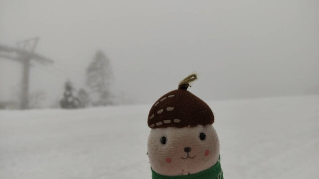
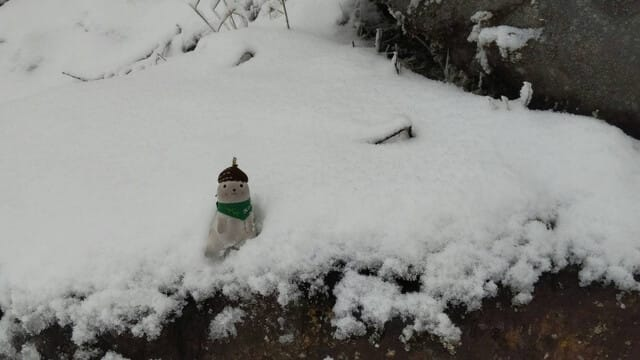
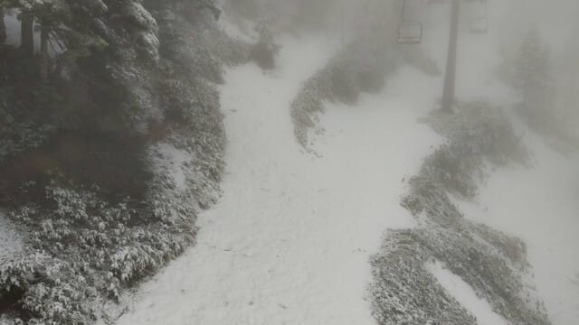
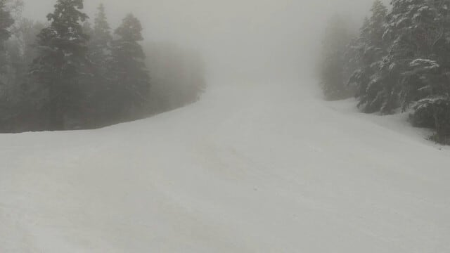
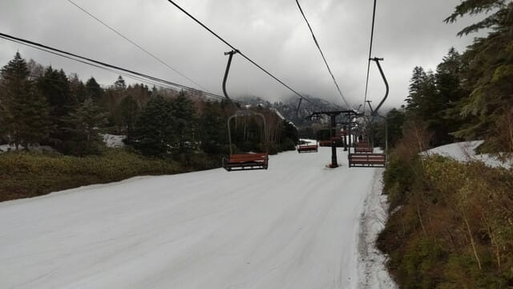
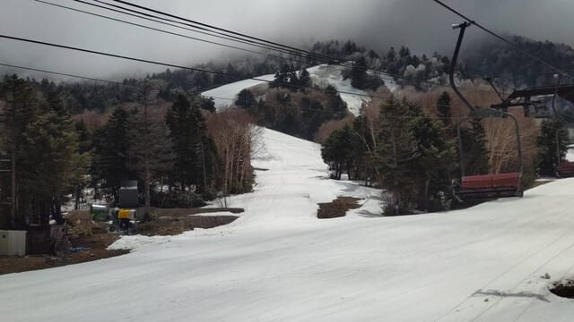
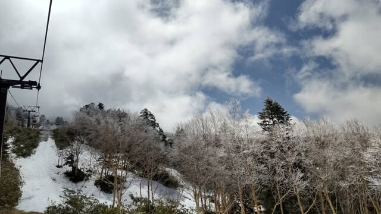

# 昨日は寝ちゃったので昼更新！GW後，5/7(水)の志賀高原横手山スキー場特派員レポート！

📅 投稿日時: 2025-05-08 13:46:29

🏷️ カテゴリ: [日記](cc4b5682fb7b8b144980957a978653fb0.md)

ダメですね…

スキーから帰ってきた翌日は，昼間の仕事で

疲れ果てて帰宅後Blogを書こう…と思いつつ

気づいたらまた床で寝てました（泣）

ということで．いつもと違って手短に

昼に更新！

えー．

GWが終わっても，志賀高原に通い続ける

おこみん特派員から，GW明けの志賀高原の

写真が送られてきました～！

なんと！

昨日，7日の横手山．

朝は5cmくらいの積雪があったようで…

志賀草津道路も，渋峠から先は通行止めに

なったほどだったみたいです！

いやー．

とてもGWが終わった後とは思えない

景色ですね…

朝7時から営業開始の横手山．

朝のうちはちょっとガスっていたみたいで，

当然下地はガチガチに凍って硬く，

そのうえで視界が悪いのでちょっと怖かった

みたいですが…

でも，まだ第1も結構幅いっぱい滑れるし…

第2も海和ゲレンデも，幅いっぱい滑れる

みたいで．

今週末も全然問題なさそうな感じですね！

ちなみに，この日は午前10時くらいに

一瞬青空も見えたみたいですが…

横手山＆渋峠，今の時期は早朝営業が無く

7時から営業開始で，4時間券が5300円，

一日券が5600円です～！

うーん．

今週末，かぐらにしようか横手にしようか悩む…

とりあえず，昼更新でした！
