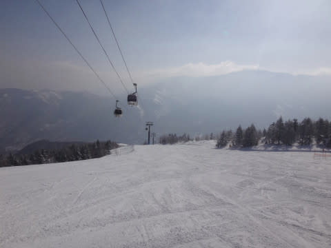

# 3月20日，3連休最終日の志賀高原詳細レポート…すっきり晴天！気温は上がったけど3月下旬としてはGood！

📅 投稿日時: 2017-03-22 04:03:57

🏷️ カテゴリ: [2017スキー滑走日記](c7d777cecfc91bdf0fa464ad62c6d49ab.md)

今日もなんだかご無体時間まで仕事をしていた

気がする，Skier_Sです．

…ってことで．

今日もこんな時間に更新なわけですが．

えー．

来てます．

明日，22日朝9時の500hpa気温図ですが．

この時期にしては珍しい，500hpa面の-30℃の

寒気が来てますよ～っ！！

…志賀にはちょっと届いてない感じですが．

でも，明日22日の午前中くらいまで，

結構冷え冷えのいい雪が積もりますよ～！

23日も，それほどドサドサ積もらないまでも．

終日雪がちらつく天気かな…

そして．

今週一週間はこんな感じで，

水色で記した22日から28日まで，平年より

低い毎日が続き．

特に赤くマークした22日から25日の間．

平年より5℃くらい低い温度が続くという…

…これは．

今週末も，いいコンディションで滑れそうっ！！！

…って情報のあとは．

昨日速報した，3連休最終日の志賀高原，

詳細レポートをば．

えー．

この日は．

先日の夜に，予想を完全に裏切って（涙）．

5cmほどの積雪があったため．

うっすら積雪路面で始まりましたが．

まぁ，予想は外したけど．

雪が積もるという，いい方向に外したんだから

良しとしよう…←天気予想を外したことに対し，何らかの正当化をしようとしている

で…

この日も．

朝8時から通常営業開始となる奥志賀高原から

スタート！

天気は予想通り，すっきり晴天！←3連休中日の予想は外したけど，最終日は当てたことをしっかり主張しておく

奥志賀山頂へ出ると…

ふむ．

山頂の気温は-7℃．

放射冷却でひえひえですよ～

そして．

雪質は…

うはははははは！！！

最高じゃないですか！

まるで2月のトップシーズンの柔らか圧雪っ！

奥志賀は朝6時半からの早朝営業（1600円の別料金）があるので，

朝8時だと，もうシマシマバーンではないけど…

でも，人がほとんどいない貸切の最高雪質バーンを，

思う存分トップスピードで自由落下！

ゴンドラ待ちもなく，コース上も誰にも邪魔されず，

好きなラインで大回りしたい放題！

ぴったり11分ペース．1時間でゴンドラ5本滑れるよ！

…という，快感を1時間ほど味わった後．

どうやら，

焼額のリフト係員の方に，1ゴンの一部と認識されているらしい

私なので．

リフト係員の皆さんが心配しないように，

焼額へ移動しておきますか…

うはーー！

焼額も，朝9時ごろは，雪質最高！

それも，まだところどころシマシマが

残ってるよ！

8時スタートの奥志賀でちょっと滑って，

8時半スタートの焼額へ移動すると．

朝イチの快感が2度味わえますな…！

と，気持ちよく滑っていたのも，1時間ほど．

ゲレンデがすっきり晴天だった本日…

ありゃりゃりゃりゃ？？

雪が，かなりのダマダマ状態に…（ちょっと涙）．

そして．

ゲレンデもちょっと混んできたよ…

さすが，3連休．

でも．

輸送力が異常に高い，8人乗りの焼額第1ゴンドラ．

ゲレンデがこんな状態でも，待ち時間がほとんどなかったのが

すごいところ…

そして．

昼には．

ここも，

　昼間気温は，焼額山頂でもプラス2-3℃まで上がりそう．

と書いた予想通り←しつこく強調

気温は0℃を超えて，プラス2℃にまで上がり，

おかげで，かなり固まり気味のボコボコ雪に…（涙）．

そして，凸凹に荒れ始めてきましたよ…（泣）

その代り，午後からはゲレンデは結構ガラガラに

なってきたかな～

標高が低い，山麓付近で日が強く当たる斜面は．

わずかにウェットな感じの雪になったところも…

日が当たらず，かつ山頂に近いところは，昼間でも

いい雪質をキープしていたので，

まぁ，この時期とすればかなり恵まれてるんですけどね～．

だもんで．

再び．

日が当たりにくい，北斜面の奥志賀へ移動っ！

…やっぱり，北斜面は雪質がいいのぉ…

でも．

雪はダマダマになってないけど．

ちょっとゲレンデは荒れ始めてて．

固めの下地が出ている上に，重めの雪が

溜まったコブが乗っているような状況…

一部小回り道っぽくなってるところもあり．

うーん．

それほど滑りやすくはないかな…

まぁ，でも．

この時期としては，恵まれた雪質ではある．

夕方3時ごろ，再び焼額へ戻ると…

ちょっとゲレンデは荒れ気味．

そして…

なんだ，これはっ！？？

昼間の日差しで溶けた雪が．

夕方になって気温が下がり，

そのまま凍り始めてます…（泣）．

これは，

　この日も夕方最後の方，日が陰ってくると，

　溶けた雪が固まってなかなかエキサイティングな

　バーン状況になりそう…

という予想がその通り当たりましたね←予想が当たったことをしつこいくらいアピール

一応，焼額がホームゲレンデの私なので．

＃1ゴンの一部といった方が正確なのかも？？

こんな感じで荒れたゲレンデを．

ゴンドラ営業終了の4時まで，

滑り倒したのでした…

…

…が．

本日は奥志賀スタート．

奥志賀は，4:45までゴンドラが動いているのだっ！

だもんで．

本日3度目の奥志賀へ！←忙しく移動しすぎ

奥志賀も，さすがに夕方は固めのゲレンデコンディション

だったけど…

夕日が差し込む，

人がいない貸し切りゲレンデを…

夕闇迫るラストゴンドラまで．

しっかり滑り切ったのでした…

いやーーー．

滑った．

一日平均滑走標高差，約19000m．

むちゃくちゃ滑った3日間でした．

いや．

この3月．雪と天気に恵まれてるなぁ…

## 💬 コメント一覧

### 💬 コメント by (かず)
**タイトル**: ほんとですね
**投稿日**: 2017-03-22 06:27:21

ホームページに出てました　知らなかった　期待が高かったのでテンション下がりました　しかも奇跡の土曜は早朝無しですね　ある意味ラッキーです　これから廻り方考えます　Sさん奥志賀ヤケビ往復してますね　ヤケビももうすぐ終了なので僕も13時頃行きましたけど戻るの面倒でやめましたー

### 💬 コメント by (たろ)
**タイトル**: まさかの奥志賀
**投稿日**: 2017-03-22 12:11:20

3連休初日に初めてお会い出来てとても嬉しかったです。朝一の奥志賀で並んでいると、後ろから聞こえてきた「ヤ・ケ・ビ・タ・イ」のキーワード。「んっ・・？」板→確認良し。某スキーショップのステッカー→確認良し。更に、後ろの方にも華麗に愛想を振りまくお姿で確信。まさかの奥志賀でレアキャラを発見した気持ちでした。

念願のステッカーを頂戴した後で私の連れは、「お札を頂けるの？神様だから？」と聞かれましたので、「そうだよ。あのお方は志賀高原の神セブンの一人なんだよ。」と説明したところ、「そうなんだー」と妙に納得しておりました。（笑）

またお会い出来た時、ご挨拶させて頂けたらと思います。

### 💬 コメント by (Skier_S)
**タイトル**: 今週末も冷えるよ！
**投稿日**: 2017-03-23 05:40:13

＞かずさま

そうなんですよ．

土曜だけ早朝やってなかったんです…

この時期，早朝最高だと思いますよ．

今週末も早朝行きたいんですけど…

子供連れなので無理っぽいです

＞たろさま

この週末はお世話になりました～．

見事に発見してくださいましたね（笑）

それも，会話が

「朝イチならゴンドラ11分サイクル…」

「1時間で標高差2500m…」

みたいな逝ってしまっている会話でしたから，

すぐわかったかと（笑）

しかし，「志賀高原の神セブン」ですか！

ウケました．

これからはステッカーじゃなく，お札と称して

配りましょうか…

また志賀高原でお会いしましょう！

