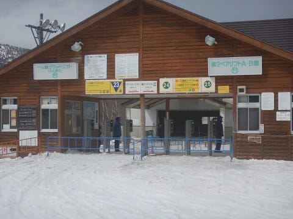

# 2019/5/6(月)GW最終日の志賀高原スキー場，詳細モード…早朝晴れ，午前は曇り，昼過ぎから小雨，午後2時には雷でリフト停止（涙），夕方はまた晴れと，目まぐるしい天気で，焼額のシーズン終了！

📅 投稿日時: 2019-05-09 04:30:53

🏷️ カテゴリ: [2019スキー滑走日記](c3e4496fc0fb7f9c17ff21214a35b1ace.md)

えー．

昨日は．

スキーシーズンに入って初めて，

このBlogが更新されない一日となってしまい．

このBlogを毎日見ているという奇特な

方々におかれましては，

「ついにSkier_Sは死んだか…」

と思われたことでしょうが．

ええ．

死んでました．

10日間のGW，中一日に23時間だけ家に

滞在した以外，ひたすら志賀高原で過ごし．

ほぼ毎日，ぶっ続け連続で早朝から

ラストゴンドラまで滑り続け，

かなり疲れていたところ．

10日ぶりの出勤で，大量の仕事が積滞している

ところにトラブルの緊急対応が発生し…

死んでました（涙）

…ってなことで．

昨日はBlogを書くパワーもなく，

倒れていたわけですが．

今日は，GW最終日の志賀高原レポートを

書くのだ！←とはいえ，今日もご無体時間だけど（泣）

とりあえず．

GWラストのこの日．

早朝に並んでいる人は…

えらく少ないですね…

早朝はかなりいい感じの天気だというのに．

ここまで参加者が少ないとは…

10連休という長い休み，最後の日まで

滑ろうという人は少ないんだろうなぁ…

ってなわけで．

山頂に出ると．

今朝の気温は，早朝から+3℃（涙）

朝から気温高すぎ…（泣）

早朝1本目の山頂だけはしっかりした

雪だったけど…

麓付近はきれいなシマシマながら，

朝からすでに緩めな感じで…

2本目からは，もう表面がかなり

重い感じに崩れていきます（涙）

しかし．

これまで毎日，比較的人が多かった

早朝ですが．

GW最終日はがらがらで，

結構気持ちよく滑れるなぁ…

でも．

通常営業終了時には．

かなりゲレンデも荒れて．

早くも板の滑りが悪くなり始めて

来ました…（泣）

だもんで，いつものパターンで．

通常営業開始時にオープンする

パノラマコースへ，オープンと同時に

突っ込みますが…

すでにオープン時から雪は緩く．

シマシマのエッジが立ってません…（泣）

唐松コースも，8:30のオープン直後から

すでに板の滑りが良くない感じ（涙）

通常営業開始時には，すでに雪の

滑りが悪くなり始めていたので．

早朝営業終了と同時に帰っちゃった人も

多かったみたいで．

ただでさえ人が少なかった本日の早朝営業より．

通常営業開始後の方が人が減ってるん

ですけど…！？？

とりあえず．

シーズン券が使えない，横手・熊の湯の

延長営業を除いて．

今シーズンの志賀高原営業最終日となる本日．

焼額以外の状況がどんなか見ておこう…と．

まずは奥志賀方面へいってみますが…

昨シーズンはGW前に息絶えた，ゴンドラ側の

ダウンヒルコース．

やっぱり雪の滑りは悪いですが（涙）．

まだ問題なく滑れますね～．

ただ，ヒルサイドコースは非圧雪で．

ちょっと滑れるような感じではなかったし…

ゴンドラ乗り場付近は，かなり土が

出てきてましたね～…

とはいえ．

人工雪を打ってない奥志賀．

ダウンヒルコースはGW最後は

結構苦しいことが多いけど．

今年はちゃんと最後まで滑れましたね…

そして．

奥志賀のリフト側，

エキスパートコースですが．

こちらも滑りが悪めの，すごい重い雪ですが．

午前中から，もう誰もいないガラガラ

ゲレンデです…

リフトもスカスカだし．

いつもはコブだらけになるこのコースも

人が少ないので，荒れてはいるものの，

コブ斜面になってませんね…

コース脇にコブラインができてましたが．

コブ溝に全く土が出てないので．

雪の厚みはまだまだありそう…

うーん．

これで今シーズン終わりとは信じられない…

で．

昼ごろに一の瀬方面にも足を延ばしてみましたが…

一の瀬ファミリーも雪の滑りが悪く，かなり

重い雪だったので．

…もう，誰も滑ってませんね…

見渡す限り，誰もいません．

寂しい…

そして．

寺子屋スキー場まで行ってみますが．

寺子屋スキー場に着いた午後1時ごろは，

雲ゆきも怪しくなっていて．

遠くで雷鳴も聞こえ，

やばいなぁ…

と思っていたところ．

…午後1時半ごろから…

降ってきましたよ．

雨が（激涙）．

午後2時ごろにピークで，

ウェアがしっとりするくらいの

降りになってきて．

そのせいで，ゲレンデには，

リアルに他の人が見つけられない状態に…

私「…もしかしたら，今，寺子屋で滑ってるのって

　私一人だけですか！？？」

リフト係員「違いますよ～！」

私（そうだろうなぁ…いくら人が少ないとはいえ，

　私一人のために寺子屋スキー場を動かしているって

　状況は無いよね）

リフト係員「もう一人います！」

私「って，二人だけかい！」

ってな感じで．

誰も滑ってないので，午後になっても

シマシマが残る寺子屋でしたが．

午後2時過ぎに寺子屋を脱出し，

焼額へ戻ろうと，一の瀬へ降りたところ…

リフト係員「落雷の危険があるので，リフト営業を

　見合わせます～！！」

えええええええ？？？

なんということかっ！！

午後2時過ぎに，一の瀬エリア・焼額・奥志賀の

全てのリフトが止まるという．

予想外の状況に…！！！（激涙）

これは…

最悪，このまま営業再開しないで

シーズン終了か？？？（泣）（泣）（泣）

…と，危惧していたところ．

奥志賀は午後3時前，

焼額，一の瀬も午後3時過ぎには営業を

再開！！

あーー，よかった…

ってことで．

無事，焼額へ戻ってきますが…

もうほとんど人が滑ってなかったらしい

焼額．

雪はかなり汚れてますね（涙）

でも．

わがホームゲレンデの焼額．

今シーズンの営業も残り1時間．

12月第1週から，丸々5か月以上．

やんごとなき事情があった1週以外，

ずっと休むことなく，毎週通った

焼額でしたが．

今シーズンは，もうお別れです…

あぁ…今シーズンもお世話になりました…

ラストまでたっぷり雪が残った今シーズン．

春営業も1ゴンになり，4月以降も

滑れるコースは多かったし．

振り返ると．

恵まれたシーズンだったかな…

ってなことで．

ゴンドラ営業終了ギリギリに

乗り場に飛び込むと…

リフト係員「Sさん，ラストのお客さんです！」

ってことで．

今シーズンの焼額スキー場の，

最後の乗客となったわけですが．

ラストはラブゴン締めでした…

そして．

山頂では．

奥志賀と焼額のパトロールさんどうしの

シーズン終了の挨拶といった，

シーズン最後のイベントを横目で見つつ…

わがホームゲレンデ焼額の．

今シーズンのラストを滑り終えたのでした…

あぁ…

…終わってしまった．

終わってしまいました．

10連休も．

わがホームゲレンデの営業も．

終わっちゃいましたよ…

なんと，シーズンとは短いものよ…（刹那感）

でも．

今週からは，かぐらに行くし．

私のシーズンは，まだまだ続きますよ～！

## 💬 コメント一覧

### 💬 コメント by (原克彦)
**タイトル**: Unknown
**投稿日**: 2019-05-09 06:59:07

一の瀬ではコンスケさんも滑ってなかった？？

### 💬 コメント by (横須賀のウルトラセブン)
**タイトル**: 感動のラストヤケビ
**投稿日**: 2019-05-09 08:22:55

あ～朝の連続テレビ小説・ヤケビ日記が最終回ですか！

それにしてもヤケビラストシーンは感動しました（涙）きっとヤケビのスタッフさん達が、Ｓさん一人の為にゴンドラを動かしてくれたのでしょう！！ヤケビスタッフ万歳ヽ(^o^)丿Ｓ

さんのスキーシーズンはまだまだ続くようですので、お怪我なきよう楽しんでください。それでは来シーズンまでグッドラックです👋

### 💬 コメント by (Skier_S)
**タイトル**: コメント回答遅れました
**投稿日**: 2019-05-11 00:24:32

＞原さま

コメント回答遅くなってすみません…

いや，KonSukeさんも滑っていたようですが．

タイミングがずれていたのか，私がコースにいる時は

リフトに乗っているタイミングだったようで．

コースの上から下まで，完全に無人でした（笑）．

＞横須賀のウルトラセブンさま

コメント遅くなってすみません～！

12月第1週からひたすら続いたヤケビ日記，最終回です．

見事にラスト搬器Get，それもラブゴン締めという，

見事なヤケビラストでした．

私のシーズンはまだまだ続きますが，

来シーズンに志賀高原でお会いしましょう！

