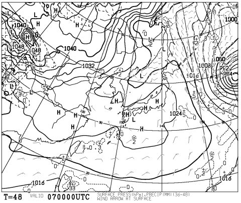
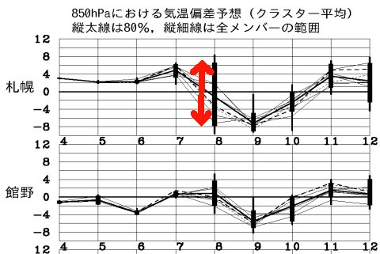

# うーむ．意外とこの週末の志賀高原，いい感じの天気になりそうな予感…

📅 投稿日時: 2015-02-06 00:20:47

🏷️ カテゴリ: [日記](cc4b5682fb7b8b144980957a978653fb0.md)

えー．

心配された，首都圏での大雪ですが．

…低気圧の中心が思ったよりもかなり南にそれ．

首都圏では想定ほどの降水量がなかったため．

かなり冷え込みはしたものの，当初言われていたほどの

積雪にはならなくて．

…なんだか，肩透かしを食らった感じがありますが．

まぁ，首都圏全面通行止めの[去年の悪夢](e9f83615a49245623d0b12c8ac5ba6af4.md)は繰り返されず，

結果的にはありがたかったかな！

＃また，あの悪夢が繰り返されたら…おそらく，死ぬ．

＃このご無体職場で週末にストレス発散できなかったら，

＃暴れて死ぬ．

ということで．

昨日はまだ正確に見切れなかった，今週末の予想，

追加情報をば…

7日，土曜日の予想地上天気図は，昨日とほとんど変わっていないように

見えますが…．

日本海側にかかっていた降水予想が消えたので．

うーむ．

土曜は多少雲が出るかもしれないけど．

基本的には晴れ間がのぞく，絶好のスキー日和になりそうな予感！

金曜は，志賀高原もたぶんそこそこの雪が降るだろうから．

土曜朝イチは，柔らかい雪が圧雪された，柔らかめ圧雪バーンで．

日が射す中きれいな圧雪を滑れる，いい日になるかな！

そして，日曜なんですが…

うーむ．

こんな感じで，まだまだ気温の予想ばらつき度合いがかなり

幅広く，予想が確定しない状況なんですが…

まぁ，この日も雲は多めかもしれないけど，

時々太陽が雲に隠れたり晴れたり…って感じかな．

土曜の降雪はなさそうだから，朝イチは締まった最高の圧雪で．

この日も，いい感じのスキー日和になりそうな予感…

とりあえず．

首都圏の交通マヒもなさそうだし．

土日は吹雪いたり天気が悪化したりすることもなく，

太陽も顔を出してくれそうだし．

…この週末，いい感じになりそうかな～．

## 💬 コメント一覧

### 💬 コメント by (Goku)
**タイトル**: Unknown
**投稿日**: 2015-02-06 19:56:04

明日は朝から晴れたらサイコーの一日になりそうですね♪

私も朝イチから１ゴンスタートです。

さーＷＡＸ入れなきゃ。

### 💬 コメント by (Skier_S)
**タイトル**: Gokuさま
**投稿日**: 2015-02-06 23:37:24

明日，朝に雲が残るか，晴れるかは，

結構微妙ですが…

明日は昼間は晴れ間ものぞく，いい雪の

一日になるはず！

…逆に，日曜が．

午後から崩れそうな感じになってきました…

明日朝イチ，またゴンドラ上から発見されるのかな～（笑）．

