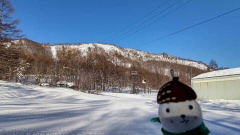
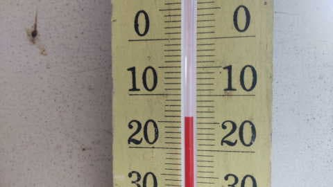
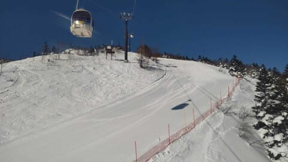
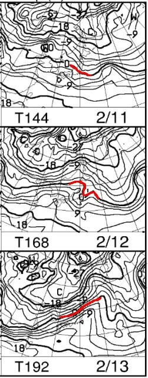
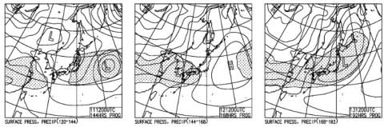

# え？2月11，12，13日の志賀高原はヤバいくらいの高温になりそう…2月中旬なのに13日は雨かも！？？

📅 投稿日時: 2023-02-07 03:56:07

えー．

昨日の記事は，いろいろ疲れてたからか…

書き終わったのに下書きのままに

なっちゃってて．

朝9時過ぎに慌てて投稿しました…

朝早くに確認した人は，

「あれ？更新されてない？」

と思ったかもしれませんが．

2時間睡眠で日帰り志賀チャレンジ

という無謀で死ぬほど疲れながらも，

ちゃんとBlog更新してました～！！

日曜は2時間睡眠で23時間以上活動しながら．

月曜ちゃんと朝から会社に行って．

そして，ついさっきまで仕事やっつけていて．

で，明日は朝7時には家を出なくてはならない

という…

もう4時なんですけど…（涙）←Blog書いてないで寝ろ

とりあえず．

今週末もスキーに行ったら，

命を削ってスキーをすることになりそうな

今日この頃，皆様いかがお過ごし

でしょうか（時候の挨拶）

ってなことで．

今日もおこみん特派員から写真が送られて

来ましたが…

あさイチは見事な晴天シマシマ！

気温は，朝は-15℃くらいと冷えたみたい

ですが．

昼間はかなり気温が上がったようです…

積雪がないので，バーンはちょっと硬めに

仕上がっているようですが．

一日晴れたスキー日和だったみたいです…

で．

このあとですが．

11，12，13日の天気図を見ると…

なに！？？

一番冷える2月の中旬なのに，

赤い0℃線がこの3日間ずっと志賀より

北！？？

そして，地上天気図は…

11，13日と，志賀は降水域ですね…

特に，13日はヤバそう…（涙）

ということで．

11日は標高が低いところはちょっと雨っぽい

感じになるかも…（泣）

そして，さらに13日はもっとヤバいです．

2月中旬なのに，雨になるという

最悪のシナリオか…（激泣）

なぜ，2月中旬に…

ってなことで．

ダメだ．

もう眠いので寝ます．

いかん…

疲れてる…

## 💬 コメント一覧

### 💬 コメント by (レインボー75)
**タイトル**: Unknown
**投稿日**: 2023-02-07 21:15:09

火曜日の志賀高原情報

どこもかしこもベストコンディションの一日でした。細かく感想の書く暇もないくらいベスト。圧巻は奥志賀エキスパ。過去にみたことのない圧倒的な華麗な流れるような滑りを目撃できました。旧知の人ですが、死ぬ前にああいう感覚を味わってから死にたいと、また、ハードルが高くなりました。閻魔様にはなかなかお目通りできそうもありません。

### 💬 コメント by (低速)
**タイトル**: Unknown
**投稿日**: 2023-02-08 01:41:34

いよいよ恐怖のアイスバーンが出来たら困る😂

### 💬 コメント by (レインボー75)
**タイトル**: Unknown
**投稿日**: 2023-02-08 04:35:58

お借りします。

副院長様、本日はありがとうございました。いずれまたゆっくりお話ししたいと存じます。

### 💬 コメント by (Skier_S)
**タイトル**: 久しぶりによく寝た…
**投稿日**: 2023-02-08 08:09:15

＞レインボー75さま

結構バーンが締まっていたみたいですが，スピードバーンで

エッジがしっかり嚙んでよかったみたいですね…

今週末は重い雪が降ってきそうなので，今のうちに楽しんでおいてください！

＞低速さま

最新の天気図では，何とか13日まで雨にならずに済みそうなので…

2月のトップシーズンにアイスバーンという最悪の事態は避けられそうです

