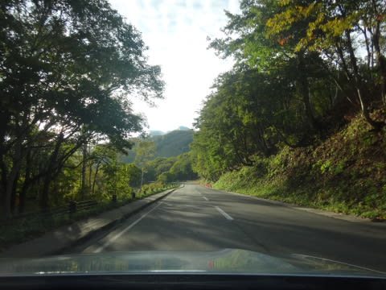
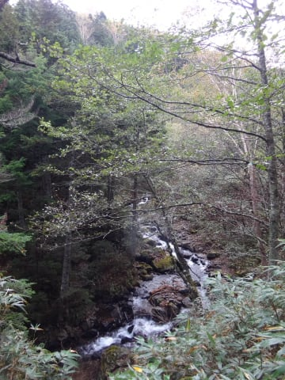
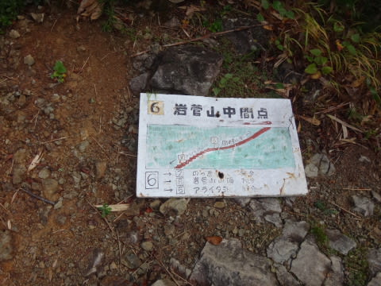

# 焼額の向かい側に見える，あの岩菅山に登ってきた

📅 投稿日時: 2016-10-12 01:44:38

えー．

ということで．

このBlogのシーズン中のスキーレポート．

いつも，朝イチの焼額山頂からの写真で

始まりますが…

そう．

その，焼額の写真で，いつも写っているあの山．

焼額の真向かいにそびえたつ，あの山．

毎日毎日眺めるあの山が気になって．

いつかは登ってみたい…

あの山のてっぺんから，焼額を眺めてみたい…

と．

思っていたのですが．

ついに先日，その10年越しの願望を

実現してしまいました～！！

この，焼額から正面に見える山は．

岩菅山（いわすげやま）2295mと，

裏岩菅山（うらいわすげやま）2341m．

ここに登るには，2000m越えの，

結構本格的な山歩きになります…

で．

この3連休．

土曜，日曜と，2日続けて雨（涙）．

日曜が終わった段階で，3連休最終日の

月曜も曇りの予想だったので．

この3連休に岩菅山に登ろうとは，

これっぽっちも思っていなかったのですが…．

当日朝，予想外の晴天だったので．

全くの思い付きで「岩菅に登ろう！」

と，決めたのでした…←全く無計画

ということで．

道の駅の車中泊で起きた朝…

＃レガシィで初の車中泊でしたが．

＃一人で車中泊するには，広さは十分ですな．

＃この車．

朝6時ごろに起きると．

「今日は，天気予報は曇りじゃなかったのか？？」

というすっきり晴天！

うぉぉぉぉ！

まさか…

まさかすっきり晴れるとは！！！

これは…

曇りだから，のんびりトレッキングコースでも…

と思っていた計画を切り替えて．

岩菅登山だ！！

…と，志賀高原を登ります…

いや．

意外といい天気じゃないですか．

途中の蓮池も，朝日に照らされてきれいです！

…これは，絶対に今日登るしかないよね…

と，やってきた一の瀬登山口．

朝7時前なのに，かなり車が多いよ…

さすが，3連休．

ってことで．

一の瀬登山口から，出発！

山頂までのコースタイムは，2時間40分ほどです．

こーゆー木々の間を…

10分も階段を登ると…

まずはT字路に突き当たります．

右に行くと，一の瀬ゲレンデ方向．

左に行くと，岩菅山方向だそうですが…

スキーヤーの本能に従うと，一瞬右に行きたくなりますが．

今日の目的は，山を滑り下ることではなく．

山を登ることなので，左に行きます．

…ここから岩菅山まで4.3kmか…

先は長そうだな…

んで．

紅葉がちらちらと眺められる…

のんびりとしたお散歩コースのような，

用水の脇を歩くこと，約20分．

アライタ沢の流れが見えてくるので…

それを渡ると．

ここから，本格的な上り坂が始まります…

川を渡ってから，景色も見えず，ひたすら木々の間の

階段やら坂道やらを登り続けること，約30分．

階段が続いて，わりと退屈＆体力的に

しんどい30分を過ごすと．

「岩菅山中間点」

とやらに到着．

ここまでで約1時間弱くらい．

木々に覆われ，ほとんど周りの景色は

見えませんが．

天気はなんとか持ってくれそうです．

ここから約30分，今度はこんな木々の間を縫った

そこそこの斜度の山道を登っていくと…

「ノッキリ」という分岐点に到着！

ここは，右に行くと寺子屋山頂．

左に行くと岩菅山…

という分岐点で．

ベンチが二つほどある，狭い広場に

なってます．

出発時の気温は，車の温度計でプラス4度という，

この時期にしては寒めでしたが．

結構な斜度を1時間登り続けてたので，

かなり汗だく．

大体ここまで，麓から1時間20分．

景色が全く見えない場所ですが．

ちょうど休憩タイムにいいころ合いですかね…

…しかし．

アライタ沢を渡ってから，ノッキリまでの1時間．

木々の間を縫って歩くので．

ほとんど周りの景色が見えず，

時々この程度の「あぁ…焼額が見えてるなぁ」

って景色が1-2回，木々の隙間から見えるくらいで．

…ここまでは，ちょっと単調なコースだったなぁ…

さぁ．

このノッキリからが，本格山登り．

ここからのコースタイムは，あとわずか30分！

…だけど…

山頂はまだかなり上の方に見えるってことは…

ここから，かなり急ってことかな？？（戦慄）

（つづく）

## 💬 コメント一覧

### 💬 コメント by (まいる)
**タイトル**: おお！
**投稿日**: 2016-10-12 23:19:31

Sさん、お疲れさまです。

登山やるんですねー

私は残りいくつ登れるかですが、現在、過去の分をヤマレコ記録中です。

### 💬 コメント by (Skier_S)
**タイトル**: まいるさま
**投稿日**: 2016-10-13 05:56:44

いや，私は全く山登りをしない人なんですが…

岩菅山にだけは登ってみたい，と

かねてから思っていただけです…

登山は完全ど素人です（笑）

