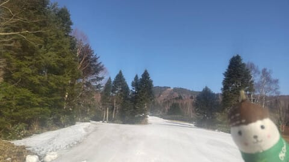
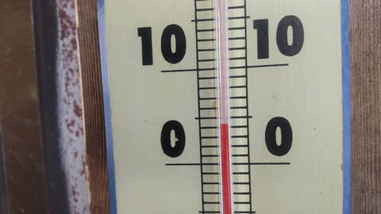
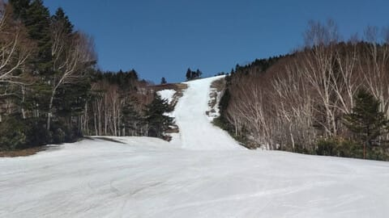
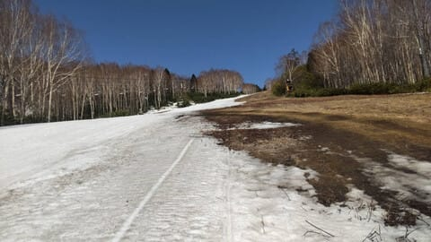
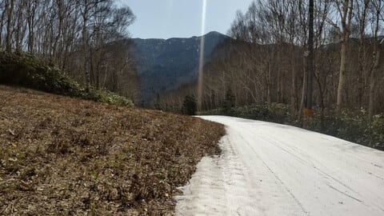
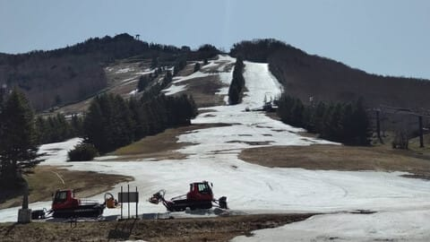
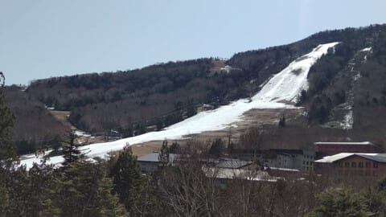

# Skier_SはGW前半も志賀に行くとお思いでしょうが…

📅 投稿日時: 2023-04-29 01:02:42

えー．

4月28日の今日も，おこみん特派員から写真が

送られてきましたが…

本日も志賀高原は，晴天＆高温だったようですね～…

…晴天はまぁいいとして，高温が…

晴天＆高温のダブルパンチが雪を痛めつけるん

ですよね…(涙)

今日も焼額は朝6時からの営業開始だけど．

雪が閉まり気味だったのは早朝の一瞬だけ．

朝7時には早くも気温が+5℃近くまで

上がってしまったようで…(涙）

そのせいで，朝8時にはザブザブに緩みまくった

雪になり，9時過ぎには早くも妖怪板つかみが

出現するようなコンディションだったようです…（泣）

焼額も，もう雪は残り少なくなってきましたが…

サウスコースも雪を寄せてまだコースをちゃんと

つなげているようで．

コース幅は狭くなってますが，最終営業の29日(土)までは

問題なく営業できそうな感じです～！！

で．

高天ヶ原は昨日で営業が終了して，GW前に

息絶えましたが…

一ノ瀬ファミリーは…

下半分は30日まではもちそうな感じですね．

…まぁ，30日は雨も強い荒天なので，

30日に営業できるかどうか微妙ですが…

ってなことで．

29日は高温の晴れ，

30日は早朝から強い雨＆風の，とてもじゃないけど

スキー日和じゃない天気ですが．

今週末も志賀高原に行ってます～！！

…と，言いたいところですが．

ええ．

29日は焼額ラストデーなので，何があっても

滑りに行きたいところですが．

29，30日と出張でスキーに行けません（涙）

なぜ，GWの土日に宿泊出張入るかなぁ…（泣）

それも，ヤケビのラストデーを狙って…（激泣）

もう，上司の嫌がらせとしか思えない

ただ，5月1日からは休めそうなので，スキーに行く

予定です～！！

…が．30日の雨でゲレンデが全滅したら，

5月1日から休みになっても，なすすべもなく

のたうち回るだけなので．

30日の雨はそれほどひどくなずに，

熊の湯も奥志賀も横手も，5月1日以降まで営業が

続いてほしい

と，心の奥底から深く願う，Skier_Sなのだった…←志賀に槍やミサイルが

降るように願った人と同一人物とは思えない
