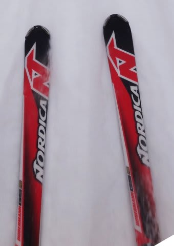
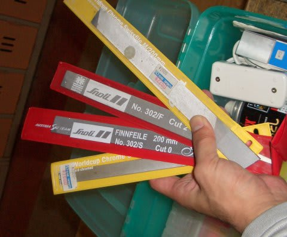

# ヘタったと思った，Nordica Dobermann GSproのエッジをギンギンに研いでみた

📅 投稿日時: 2013-02-13 02:06:49

えー．

以前にですね．

[その1](e7fa96c3f88bd94ba6390c710d6538679.md)，[その2](e2417d511869d49d0e1e493c47fbd692c.md)で書いたように．

ATOMIC BLUESTER SXと乗り比べると．

エッジグリップがなく，明らかに安定感が低下してキョロキョロしてしまうように感じてしまった，

'07 NORDICA Dobermann GS pro 181cm．

181cmのGS板が，165cmの小回り板より高速安定性が低いってどういうことっ！？

これは，明らかに．

ヘタった～っ！！！！

…と，思ったわけですが．

ちょっと待てよ．

もしかすると．

この板．

エッジを研げば．

エッジを新品同様に立たせれば．

…エッジグリップが回復しちゃったりして，

まだ現役バリバリで使えるようになったりしないかな…？？

ってことで．

ギンギンにエッジを研いでみましょうか～

荒目のファイルを使って，気合を入れて，ありえないくらいがんがん削ってみましょう．

…ってことで．

エッジを削ること，トータル約1時間以上．

これで復活すればもうけモノ，って感じで．

もう，かなり削り込む．削る．ひたすら削る．

そして．

エッジは削っただけでは終わらない．

そこからの研ぎ出しが重要なんだな．

つーわけで，取り出しましたるアルカンサス砥石．

かなり硬く，目の細かい砥石です．

こいつでゴシゴシごしごし，

…かなりの時間をかけて．

仕上がったエッジは．

それはもう，かなり危険レベル（笑）．

これははっきり言って…凶器です．

素手で触りたくないですね～．

これなら，アイスバーンでも引っかかりまくりでしょう…

って感じで仕上げたNORDICA Dobermann GS pro．

これをゲレンデにもって行き．

朝イチ焼額で，いざ出動！

さて，結果やいかに？？

（続く）

## 💬 コメント一覧

### 💬 コメント by (ひろりん)
**タイトル**: Unknown
**投稿日**: 2013-02-13 16:21:50

自分はエッジ研ぎ、怖くてできません（＞＜）

エッジで板の性格かわりますもんね♪

へたった板でエッジ研いだら・・・

へニャへニャ感が目立ったりしてｗ

### 💬 コメント by (Skier_S)
**タイトル**: ひろりんさま
**投稿日**: 2013-02-14 01:45:31

いやー．

自分でエッジが研げると良いですよ～．

チューンナップに出さなくても良くなるし，いつも新品のエッジグリップを

維持できますし…

でも，自分でエッジを研ごうと思うと．

ファイルやらガイドやら，結構高いのが問題かも…（笑）．

今回，「ヘタったなぁ」と思った板のエッジを研ごうと思ったのは，

シーズンそんなに滑らない人が，昨シーズン買ってチューンナップに

出してなかった…という板を履いたところ．

「まだそんなに履いてないのに，エッジを手入れしないと

こんなにグリップがなくなるのかっ！まるでヘタった板みたいだなぁ…」

って思ったので，

「自分のNordicaも，エッジが丸まっているだけなのかも…？」

って，試したくなったのが理由だったりします…

