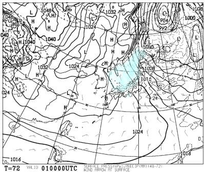

# この年末年始の志賀高原スキー場の天気は？…1月5日ごろまでひたすら雪降りが続きそう．パウダーが続くけど，1日くらい晴れて欲しい…’

📅 投稿日時: 2021-12-30 00:03:00

ってなことで．

[25日の金曜日の記事](eeb4d049a6d3b43285a973a49c798fad8.md)に，

　志賀高原で年内に晴れるチャンスは

　29日だけか？？？

…と書いた通り．

特派員からの写真を見ると，本日29日の

志賀高原は，久しぶりの晴天と

なったようですね…

ここ数日，雪の日が続いたので，

久しぶりの晴れ間だった感じなのですが．

…果たして，この年末年始休みの

志賀高原の天気はどうなるのか？

いつも通り，天気図から読み解いて

みましょう…

えー．

まず，12月30日の850hPa気温図を見て

みると，水色の-6℃線が志賀高原にか

かる程度なので，ここしばらくのように

-15℃レベルまでは冷えなさそう…

そして，30日の地上天気図は．

うーん．

低気圧が通過したての，ちょうど冬型に

なり始めるところ…って感じなので．

朝は晴れ～曇り，昼間は雪がぱらつく程度か…

続いて，大晦日の12月31日は．

850hPa図を見ると…

をををを！！

水色の-12℃線が志賀高原にかかります！

これは激冷え！

また，朝は-15℃くらいまで冷えます！

そして地上天気図は，間隔が狭い縦縞

になっているので…

31日も，朝までに20cmほど積雪がありそう！

この日は終日太陽が拝めず，

昼間はひたすら雪が降り続き，

風もそこそこありそうなので．

…要するに，終日吹雪ってことですね…

で．元日の850hpa図を見ると．

この日も水色の-12℃線が志賀に

かかっているので…

大みそかから引き続き，

朝は-15℃まで冷える激冷えデー！

地上天気図を見ると…この日も

等圧線が縦縞気味の冬型で，

日本海が水色の降水域で埋まって

いるので．

この日もかなりの雪が積もりそう…

朝は少なくても30cmくらい，

脛～膝パフくらい積もるかも！？

午後は雪が弱まるかな．

もしかすると晴れ間も？

で．

続く1月2日の850hpa気温は…

この日，志賀高原にかかっているのは

水色の-6℃線で，31，1日に比べると

5℃ほど気温が上がりそう…

でも，朝は-10℃クラス．

昼間もマイナス気温ですので，十分

冷えてます…

この日の地上天気図は．

この日も縦縞ですが，等圧線の向きが

南北というより，北西-南東の向きに

傾いているので．

ちょっと冬型が弱まりつつある感じ．

雪の降りは弱くなるけど，この日も

基本的に曇り～雪降りの一日．

で，最終日，1月3日ですが…

この日の850hpa気温も，水色の-6℃線

が志賀にかかる程度なので．

激冷えではないですが，そこそこの冷え．

昼間もマイナスキープの1月らしい

気温．

そして，地上天気図は…

この日は，北西-南東の向きに等圧線が

傾いているので，完全西風パターン．

志賀は降らない感じなので．

もしかすると晴れるかも…？

…ってなことで．

まとめると．

12月30日：朝イチは曇りだけど…

　うっすら日が射したり雪が舞ったり，

　という感じかな？

　朝の積雪は数cm～10cm．

　あさイチの気温は-5℃程度かな？

　あさイチはシマシマ圧雪にうっすら

　新雪で，かなりいい感じ！

　昼に向かって雲が厚くなり，

　午後には雪が時折強く降る

　天気になりそう．

　雪質は終日軽くていい感じ．

12月31日：朝から雪降り！

　朝は積雪20cmほど．

　あさイチの気温は-15℃くらいの激冷え！

　昼間も-10℃くらいをキープ．

　終日ひたすら雪が降り続け，風も

　そこそこあって，寒いので，

　根性の無いスキーヤーふるい落とし

　機能が全力発揮される天気．

　昼間もひたすら積もるので，ゲレンデは

　終日プチパウダー状態．

1月1日：朝までに30cm以上積雪．

　脛～膝パフのパウダーデー！

　あさイチの気温は-15℃と激冷え．

　圧雪バーンもブーツパフか．

　昼に向かって雪は弱まり，

　もしかすると午後は薄日が差す

　可能性も…

　でも，終日冷え冷えで雪はGood．

　ただ，夕方は斜度のあるバーンは

　雪が荒れていくかな…

1月2日：朝までの積雪はそれほどなし．

　数cm～10cmほどかな？

　気温は前日までよりちょっと上がる

　けど，あさイチは-10℃近くとそこそこ

　冷えるし，終日マイナスキープ．

　天気は…まだよくわからないけど，

　志賀だと曇り＆小雪→午後は晴れ間も？

　といった感じかな

1月3日：志賀は西風パターンなので，

　朝までの積雪は無いかな…

　あさイチの気温は-10℃を上回る程度．

　あさイチは，柔らかい雪が圧雪された

　最高シマシマバーン！

　曇り～晴れの天気．

　運がよければ終日晴れて，昼間もそこそこ

　冷えているので，冷え冷え最高の雪質で

　一日滑れる，良さそうな日．

…って感じでしょうか．

ただ，まだ2，3日の予想は精度が低いです…

とりあえず，31，1日とパウダー予報で，

2日も朝は積雪があるかな？

3日は，今のままなら晴れ～曇りで，

志賀は雪はそれほど積もらなさそう．

（新潟など海が近い日本海側は降ります…志賀は降らない）

まぁ，雪不足や雨の心配は全くないし．

25日からの週末のリプレイを見るような，

冷えて雪が積もる正月休みになりそうです…！

ってなことで．

私も明日からしばらく志賀高原に

舞い戻ります～

…志賀高原から帰宅してまだ24時間

経ってませんが．

あと3時間半ほどで出発です…！！

…そして，先週土曜から3度目の

志賀行きだったりする…←いったいどれだけ志賀が好きなんだ

## 💬 コメント一覧

### 💬 コメント by (かず)
**タイトル**: Unknown
**投稿日**: 2021-12-30 05:21:38

パウダー予報多くて最高です！たまにはこちらスタートなんかどうですか？？笑

### 💬 コメント by (m&t)
**タイトル**: Unknown
**投稿日**: 2021-12-30 23:13:48

Sさん

今日はお世話になりました

ただ今無事着きました（Tも無事でした）

多分また1／3に参戦しますので、よろしくお願いします

天気予報もよろしくお願いします

### 💬 コメント by (Skier_S)
**タイトル**: 明日はパウダー！
**投稿日**: 2021-12-30 23:24:11

＞かずさま

奥志賀スタートも悪くないのですが…

どうも焼額の呪いが解けず，ホームの焼額に行っちゃいます…

＞m&tさま

今日は最後までお疲れさまでした～！！

1月2日と3日の予想，明日の夜にでも軽くやりますね

